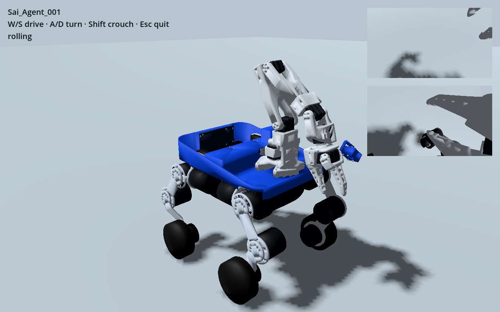

# Sai_Agent_001

A four-wheel-leg cargo robot with a front SO101 arm, an open blue cargo bay,
camera mounts and a rear touchscreen layout. The same named joints and physical
model are used across training and game integration.

**Development preview.** WASD and held-Shift crouch pass eight-case checks in
CPU MuJoCo (reduced and fully articulated models) and Godot/Jolt. Continuous
20/40 mm stairs pass the reduced/full MuJoCo and Godot development suites.
60 mm and held-out terrain are still being checked.
Hardware has not been built or measured.

| Capability | Current evidence |
|---|---|
| Forward/reverse, left/right yaw, combined turning | MuJoCo reduced/full + real Godot key events passed |
| Shift crouch, release recovery, crouched driving | Passed; approximately 35–40 mm lowering |
| Zero movement input | Bounded-torque braking and height IK |
| Continuous stairs | Four 20/40 mm risers up/down passed in MuJoCo reduced/full and Godot |
| GPU training | MuJoCo Warp + PPO on GB10; CPU threads capped at two |
| Godot | One-command launcher, full articulation, camera views; flat acceptance passed |
| Unity | Dedicated native-model adapter in draft PR; editor execution unverified |
| Hardware | Source/envelope and provisional inertia model; not measured validation |



## 直接启动 Godot / Run Godot

Install Godot 4.7.2 and Python 3.12 with `uv`, then from this checkout:

```sh
uv sync
uv run sai-agent godot
```

W/S 前进后退，A/D 左右转向，按住 Shift 下蹲、松开恢复，Esc 退出。
The launcher starts the policy service and Godot together. Godot/Jolt owns the
physics; Python supplies motor targets and uses MuJoCo only for arm bias/FK.
No separate training process is needed to play. `--godot-bin` selects an executable.

For a recorded headless input test:

```sh
uv run sai-agent godot --headless --case W --output artifacts/godot-W.json
```

Experimental stair scene: `uv run sai-agent godot --stairs .02` (add
`--descending` for descent). A simulated ground raycast selects the stair policy
and a slower approach speed. The four-riser 20/40 mm development cases pass;
this is **not** camera-based VLA or validation on arbitrary stairs. Cameras
render separate observation views.

See [the active plan](docs/PLAN.md), [control contract](docs/CONTROL_CONTRACT.md),
[evaluation evidence](evidence), and [experiment ledger](experiments/ledger.jsonl).

## Current MuJoCo checks

Python 3.12 and [uv](https://docs.astral.sh/uv/) are required. From this checkout:

```sh
uv sync --extra test
uv run python scripts/evaluate_flat.py --policy policies/flat-v1.onnx --out artifacts/check-flat --require-pass
uv run python scripts/evaluate_flat.py --policy policies/flat-v1.onnx --out artifacts/check-full --full-robot --require-pass
```

Optional training dependencies:

```sh
uv sync --extra train
OMP_NUM_THREADS=2 OPENBLAS_NUM_THREADS=1 MKL_NUM_THREADS=2 uv run python scripts/benchmark_gpu.py
OMP_NUM_THREADS=2 OPENBLAS_NUM_THREADS=1 MKL_NUM_THREADS=2 uv run python scripts/train.py --worlds 256 --seconds 300 --name my-flat-trial
```

Training rejects silent CPU fallback. Trials retain configuration, source hashes,
checkpoint metadata and iteration metrics. Reward alone is not acceptance.

## Models and provenance

- `models/locomotion.xml`: fixed arm/cargo training reduction; collision proxies
  and unchanged total mass are documented in its manifest.
- `models/full/robot.xml`: full arm/cargo articulation and original contacts;
  two cargo belt couplings, no attachment constraint on the carried item.
- `models/full/visual.xml`: the same model with redistributable displays.
- `models/full/assets`: Y-up GLB display parts for the game adapters.
- `policies/flat-v1.onnx`: deterministic actor with normalization included.

SO101 and Raspberry Pi material retain their licenses. Vendor CAD without
confirmed redistribution permission is replaced only in the display layer by
independent dimensional envelopes. Contacts, inertia and joint frames are
separately checked for invariance. See [third-party notices](THIRD_PARTY_NOTICES.md)
and [part-level provenance](models/asset_provenance.json).

Inspired by [MicroDuck](https://github.com/pollen-robotics/microduck)'s functional
approach to characterful robots; the wheel-leg cargo chassis is an independent
design. The bounded experiment loop takes inspiration from
[autoresearch](https://github.com/karpathy/autoresearch).
