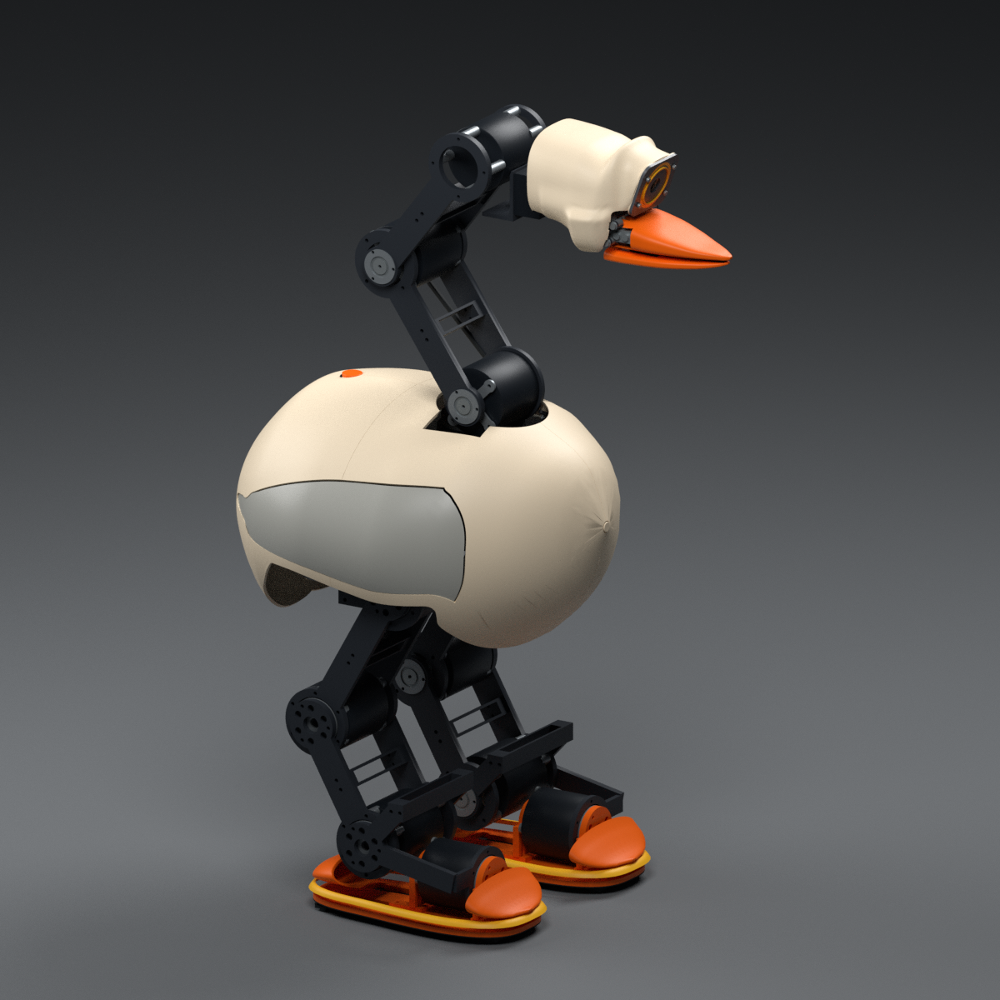
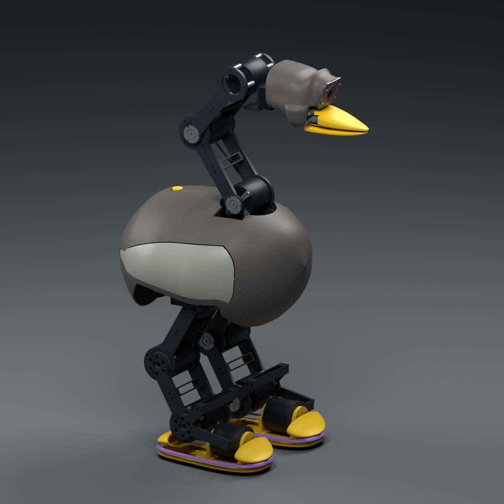
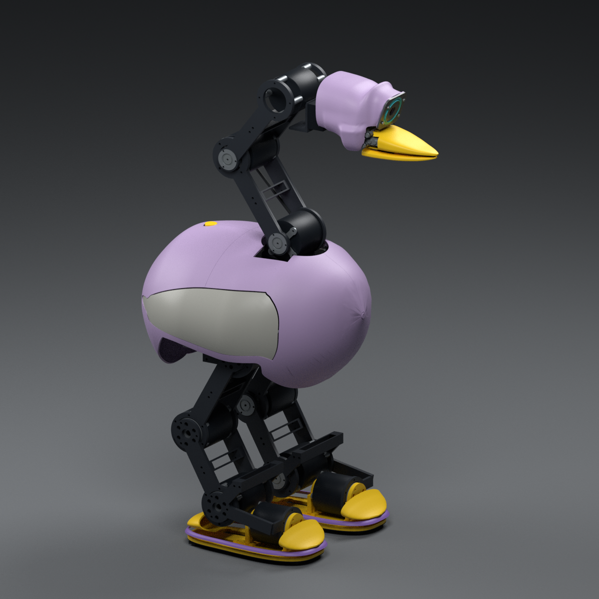
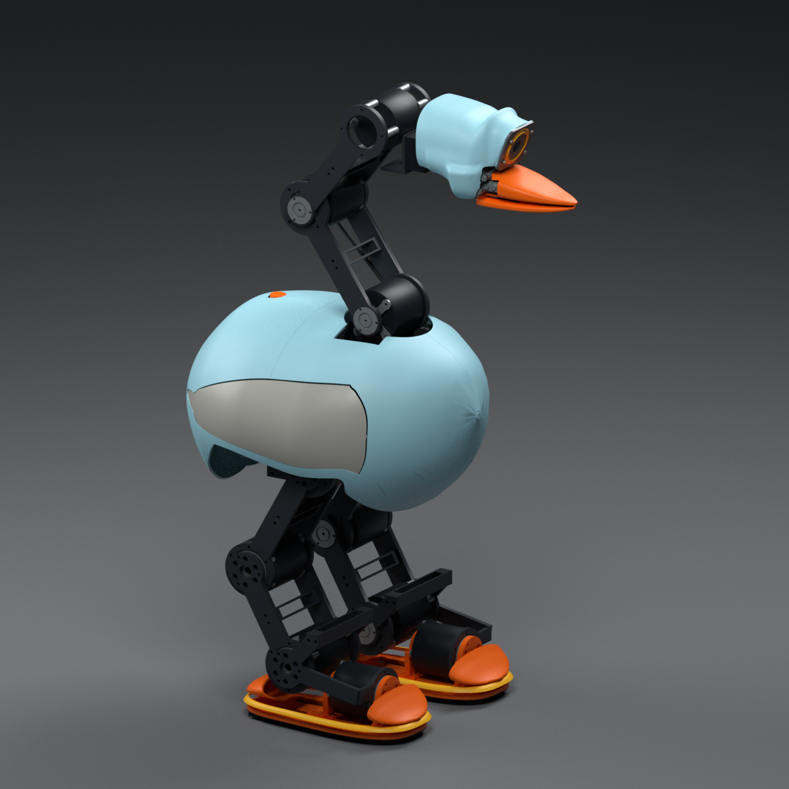
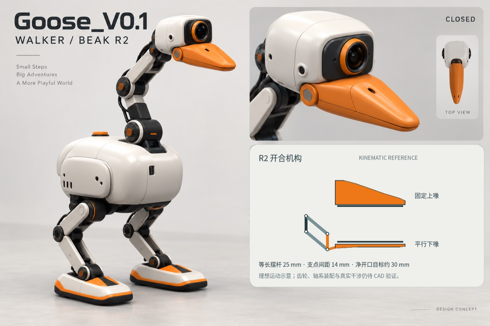
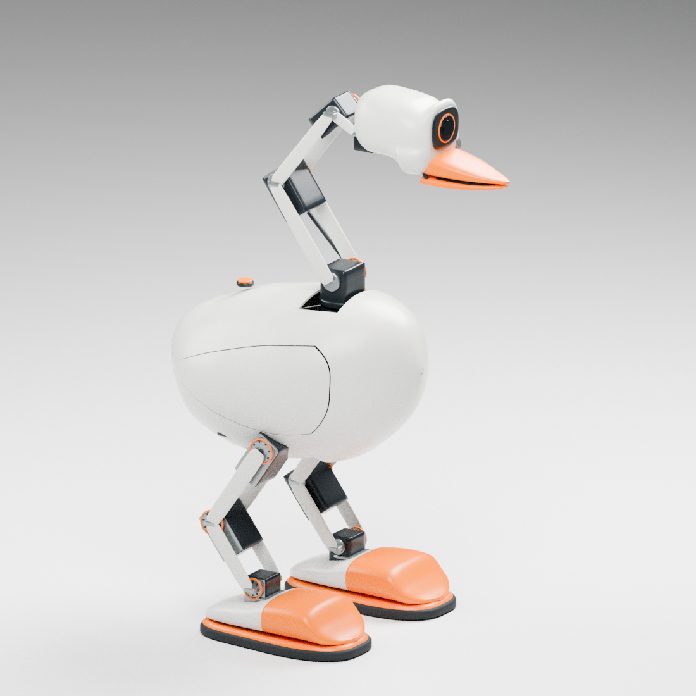

# Sai_Rotbots

面向真实世界互动与任务的开源机器人工程。保留轮腿机器人 **Sai_Agent_001**、后备箱平整的 **Sai_Agent_002**，并开发长颈双足机器人 **Goose V0.1**。仓库由 `Sai_Agent_001` 直接改名，提交历史和旧版本发布均保留。

| Robot | Cargo bay | Guide |
|---|---|---|
| Sai_Agent_001 | Original powered opposed pads and belt mechanism | [001](robots/Sai_Agent_001/README.md) |
| Sai_Agent_002 | Continuous flat floor, no moving clamp mechanism | [002](robots/Sai_Agent_002/README.md) |
| Goose_V0.1 | Long-neck biped with a gripping beak; initial training checkpoint | [Goose](robots/Goose_V0.1/README.md) |

## Goose V0.1：一只幽默又实用的机器人鹅

Goose 的初衷来自 [Untitled Goose Game](https://goose.game/)：把鹅的好奇、探头、歪头、回望、动作停顿和叫声带进真实世界，也让它能帮人做小事。**叼起物品和拖拽物体同等重要**；目标包括指定轻量日用品、布边、空拖鞋、轻篮及小车，支持遥控和“叼过来／拖到指定位置／放下”的指定物自主任务。这些是设计目标，完整任务能力仍待验证。

我们将它视作 [MicroDuck](https://github.com/pollen-robotics/microduck) 的“Max Pro”方向：借鉴双足互动机器人的经验，增加头颈活动范围、真实嘴部夹持和腿脚机动。外观追求简约的鹅感，以可打印曲面、大眼、橙色嘴脚和两侧手动检修门表达角色；检修门不画写实羽毛。最终外观须与实际制造装配一一对应。

### 当前工程装配



上图直接来自当前 **460 件源装配**，不是实物照片或最终制造验收图。单件打印主头壳、相机面板、夹嘴和深色承力结构分别承担实际功能。当前候选有 **18 个主动轴、约 10.43 kg 条件质量**；闭合零位包围尺寸约 **43.4 × 26.9 × 64.2 cm**（长 × 宽 × 高），姿态变化会改变外部包围尺寸。质量含设计预留，尚非实物称重。

| Cream 奶油白 | Graphite 石墨灰 |
|---|---|
|  |  |
| Lavender 薰衣草紫 | Sky 天空蓝 |
|  |  |

四款使用同版几何、同镜头与灯光，分别配置主壳、中性检修门／脸板、深色骨架、嘴脚及眼圈／鞋边辅色；见[配色与源身份记录](robots/Goose_V0.1/design/microduck_color_blocking_one_piece_head_service.md)。

### 设计图与外观演进

| 早期 R2 尖嘴概念 | 已确认的阶段性外观基线 |
|---|---|
|  |  |

这些图保留设计意图和演进过程。右侧[外观基线](robots/Goose_V0.1/design/fuller_exterior_review.md)曾获阶段性确认；之后按真实器件、承力和装配需求继续调整。概念图上的旧尺寸与性能不作为当前工程参数，当前一体头壳版仍需最终审美与制造验收。

### 当前交付与下一步

当前[初始训练检查点](robots/Goose_V0.1/design/training_checkpoint_handoff.md)提供同源 MJCF／URDF、质量与完整惯量、18 轴 SI 契约、65 项观测／18 项动作，以及每脚六个被动压缩垫的软脚底模型。0.2 秒名义自由根站立冒烟检查通过；这仅支持初始训练探索，尚未证明行走、转向、地面拾取或日用品拖拽。MuJoCo、Godot/Jolt、Unity 和 Bevy 适配共同遵循中立契约，跨引擎验收仍待完成。

完整安装与线束、翼门固定、供电保护和独立急停、真实电机额定及热／载荷检查仍未闭合，**不能直接按候选 BOM 下单装机；第三、第四阶段和硬件冻结尚未完成**。原交接图片、文档、采购表以及成功／失败记录均保留，历史模型的结果不替代当前版本验证。

从[Goose 资料入口](robots/Goose_V0.1/README.md)、[460 件训练交接](robots/Goose_V0.1/design/training_checkpoint_handoff.md)、[Sai_Lab 源码接入](docs/guides/goose_sai_lab_handoff.md)、[单件头壳结构](robots/Goose_V0.1/design/one_piece_head_checkpoint.md)、[行为要求](robots/Goose_V0.1/design/behavior_requirements.md)继续；[原始资料图片库](robots/Goose_V0.1/design/concepts/index.html)与[导入记录](robots/Goose_V0.1/source/workspace_import.md)保留溯源。大型 Blender／OBJ 资产须按 [Git LFS 拉取说明](docs/guides/large_asset_checkout.md)获取完整内容。

## Project organization

Robot-specific design, models and evidence live under `robots/<robot_id>/`.
Shared policies and configurations live under `shared/`; common software lives
under `src/sai_agent/`, with categorized command entrypoints in `scripts/`.
Local generated runs belong in `artifacts/<robot_id>/<run_id>/` and are not committed.

Read the [engineering rules](sai_robots_engineering_rules.md) before adding or
moving files. The [migration record](docs/guides/directory_migration.md) maps old
paths to their new locations without rewriting historical experiment records.

Both variants retain the front SO101 arm, four wheel-legs, camera mounts and
rear touchscreen layout. Hardware has not been built or calibrated.


## Run in Godot

Python 3.12, Godot 4.7.2 and `uv`:

```sh
uv sync
uv run sai-agent godot --robot Sai_Agent_002
uv run sai-agent godot --robot Sai_Agent_001
```

W/S 前进后退，A/D 左右转向，按住 Shift 下蹲、松开恢复，R 重启。
Omitting `--robot` preserves the original 001 default.

```sh
uv run sai-agent godot --robot Sai_Agent_002 --task cargo
uv run sai-agent godot --robot Sai_Agent_002 --stairs .04
```

002 uses contact-only pickup → placement → passive transport. It has no
clamping stage or cargo attachment constraint. Objects can slide or fall;
this variant does not promise automatic load restraint. Camera images are
available but the current tasks use model-state IK and terrain raycasts,
not VLA. The touchscreen remains a hardware layout, not implemented firmware.

## Models, training and integrations

[`robots/catalog.json`](robots/catalog.json) maps stable robot IDs to separate
model directories. Shared controllers/policies are retained; new robots can add
catalog entries and their own model directory. The `sai-agent-001` Python
package name and `sai_agent` import remain for existing integration compatibility.
The repository name is `Sai_Rotbots` as requested, including that spelling.

```sh
uv sync --extra test --extra cad --extra assets --extra hardware
uv run pytest -q
uv run python scripts/evaluation/evaluate_flat.py --robot Sai_Agent_002 --policy shared/policies/flat-v1.onnx --full-robot --out artifacts/002-flat --require-pass
uv run --extra train python scripts/training/train.py --robot Sai_Agent_002 --worlds 256 --seconds 300 --name my-002-trial
```

The variant reuses existing trained actors and is checked on its changed
mass/contact model. It is not presented as a newly trained policy. GPU training
accepts `--robot`; each run records the selected model hash and robot ID.

See [002 scope and evidence](robots/Sai_Agent_002/README.md),
[game integration notes](docs/guides/integrations.md),
[001 historical acceptance](robots/Sai_Agent_001/design/simulation_guide.md),
[variant plan](robots/Sai_Agent_002/design/agent_002_plan.md), and [third-party notices](THIRD_PARTY_NOTICES.md).
Old alpha.3 results describe 001, not 002. Unity editor validation remains pending.

SO101 and Raspberry Pi derivatives retain their upstream licenses. Supplier
CAD with unconfirmed redistribution rights is represented by independent
nominal display envelopes. Physics parameters are documented estimates, not
measured hardware values. Inspired by [MicroDuck](https://github.com/pollen-robotics/microduck)'s
functional design philosophy; the wheel-leg cargo chassis is an independent design.
