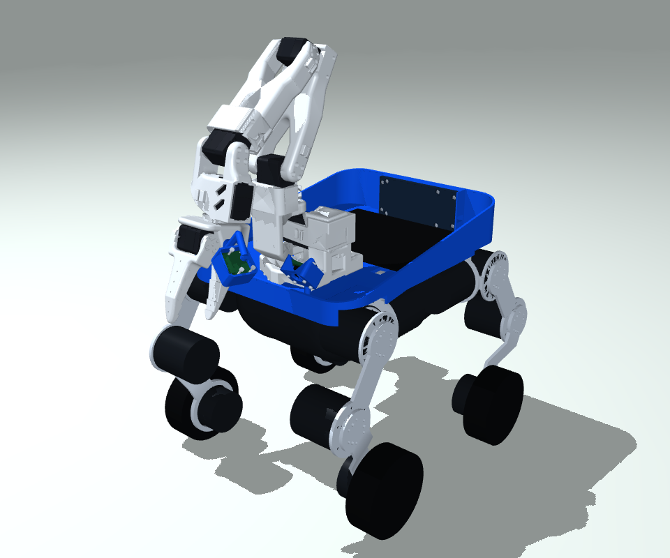
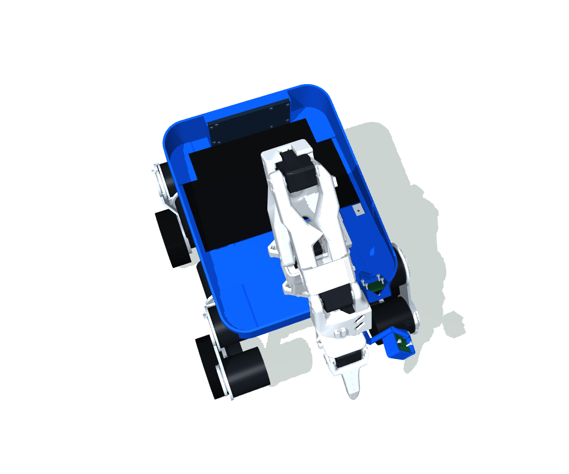

# Sai_Rotbots

开源轮腿机器人系列。保留 **Sai_Agent_001**，新增后备箱平整、去掉电动夹垫的 **Sai_Agent_002**。仓库由 `Sai_Agent_001` 直接改名，提交历史和旧版本发布均保留。

| Robot | Cargo bay | Guide |
|---|---|---|
| Sai_Agent_001 | Original powered opposed pads and belt mechanism | [001](robots/Sai_Agent_001/README.md) |
| Sai_Agent_002 | Continuous flat floor, no moving clamp mechanism | [002](robots/Sai_Agent_002/README.md) |

## Project organization

Robot-specific design, models and evidence live under `robots/<robot_id>/`.
Shared policies and configurations live under `shared/`; common software lives
under `src/sai_agent/`, with categorized command entrypoints in `scripts/`.
Local generated runs belong in `artifacts/<robot_id>/<run_id>/` and are not committed.

Read the [engineering rules](sai_robots_engineering_rules.md) before adding or
moving files. The [migration record](docs/guides/directory_migration.md) maps old
paths to their new locations without rewriting historical experiment records.

Both variants retain the front SO101 arm, four wheel-legs, camera mounts and
rear touchscreen layout. Hardware has not been built or calibrated.




## Run in Godot

Python 3.12, Godot 4.7.2 and `uv`:

```sh
uv sync
uv run sai-agent godot --robot Sai_Agent_002
uv run sai-agent godot --robot Sai_Agent_001
```

W/S 前进后退，A/D 左右转向，按住 Shift 下蹲、松开恢复，R 重启。
Omitting `--robot` preserves the original 001 default.

```sh
uv run sai-agent godot --robot Sai_Agent_002 --task cargo
uv run sai-agent godot --robot Sai_Agent_002 --stairs .04
```

002 uses contact-only pickup → placement → passive transport. It has no
clamping stage or cargo attachment constraint. Objects can slide or fall;
this variant does not promise automatic load restraint. Camera images are
available but the current tasks use model-state IK and terrain raycasts,
not VLA. The touchscreen remains a hardware layout, not implemented firmware.

## Models, training and integrations

[`robots/catalog.json`](robots/catalog.json) maps stable robot IDs to separate
model directories. Shared controllers/policies are retained; new robots can add
catalog entries and their own model directory. The `sai-agent-001` Python
package name and `sai_agent` import remain for existing integration compatibility.
The repository name is `Sai_Rotbots` as requested, including that spelling.

```sh
uv sync --extra test
uv run pytest -q
uv run python scripts/evaluation/evaluate_flat.py --robot Sai_Agent_002 --policy shared/policies/flat-v1.onnx --full-robot --out artifacts/002-flat --require-pass
uv run --extra train python scripts/training/train.py --robot Sai_Agent_002 --worlds 256 --seconds 300 --name my-002-trial
```

The variant reuses existing trained actors and is checked on its changed
mass/contact model. It is not presented as a newly trained policy. GPU training
accepts `--robot`; each run records the selected model hash and robot ID.

See [002 scope and evidence](robots/Sai_Agent_002/README.md),
[game integration notes](docs/guides/integrations.md),
[001 historical acceptance](robots/Sai_Agent_001/design/simulation_guide.md),
[variant plan](robots/Sai_Agent_002/design/agent_002_plan.md), and [third-party notices](THIRD_PARTY_NOTICES.md).
Old alpha.3 results describe 001, not 002. Unity editor validation remains pending.

SO101 and Raspberry Pi derivatives retain their upstream licenses. Supplier
CAD with unconfirmed redistribution rights is represented by independent
nominal display envelopes. Physics parameters are documented estimates, not
measured hardware values. Inspired by [MicroDuck](https://github.com/pollen-robotics/microduck)'s
functional design philosophy; the wheel-leg cargo chassis is an independent design.
