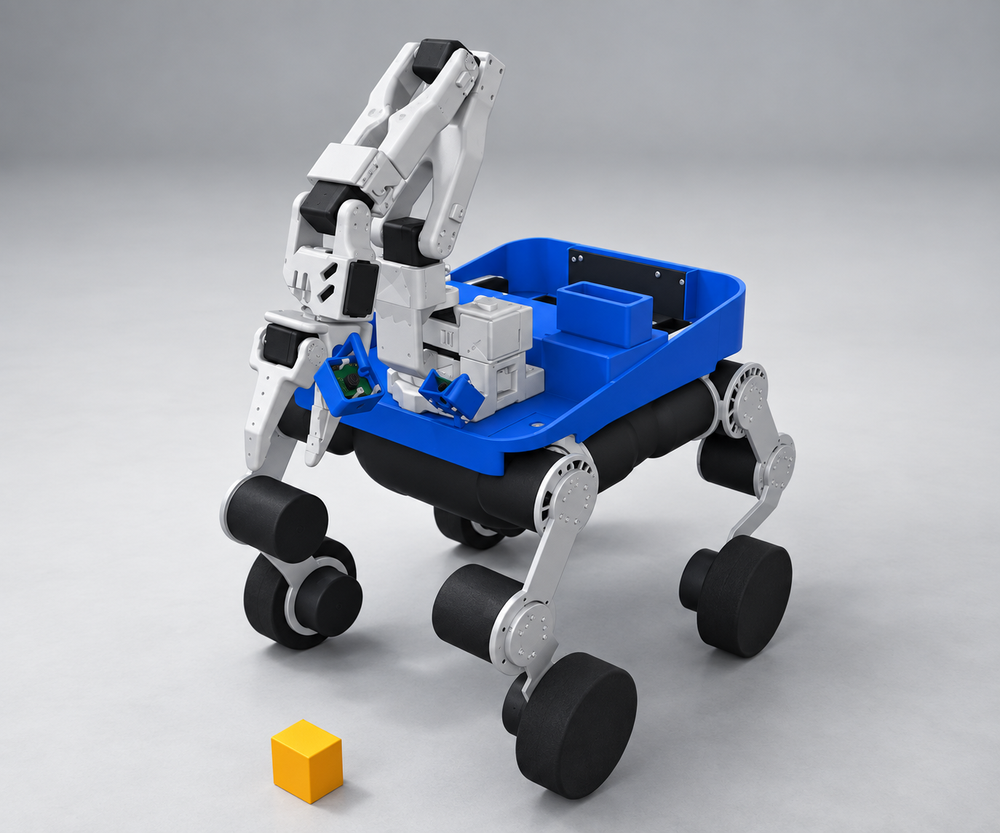

# Frozen geometry and appearance study

The physical model remains the design authority: front SO101, four separate HAA/hip/knee/wheel chains, blue open cargo body, dark lower enclosure, two actual camera placements and rear display. No generated mesh or image-derived mass, joint axis or size is used for simulation.



This material/lighting image was made with the built-in image generation tool from actual MuJoCo display views. It retains the main silhouette, arm plate construction, cargo structures, wheel count and attachments. Small fastener, surface and shading details are illustrative; the image is not a dimensioned drawing or hardware verification. The simulator viewport in the README shows the actual assets.

The theme is a compact carrying machine whose character comes from its broad wheel stance, visible mechanisms and forward-reaching arm. Blue identifies the cargo body, pale grey the SO101, silver the leg plates and charcoal the drive modules and lower enclosure. No animal costume, face display or extra limb was introduced. Hardware calibration, self-collision validation and final shell manufacturing details remain open.

## Generation prompt

```
Use case: lighting-weather / precise-object-edit.
Asset type: industrial design presentation of the already designed Sai_Agent_001 robot.
Input image 1 is the STRICT engineering geometry and camera composition reference. Input image 2 is the same physical robot from the opposite side, supporting reference only. Do not invent a new robot or alter silhouette to improve aesthetics.
Create ONE front three-quarter product render, using exactly image 1 camera view, same actual SO101 open plate arm, same plain open two-finger gripper and its compact blue camera mounts, exact four articulated legs with exposed circular joint motor envelopes, exact four small cylindrical wheels, same blue cargo tray, black belly, exact position and size of all cargo structures. Keep the real stepped linkage and articulated plate SO101 geometry; do not replace it with a generic tubular industrial arm. Preserve all physical attachment relationships, every existing substantial part and relative proportions. No extra sensors, wheels, joints or ears, no face.
Change only lighting and material rendering: soft broad studio lighting with readable shadows, matte saturated cobalt-blue polymer shell and camera brackets, satin pale grey SO101 printed plates, natural silver leg plates and fasteners, dark charcoal motor bodies and soft black rubber wheels, restrained realistic fine material texture. Avoid chrome, excessive bloom, flat white overexposure and cartoon simplification. Keep the small yellow cube on the ground at the same location. Neutral light grey studio floor/backdrop; remove the distant course landscape only.
No text, no branding, no arrows, no dimension annotations, no fabricated engineering detail or cargo. This image is appearance communication with immutable source geometry, not proof of fabrication. The robot itself must remain a faithful rendering of image 1, not a redesign.
```
