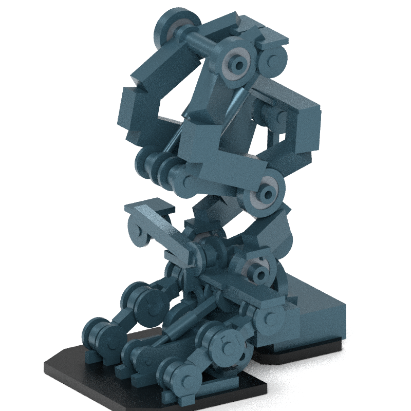

# Gorilla G3 功能链与末端重设计检查点

**安装、承力、审美和稳定 SI 均未放行。** 本检查点保存实际有限材料输入总成、三轴腕候选与新下腿—踝—折叠脚。它们尚未组成可用整机。用户最新六图已授权末端重设计，参考图用于结构与造型启发，不提供吨级能力证据。

| 模块与最终源 | 实际增量 | 裁决与范围 |
|---|---|---|
| 单个腰 roll 输入，`8cff49fe…` | 转子 holder、轴/WG、双支承、制动反力、反馈和冷却端口；81 件原生资源通过、中立自身材料零交 | 条件局部 16.316 kg，未含外部控制/线束；原腰安装壳仍有16对冲突，释放检查未联动弹簧变形。OEM基材/接合深度/持续热未核，不能称整腰安装通过 |
| 选定三轴腕，`5d6e224b…` | 32/25/25 齿轮族及五手驱动保留；27 个串联 ±45°/0 姿态采样方向秩3 | 强资源仅639/640通过；roll gear代理两闭边界触碰。25 kg条件重力域的pitch/yaw约103.6/50.4 N·m；不是手臂额定载荷。旧肘、甲、五驱动和掌指腱路仍冲突 |
| 左下腿 B，`8fb41bd8…` | 宽双侧承力座、恒材料缸/杆、固定后跟/足弓、独立折叠前掌和两侧机械压撑；5缸零长条件闭合 | 强资源49/50；足弓含低于阈值闭腔边界，前掌5个实际材料根，合法owner仍穿插。单踝pitch在指定3t前偏载需约41.5 MPa缩回压力，超过本版30 MPa条件上限；未建踝静态hold，安装/承力拒绝 |

主线程独立复核了同版原生材料、穿插证据、质量分项、方向秩和重力恒等式，实际查看完整四视、裸架及卸载折叠图。左末端逐件列出金属约319.2 kg，计10个参考轴承、脚垫与6片新甲后约356–387 kg；另缺油、阀、软管/密封、上游膝驱动等。按owner布尔并体的约0.58 kg差额只为诊断，不能作为真实连接或减重证明，也不能加到历史整机账本成为新质量。



新护罩在正/后视成为宽直板，审美低于 AA3；**主线程否决采用，不提交用户批准这个粗罩**。以下是同一源的失败包装记录，上半身/手臂来自 C15，仅为外观语境；右末端为视觉镜像，没有借用左侧物理证据。

[正面](root_render/leg_b_complete_01/whole/native_front.png) · [左面](root_render/leg_b_complete_01/whole/native_left.png) · [后面](root_render/leg_b_complete_01/whole/native_rear.png) · [顶面](root_render/leg_b_complete_01/whole/native_top.png) · [卸载折叠](root_render/leg_b_complete_01/forefold/native_left.png)

## 原厂尺寸纠正

独立放大查看原厂单页图后，纠正旧 G/G1/G2 与初始 G3 对 J 尺寸的解读：J 是向内台阶，不能加到总长 B。50/65 总长90/115 mm，固定 case 面为85/108.5 mm，输入 pilot 仍到总长端；腕25/32同样区分总长52/62 mm与case46/57 mm。实际小 PCD 输出配合面仍有条件假设，不能直接用整体端面代替。历史错误候选不覆写，最终 G3 重新建源并绑定核查。

[50 原厂图](https://www.harmonicdrive.net/_hd/content/caddownloads/dxf/csg-2uh_gearheads/csg-50-xxx-2uh.pdf) · [65 原厂图](https://www.harmonicdrive.net/_hd/content/caddownloads/dxf/csg-2uh_gearheads/csg-65-xxx-2uh.pdf) · [独立纠正收据](root_mechanics/primary_datum_correction.json)

## 保存、复现与下一动作

[快照清单](snapshot_manifest.json)逐文件记录原始和保存哈希。大 JSON 用确定性 gzip 保存，原字节可恢复；设计 producer 以 `.py.txt` 作为实验输入记录。下载的原厂PDF/参考图片、日志与 Blender 缓存不入库，来源和哈希仍在原记录中；清单不宣称完整递归依赖均随仓库提供。

```bash
.venv/bin/python experiments/gorilla_v0_1/internal_structure_g3_functional_chains/restore_snapshot.py.txt --root "$PWD"
```

需按各 producer 的输入绑定先恢复 C15、G/G1/G2 和 E2a/F 所需记录，再取得对应哈希的原厂缓存；恢复工具拒绝覆盖已改变的 scratch 文件。依赖与复现范围分别记录，不把文件恢复成功写成物理通过。

G4 回到完整关节总成的拓扑比较：双侧固定座、转动载体、轴承/保持/止挡、驱动力臂和宽薄闭口肋壳一起安排，先验证一个完整关节再串 Z 链。3t静态压缩路径与正常自重行走/操作驱动域分别核算；机械hold必须实际建模，不能替当前单缸虚增承载。用户10:05后已把新腿脚图交给「Gorilla 设计」，本线程不并行改外观包装；继续内部可适配参数/单关节原型，新图收到后再联合适配。持续目标、排期和门禁以[唯一当前索引](../../../robots/gorilla_v0_1/design/current_decisions.md)为准。
