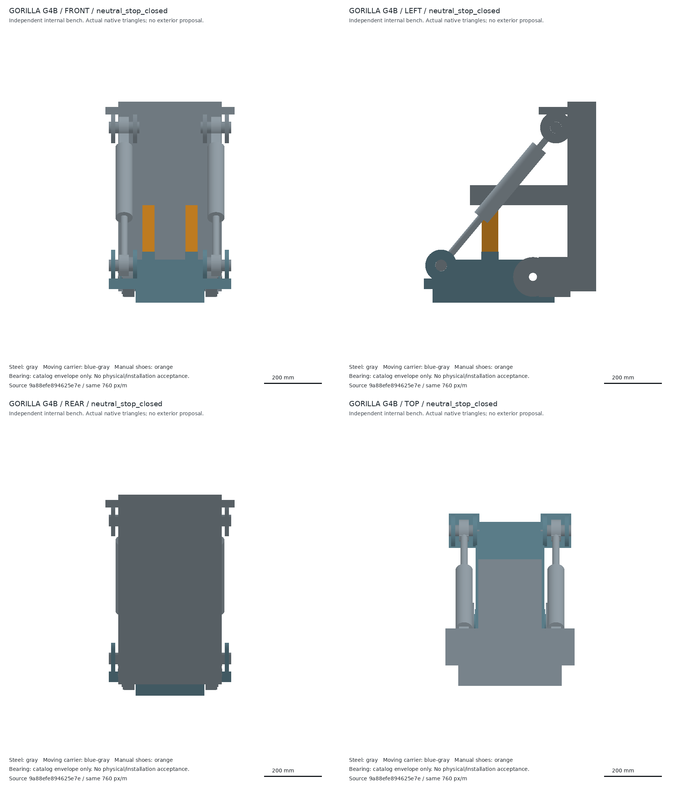

# Gorilla G4 独立关节与承力空间检查点

G4 保存两个踝布局的解析比较、宽薄闭口承力壳预算，以及一个实际有限材料的独立 pitch 关节。**未组成新腿、未采用新外形、未取得结构或驱动放行。** 用户把新腿脚原画交给「Gorilla 设计」；本实验不并行改包装。壮硕原形提供骨架的宽厚三维设计空间，后续墙肋可重新分配，但电机、传动、能源、热与维护空域必须共同保留。

最终原生源 `9a88efe894625e7ed3d3f15e544ead7b574382035594ab8d4b81f530fbb7b21a`，报告 `567104f3…`。主线程独立重建材料、碰撞和载荷平衡：30 件原生资源通过，固定母材和输出载体各 1 个实际材料根；中立闭/开与 ±25° 的四姿态没有超过门限的实体交叠。卸载后两鞋沿 +X 抽出 280 mm，21 采样位置无交；原 Y 方向 12/21 相交的失败源保留。采样不等于连续扫掠，手动抽鞋未具备自动解锁、侧保持、把手、存放或完整工具资格。



已计有限钢材 131.181 kg＋两个目录轴承 2.3 kg＝133.481 kg，油、阀、密封、管线、保持与上下游安装仍缺。这与早期 23.9–43.2 kg 承力节点预算的功能/长度范围不同，不能作减重比较或相加到旧整机。轴承完整惯量仅包络假设；实际压力中心、预载、配合和寿命未核。短轴颈承担局部支承，驱动/止挡转矩由连续宽载体传递，不能让一根 60 mm 长轴承受全部 pitch 转矩。

3t＝29,430 N 仅指定静态压缩输入。在原型的角域、偏载和两种力分配中，最大名义推力 32.799 kN；21 MPa×0.8 有效力仅余 0.57%，未计自重和动态项。1.5 敏感工况在 30 MPa×0.8 仍有 2/18 拒绝。原型长缸与上游 Z 链未集成，刚度、屈曲/疲劳、节点/螺栓、压力/热及完整接触均未放行。42 组固定/输出六维平衡的独立复核残差小于 1e−10，仅证明方程与指定分配一致。

[关节详细报告](pitch/report.md) · [优化母材域/真实接口/六维载荷](pitch/optimization_handoff.json.gz) · [主线程独立收据](root_review/review_final_pitch.json)

两种布局的只读比较优先保留 T2 短纵向双缸作为下一内部探针：±10° 可给约 96 mm 行程，±15° 的完整回缩长度欠约 37 mm。T1 长缸跨入上游折腿，不能将独立 bench 的无交结论移植给整腿。新的轴位、足部摆动库存、静态锁、流量/回馈与外观都仍需共同设计。

[两种布局与退出条件](architecture/architecture_comparison.md) · [薄壁/加筋/支承预算](housing/housing_budget.md)

[快照清单](snapshot_manifest.json)保存精选实际源、失败历史和复核记录；大 JSON 确定性 gzip，原字节可恢复。下载的原厂资料、运行时和缓存不入库。旧依赖和原厂缓存按原哈希另行取得；此清单不是递归依赖或物理认证。

```bash
.venv/bin/python experiments/gorilla_v0_1/internal_structure_g4_joint_study/restore_snapshot.py.txt --root "$PWD"
.venv/bin/python .scratch/gorilla_internal_g4_pitch_module/check_module.py
.venv/bin/python .scratch/gorilla_internal_g4_root_review/review_final_pitch.py
```

下一步先建立实际三维承力组件与同工况基线，再用 [G5 工具链](../topology_g5_toolchain/README.md)做材料分配、真空洞重建和独立复核。整体目标与唯一状态见[当前决定](../../../robots/gorilla_v0_1/design/current_decisions.md)。
