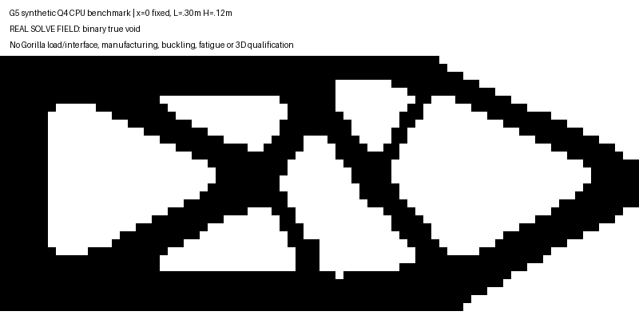

# Gorilla G5 CPU 拓扑优化工具链

用户明确：壮硕身体是留给承力骨架的三维空间，要求提高合金结构的强度重量比；AI 图只说明意图。后续利用宽厚设计域布置闭口承力、内肋和节点，同时保留电机、传动、电池、散热、运动及维修空间。原有粗框墙肋可重新分配，真实接口与必要功能空域才是不能随意删去的条件。

本检查点已完成工具研究、真实 CPU 多工况 Q4/SIMP 计算、二值真空洞重装配及独立 scikit-fem 字段对照。**这是合成二维工具算例，尚未优化 Gorilla 三维骨架，不提供机器人减重、强度或耐久资格。**

| 同边界合成计算 | 材料库存 kg | 加权柔顺度 J | 范围 |
|---|---:|---:|---|
| 实体 10 mm 满板 | 2.826000 | 0.03430028 | 合成 plane-stress 基线 |
| 实体 5 mm 满板 | 1.413000 | 0.06860056 | 目标相同库存基线 |
| 连续 SIMP 密度 | 1.413000 | 0.07214092 | 虚拟刚度，比上行差 5.16% |
| 二值 10 mm 真空洞 | 1.419623 | 0.05884706 | 全部实际材料保留，1 个面连通根 |
| 实体 5.0234375 mm 满板 | 1.419623 | 0.06828049 | 与二值严格同质量 |

二值候选在这组载荷下柔顺度比严格同质量满板低 13.82%，多出的 6.623 g 没有隐藏。80 次迭代在允许上限停止，change 0.026615，**未达到 0.01 收敛标准**。二值空洞无 Emin、没有删岛或补桥；所有支承/加载保留区仍在。密度过滤不提供制造最小壁保证。Q4 中心应力未网格收敛，屈服、压缩屈曲、疲劳、缺口/接触、三维和实际关节均未核，不能将该收益转写为吨级承载能力。



主线程用 scikit-fem 12.0.2 独立装配四种材料场，完整位移与中心 VM 字段的相对差约 1e−12；真实空洞保留同一全部材料。两个装配器的数值一致性通过，不意味着共同边界假设成为真实机器人。刚体/常应变/组装 patch、力矩平衡、灵敏度及网格差异均在报告中保留。

[实际计算短报告](benchmark/benchmark_findings.md) · [输入](benchmark/input.json) · [主线程独立字段对照](root_review/independent_field_comparison.json) · [工具/约束研究](research/topology_research.md)

计算依据来自 [DTU 作者论文](https://www.topopt.mek.dtu.dk/-/media/subsites/topopt/apps/dokumenter-og-filer-til-apps/topopt88.pdf)，Q4/SIMP 实现自研、未复制第三方代码。[scikit-fem 官方文档](https://scikit-fem.readthedocs.io/en/latest/)及 BSD 许可在研究来源中记录；运行库隔离安装、不修改项目锁。研究中的未执行安装提议属于较早状态，主线程随后已安装并完成上述对照。研究 preparer 的高载荷平板只是另一个输入准备样本，没有求解/优化/资格，不能与实际工具梁混用。

[快照清单](snapshot_manifest.json)记录精选原始/保存哈希，确定性压缩可还原。原厂下载和依赖运行时不入库；源/输入、实际计算场与独立检查均保留。恢复工具拒绝覆盖已变更 scratch 文件。

```bash
.venv/bin/python experiments/gorilla_v0_1/topology_g5_toolchain/restore_snapshot.py.txt --root "$PWD"
uv pip install --python .venv/bin/python --target .scratch/gorilla_topology_runtime --no-deps scikit-fem==12.0.2
.venv/bin/python .scratch/gorilla_internal_g5_topology_benchmark/run_benchmark.py --nx 80 --nz 32 --maxiter 80
.venv/bin/python .scratch/gorilla_internal_g5_root_review/compare_independent_fields.py
```

重算会产生新的时间戳/输入与报告身份；数组与结果按其精确范围比较，不能覆盖历史检查点。下一阶段绑定 [G4 实际组件](../internal_structure_g4_joint_study/README.md)或后续整机组件的真实载荷、接口和宽厚设计域，先三维基线、再材料优化和制造重建。状态见[唯一当前索引](../../../robots/gorilla_v0_1/design/current_decisions.md)，腿脚外观仍待用户指定的新稿。
