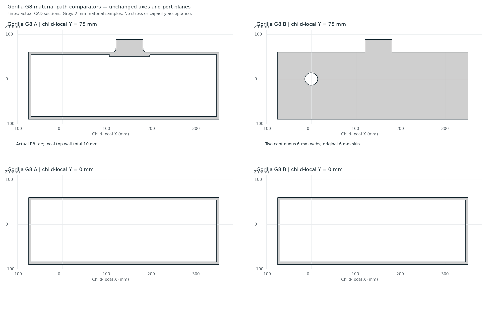

# Gorilla G8 宽厚三维材料路径对照

**内部体积确实可以用于建立更直接的传力路径。** 本轮在同一实际承力件上比较局部过渡与连续内肋，保留接口、外包络、轴孔、销孔和 keeper 孔，以及全部原 42 个指定反力工况。尚未运行 Gorilla 三维拓扑优化，也未放行强度、真实接触或整机能力。

这是独立关节 bench 的一个子承力件，不能将其坐标、质量或长缸直接套进机器人。新腿脚画稿仍等用户指定「Gorilla 设计」交回；本轮不改变外观。

## 同功能真实 CAD 与条件三维结果

| 候选 | 条件钢质量 | 六组压撑最差柔顺度 | 压撑最大去刚体位移 | 36 组驱动最大 VM，仅诊断 |
|---|---:|---:|---:|---:|
| G7：6 mm 闭口皮 | 31.985 kg | 66.117 J | 1.174 mm | 479.6 MPa |
| A：真实 R8 根部过渡＋局部 10 mm 顶壁 | 32.458 kg | 62.541 J | 1.178 mm | 479.5 MPa |
| B：6 mm 闭口皮＋两条连续 6 mm 内肋 | 37.295 kg | 11.425 J | 0.163 mm | 490.9 MPa |

E=210 GPa、ν=0.3、ρ=7850 kg/m³ 是本轮均匀材料假设，不是选定合金。A 局部补厚朝腔内增加 4 mm，外侧顶壁和加载平面保持。B 内肋在止挡下连接到顶墙、底墙及两端墙；融合后重新切功能孔。两新 CAD 都是有效单实体；实际七端口面积及名义位置不变。A/B 网格分别 422,697 / 401,748 tetra，新材料门禁、独立质量/完整惯量及四姿态/21 点抽鞋检查完成，仍只覆盖其离散几何范围。

压撑最差柔顺度：A 改善约 5.4%；B 改善约 82.7%，零件质量增加约 16.6%。同一个 case20 下，B 的质量×柔顺度约为 G7 的 0.202，说明这个**特定条件线弹性指标**有较好的材料使用效率；这不等于强度重量比或承载额定。A 尖角过渡降低局部峰值，却没有明显改善整体压撑位移；B 改善真实传力路径，但驱动热点仍高，不能称全面强度改善。

根线程将 B 连续承力路径作为后续共同布局和优化的探索基底，保留 A 作对照。B 的皮/肋不永久锁死，也不是新的整机定型。下一步先将腰髋—躯干—肩桥与完整机电组在同一源中安排，再按实际可用域做材料优化。

## 工况与数值证据

全部 42 个 G4 原工况保持：±25°与中立、两种驱动反力分配及机械压撑、CoP 左右 ±100 mm、factor1/1.5。不同候选各自的八个真实原始载荷列可在约 1e−12 N 绝对误差内重构全部载荷；仅减少线性求解次数，没有投影外载或减少工况。各候选使用自己的列基与系数，最大值取完整 42 工况。

求解使用原始平衡节点力。QR 选六个位移自由度只消除刚体模式，随后移除体积加权刚体位移；原始全力残差与极小 gauge 反力保持。独立 Agent 使用 scikit-fem 梯度及 σ·∇N·V 节点内力散装，未引入根线程应变/求解函数或新刚度矩阵；G7 case18/20 与 A/B case20 的应力相对差 ≤2.6e−13、内力对原外载残差 ≤1.35e−9。其余工况的汇总核验是对保存基底的完整重构，不能冒称独立梯度覆盖所有 42 个状态。

所有 VM 数值为未收敛粗网格诊断。完整 42 工况最大值分别为 G7 692.0、A 537.8、B 490.9 MPa；B 最大值已转到驱动 case7。真实轴承压力中心/预载/配合、销载荷分摊、压撑接合、螺栓、自重、动力、屈曲、疲劳和加工都仍开放。指定反力与任意向量 traction 不是接触解。3t 静态挑战及 factor1.5 不是 3t 行走或搬运能力。

入口：[根线程逐工况对照](root_review/root_envelope_comparison.json) · [CAD 报告](cad_variants/report.md) · [载荷包](load_envelope/load_envelope_review.md) · [独立数值审计](independent_audit/numerical_audit_review.md) · [整机功能占位评审](system_allocation/README.md)。

图线为实际 CAD 切面，灰填为 2 mm 材料采样；它不提供应力或承载证据。B 在肋平面呈连续材料、中央平面仍留主腔，不能把整块蓝白外甲或空腔都当作可任意填充的实体。

## 保存与下一整机入口

[snapshot_manifest.json](snapshot_manifest.json) 保存 84 条精选原始文件，包括两 CAD/体网格、真实全 42 载荷、源/装配/数值报告及 producer `.py.txt`。六个大型基底字段或可重建 gauge 数组留在忽略目录，只记录源哈希，未保存字节。隔离运行时、下载缓存、MSH和日志不入库。`decision_context_snapshot.md` 仅保存历史输入，不恢复或回退唯一当前索引。

先恢复 [G4](../internal_structure_g4_joint_study/README.md)、[G6](../topology_g6_3d_inputs/README.md)、[G7](../topology_g7_cad_baseline/README.md)及其依赖，再执行 `.venv/bin/python experiments/gorilla_v0_1/topology_g8_material_paths/restore_snapshot.py.txt --root /home/ethan/Projects/Sai_Rotbots`。恢复只写精选 scratch、拒绝覆盖改变的字节；不安装环境或恢复大字段。重算依赖及顺序见各原始报告，主入口为保存的 `solve_load_envelope.py.txt`，使用每个新源自己的实际门禁和载荷。程序输出应在新 scratch 路径执行，勿覆盖本轮冻结候选。

G9 已开始建立整机成员、功能与空间共同源，并探索真实宽厚主躯干 CAD。旧 F1 1794 件 context 的重新注册不是新几何或新净重，幽灵库存和四缺缸均须明确处理。系统表列实际电池、泵、HX、散热与维护占位，不把 AABB 当已证明的可用腔。首检查点、稳定 Gorilla SI 和自主双足双手复杂 Bevy 任务仍未完成。
