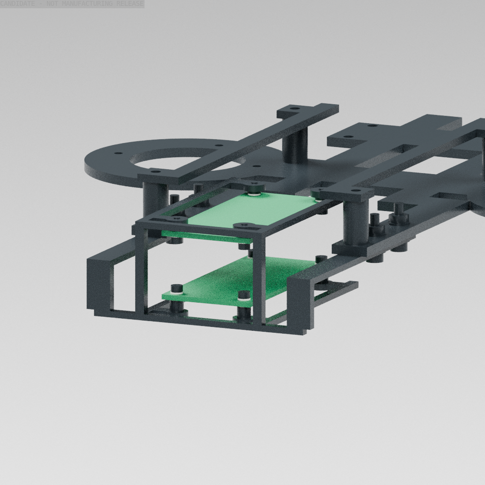

# 计算板与集线器的框架固定检查点

Radxa ZERO 3W 与 Waveshare USB HUB HAT (B) 现在有按各自厂商孔位设计的独立支承，并通过四组新 M3 孔连接到现有机身框架。42件自研原生实体、STEP/STL和128,820个闭合quad已保存，替换原底板后净增约 **28.991g**，保留原54g计算模块质量预留。**34个有限姿态中，有效源几何的增量筛查通过；Radxa 的一个无效厂商实体留下13组无法确认的接触，完整安装仍未通过。**



图示来自实际自研CAD、现有电池支承与两个自研PCB安装参考片；绿色片省略了电路、插口和pogo针，不是打印件。原始电路和连接器几何用于独立检查，没有因图示简化而删除。[可编辑Blender](../cad/source/compute_module_fixture/mount_review.blend)包含50件、147,396个quad；[身份检查](../evidence/compute_module_fixture_identity.json)核对了源哈希、顶点和边界。

## 已确定的安装关系

毫米坐标为X前、Y左、Z上；CAD没有加物理模型的3.7mm整机抬升。[配置](../configs/compute_module_mounts.json)记录全部孔位、厂商文件哈希与来源。

| 项目 | Radxa ZERO 3W | USB HUB HAT (B) |
|---|---|---|
| PCB名义外形 | 65×30×1.6mm | 65×30×1.6mm |
| 厂商PCB基准 | 顶面z=0，底面z=−1.6mm | 顶面z=0，底面z=−1.6mm |
| 到机身平移 | (−147.5,−15,301.6)mm | (−147.5,−15,321.7)mm |
| 固定孔 | 四个Ø2.8mm，按STEP与DXF逐孔坐标 | 四个约Ø3mm，58×23mm孔距 |
| 支承方式 | 下面的独立柱、上下尼龙垫片、M2×6 | 上面的独立柱、上下尼龙垫片、M2×6由下向上 |
| 名义M2啮合 | 3.4mm | 3.0mm |
| 保留的源实体 | 22件，其中1件无效 | 全部121件有效 |

Radxa资料来自[官方下载页](https://docs.radxa.com/zero/zero3/download)列出的V1.11 STEP/DXF。四个孔的坐标略不对称，不能直接照搬树莓派孔距；DXF圆半径1.4097mm与STEP的1.4mm差0.0097mm，已记录而非声称完全一致。集线器依据[Waveshare官方资料](https://www.waveshare.com/wiki/USB_HUB_HAT_(B))的2023年装配。实际购买的板修订必须匹配或重新核对，Radxa的RAM/eMMC选型仍待冻结。

两片PCB不共用贯穿叠板柱，避免孔位微偏叠加装配误差。集线器按原厂方向放置，USB-A插口朝下，pogo针朝上；上层支承在PCB上方，保留插口下方空间。两模块完整裸体的保守上下边界相隔约3.4mm；这不证明真实USB插头与线束能插入。

新四孔位于底板现有后侧纵梁：X=−96/−78，Y=±34mm。两毫米固定翼贴在3mm底板下面；M3×12从下向上穿过固定翼、底板、1mm总垫片和2.4mm螺母，名义总叠层8.4mm、露出3.6mm。原电池螺钉没有延长。底板候选是原[`torso_open_chassis_plate`](../cad/exports/body_bay_frame/torso_open_chassis_plate.step)增加四孔后的[替换STEP](../cad/exports/compute_module_mounts/torso_compute_mount_chassis_plate.step)，不覆盖原源。

[计算机架STEP](../cad/exports/compute_module_mounts/compute_dual_shelf_frame_carrier.step)为6061整体加工候选：2mm支承、3mm后侧连接、独立M2攻丝柱。加工刀具可达、装配顺序、内圆角、公差、局部强度与报价尚未完成，不能仅凭实体有效就标为制造放行。输出以原生CAD为主，quad/STL是交换和显示网格。

完整裸体需要把内部计算预留由80×48×32mm、中心z310mm，改为80×48×36mm、中心z312mm。只是增加4mm内部高度；外壳和关节未改，默认344件模型、台账与物理契约保持原哈希。新的预留仍是候选。

## 有限检查与保留的问题

[安装证据](../evidence/compute_module_mount_fit.json)覆盖34姿态，每姿态考虑11,114组包含新增件的组合，与225件现行原生实体、器件包络或已有电源固定件比较。共372次有时限的原生查询；没有超0.01mm³的非预期交集。42件自研输出的STEP回读、STL和quad闭合/绕序均通过，体积相对原生误差最大约0.0933%。[原生清单](../cad/exports/compute_module_mounts/manifest.json)保存每件质量、惯量和文件哈希。

Radxa原始主实体无效，一次修复仍无效，原文件与失败结果保留在本地`artifacts/Goose_V0.1/compute_module_vendor/`。检查完整保留其21件有效实体及无效主实体：无效体只能用包含它的原生AABB证明相离；AABB正交集或未知不能放行。四处螺钉、上下垫片和机架合计13组无法确认，因此`all_sources_sampled_fit_pass=false`，没有用任意碰撞过滤器隐藏它们。有限姿态通过不等于连续扫掠或整机通过。

同时核对[USB-CAN-A官方尺寸图](https://www.waveshare.com/img/devkit/accBoard/USB-CAN-A/USB-CAN-A-details-size.jpg)：总长78.52mm、壳体56.38mm、端子8.87mm、平面宽18.36mm。旧70×16mm预留不能完整容纳带USB头、外壳和端子的器件；当前仍保留旧版本并明确标错，下一版接口夹具须按实际插接方向重排。图没有给出厚度，不能从平面图虚构三维高度。

## 本次交付和下一步

[采购工作簿](../hardware/compute_module_mount_bom.xlsx)、[CSV](../hardware/compute_module_mount_bom.csv)及[追溯记录](../hardware/compute_module_mount_bom.json)覆盖9行、44件，其中42件为原生固定件/替换底板，2件为既选板卡。个体板卡质量、国内价格、加工报价、具体紧固件供方尚未闭合；采购放行仍为false。

下一步先收拢当前前端夹持、相机、电源和计算固定增量到同版整机参数，再补接口/保护件及机壳支承。连接器、应力释放、散热、电气绝缘、局部强度与真正装配顺序仍是工程门槛，不以这次局部检查宣布训练硬冻结或第三、第四阶段完成。

复现入口：

```bash
env PYTHONPATH=src PYTHONDONTWRITEBYTECODE=1 OPENBLAS_NUM_THREADS=1 .venv/bin/python scripts/cad/build_goose_compute_module_mounts.py
env PYTHONPATH=src PYTHONDONTWRITEBYTECODE=1 OPENBLAS_NUM_THREADS=1 .venv/bin/python scripts/diagnostics/check_goose_compute_module_mounts.py --wall-time 240 --pair-timeout 4
env PYTHONPATH=src PYTHONDONTWRITEBYTECODE=1 OPENBLAS_NUM_THREADS=1 .venv/bin/python scripts/diagnostics/build_goose_compute_mount_bom.py
env PYTHONPATH=src PYTHONDONTWRITEBYTECODE=1 OPENBLAS_NUM_THREADS=1 .venv/bin/python scripts/cad/build_goose_compute_mount_fixture.py
```

厂商原文件保留在本机、不随Git分发；下载地址和SHA256可以重取相同输入。保留失败源是为了可追溯，不代表认可其制造用途。
