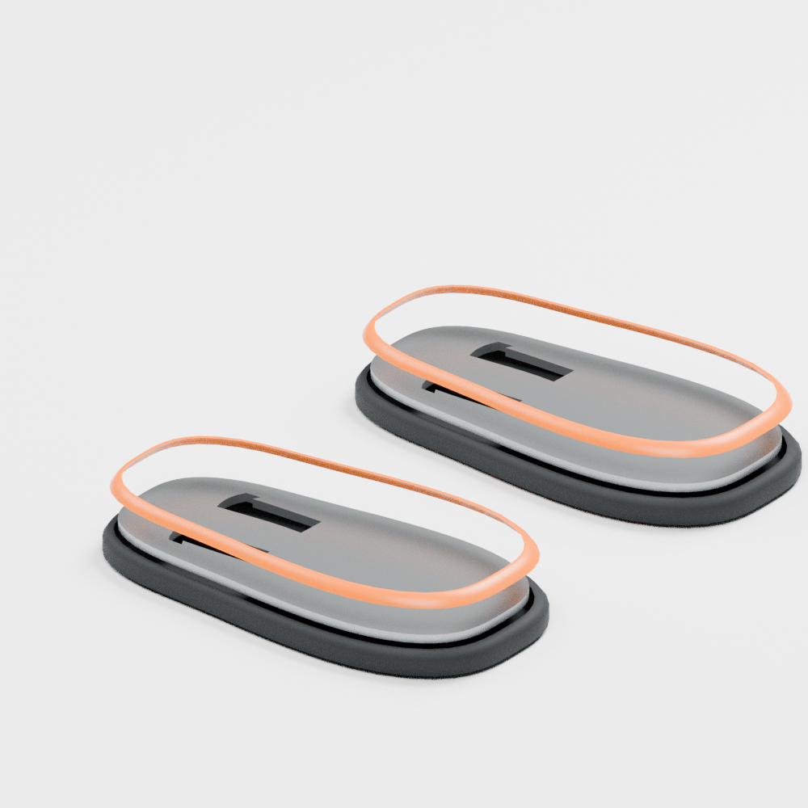

# 保持外观的脚底结构候选与嘴部传动筛查

本轮沿用[已确认外观](../evidence/accepted_appearance_baseline.json)，不覆盖其源文件。脚部完成一个可复现的结构分层候选；嘴部排除了把齿轮占位圆柱直接视为有效传动的做法。两项均不代表整机制造或行走验收通过。

## 脚底：接地轮廓不变，材料各司其职



图中金属板上移 10 mm、橙色包边上移 20 mm，便于查看，并非装配间隙。脚背与电机未显示。

- 保留原脚底底面、后跟、前掌展开和全部外侧四边面；黑色脚底改为约 3 mm 底厚的开口杯形件。
- 橙色层改成中空包边，并移除原模型埋入黑色底部的 `z=10.5–12 mm` 重叠带。该处理不是靠渲染隐藏穿插。
- 增加 4 mm 铝合金承力板毛坯及两处减重窗口。金属板承力，橙色包边负责外观；脚踝连接孔和上方框架尚待确定，不能直接下单。
- 按橡胶 1200、塑料 1250、铝 2700 kg/m³ 假设，替换前这部分为 **0.746 kg**，包含新金属板后为 **0.466 kg**，条件减重约 **0.280 kg**。这不包括尚未设计的安装件，也不意味着整脚或整机已经称重。

[质量与初筛记录](../evidence/foot_support_candidate.json)、[实体/STEP 核查](../evidence/foot_support_geometry.json)及[四边面核查](../evidence/foot_support_quad.json)分别保留。

六个新源网格均为闭合、绕序一致的四边面网格。每只脚的脚底、包边与承力板三者交集体积均为 0；原接地面与脚底外侧面保留。两片板的 STEP 回读有效，体积与四边面源一致。STL 作为三角化交换格式，不能用其面类型判断源网格是否四边化。

125 N 点载荷的变截面梁初筛，假设踝部固定边位于 `x=31 / 75 mm`、铝弹性模量 69 GPa：后跟工况名义最大应力约 **48 MPa**、挠度约 **0.98 mm**；前掌约 **16 MPa / 0.035 mm**。它忽略窗口角部应力集中、真实连接柔度和二维板效应，不能据此宣布强度合格。之后须先完成真实固定接口，再做结构验证；步行冲击、摩擦和接触模型也尚未确定。

源文件与交换件：

- [六件四边面数据](../cad/source/foot_support_candidate/foot_parts.json)、[可编辑分解 Blender](../cad/source/foot_support_candidate/foot_support_exploded_quad.blend)
- [右承力板 STEP](../cad/exports/foot_support_candidate/right_foot_load_plate.step)、[左承力板 STEP](../cad/exports/foot_support_candidate/left_foot_load_plate.step)
- [右脚底 STL](../cad/exports/foot_support_candidate/right_foot_sole.stl)、[左脚底 STL](../cad/exports/foot_support_candidate/left_foot_sole.stl)
- [右包边 STL](../cad/exports/foot_support_candidate/right_foot_trim.stl)、[左包边 STL](../cad/exports/foot_support_candidate/left_foot_trim.stl)

STEP 目前只包含承力板毛坯。头、喙、脚背仍保留外观实体；本轮没有把它们冒充完整打印件。

## 嘴部：不能用减速比代替传动强度

50 N 在距铰轴 80 mm 的接触点对应 4 N·m。假设总效率 0.75、减速比 3，电机需约 1.78 N·m；仅这一步不足以证明夹力可实现。

| 完整成品齿轮参考 | 中心距 | 成对目录质量 | 初筛结果 |
|---|---:|---:|---|
| SS0.5-20A / SS0.5-60A | 20 mm | 68 g | 所需力矩超过目录弯曲与齿面参考值，不能据此选用 |
| SSG1-20 / SSG1-60 | 40 mm | 294 g | 清除目录数值筛查，但体积、重量显著增大，仍未适配当前头部 |

尺寸和数值来自 [KHK SS](https://khkgears.net/pdf/ss.pdf)及 [KHK SSG](https://khkgears.net/pdf/ssg.pdf)。[KHK 选型说明](https://khkgears.net/pdf/spur-tech.pdf)要求结合实际工况重新计算；目录的配对、润滑、寿命和支承假设不等同于本机的小角度往复夹取。切成扇形、减薄轮毂后也不能原样继承目录额定值。

[输入目录摘录](../hardware/beak_gear_catalog_screen.json)与[可复现计算](../evidence/beak_gear_catalog_screen.json)保存了两种候选及淘汰理由。原 24 mm 轴距占位尚无具体齿轮 SKU，不能断言所有相同尺寸的定制金属齿轮都失败，也不能把它视作已通过。

后续优先完成**带独立支承的可采购/可加工传动组件**，再决定是否小幅调整内部布局。还需核对轴承、轴和联轴器、壳内净空及头部质量；不会直接给头部塞入 294 g 的完整大齿轮组，也不会以更大电机代替齿轮和支撑验证。

## 复现

在仓库根目录安装 `assets` 与 `cad` 可选依赖，运行：

```bash
uv sync --extra assets --extra cad
.venv/bin/python scripts/cad/build_goose_foot_support.py
.venv/bin/python scripts/diagnostics/check_goose_foot_support.py
.venv/bin/python scripts/diagnostics/check_goose_editable_quad_mesh.py robots/Goose_V0.1/cad/source/foot_support_candidate/quad_source/*.obj --report robots/Goose_V0.1/evidence/foot_support_quad.json
.venv/bin/python scripts/diagnostics/screen_goose_beak_gears.py
```

生成脚部候选时，同时在 `artifacts/Goose_V0.1/foot_support_candidate/` 输出整机预览场景及 `exploded/scene.json`。用 `scripts/models/render_goose_fuller_exterior.py` 的 `foot_detail` 视角渲染后，将分解场景的 Blender 保存为 `foot_support_exploded_quad.blend`；该文件含显示用分解位移。装配坐标以 `foot_parts.json` 和 OBJ/STEP 为准。
