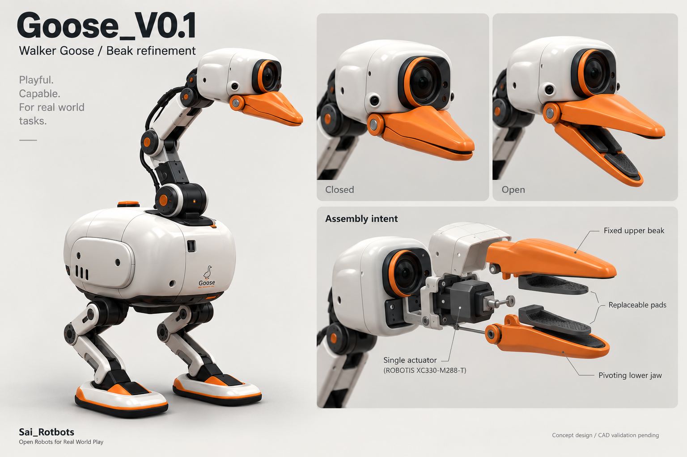

# Goose_V0.1｜柔顺鹅喙夹爪设计

**版本：beak_refinement_01 · 2026-09-27**  
**状态：外观与机构候选方案；尚未完成制造 CAD、打印装配或实物验证。**

## 1. 本轮设计

以已选中的 B 步行鹅为基线，保留身体、双腿、宽脚掌、长颈、头壳及相机的相对位置。
本轮修改嘴形、嘴内接触结构和嘴部执行器配置，不重新定义全机尺寸或颈腿关节数量。

嘴部由**固定上喙、单轴活动下喙、单个 XC330-M288-T、双侧支撑和一对可换柔顺垫**组成。
上喙厚、下喙薄，俯视轮廓向前收窄；侧面具有适度背脊和圆钝嘴尖。上下鹅喙本身就是夹指。
相机在上喙上方保持原有视觉关系，嘴根机构尽量收进头部下方/后方的现有可用空间。

本包图像用于确认外观与组件关系。尺寸、质量和夹持能力以本文件的状态标记及后续 CAD/试验为依据，不能从生成图测量。

## 2. 接触结构

### 2.1 刚性骨架与柔顺垫分工

外部橙色刚性骨架负责外形、安装和传力；内侧深灰色软垫负责接触与局部适形。
软垫的工作面略高于周边硬壳，并保留向内部变形的空间。
软垫通过卡槽与压紧件固定，避免反复拉取时脱落。

同一对软垫包含两个区域：

| 区域 | 几何建议 | 第一阶段用途 |
|---|---|---|
| 嘴尖精捏区 | 窄而较实、相向对合、圆钝边缘 | 布带、织物外露角、纸板边、物体突出部 |
| 嘴内夹持区 | 稍宽、浅圆弧或浅 V 槽、背部空腔和肋条 | 小圆柄、拉环、轻量玩具、有合适抓点的不规则物 |

SO101 的柔顺夹爪设计提供 TPU 95A 空腔/肋条的参考与打印文件 [S04]。
Goose 的外形和 X330 安装接口需重新设计；本包没有复用未修改的 SO101 STL，也未交付其派生制造文件。

### 2.2 单轴机构的实际边界

下喙绕轴运动，不是平行夹爪。大开口状态下可能把物体向嘴外挤出，必须在目标物体上测试。
用头部已有的滚转、俯仰和偏航改变夹取方向；可用角度以现有头颈工作空间与碰撞检查为准。
优先夹边缘、拉环和突出部；完全贴地的纸片不作为这一版的必达任务。

## 3. 参数表

以下前七项是本方案的设计起点或目标，**不是测量结果或生产公差**。

| 项目 | 数值 | 单位 | 状态 | 说明 |
|---|---|---|---|---|
| 嘴根至嘴尖外伸 | 50–60 | mm | 设计起点 | 在相机与嘴根实际装配包络确认后调整 |
| 嘴根外形宽度 | 30–35 | mm | 设计起点 | 不含未确定的侧支撑外凸；总成宽度需另核算 |
| 嘴尖有效夹取宽度 | 8–12 | mm | 设计起点 | 钝端对合；不做尖锐针尖或倒钩 |
| 闭合嘴根外形高度 | 20–25 | mm | 设计起点 | 上喙体积为主；电机允许部分进入既有头壳 |
| 嘴尖开口 | 25–35 | mm | 设计目标 | 与铰轴至接触点距离联算，不按图量尺寸 |
| 嘴部总成质量 | ≤70 | g | 设计预算 | 包括驱动、支架、嘴壳、软垫和局部线材；不含原相机/头壳；未称重 |
| 嘴部主动自由度 | 1 | 轴 | 本轮选定方案 | 固定上喙，活动下喙；侧向夹取使用现有头部姿态 |

外形尺寸指喙壳及接触区，不等于包含电机、支架和插头的整套安装包络。
电机可部分占用既有头壳内空间，但不能挤占相机的实际板卡、插头和散热空间。
当真实硬件无法容纳时，应回到安装关系调整壳体局部，不以缩小商品零件模型解决冲突。

## 4. 驱动、支撑与采购

### 4.1 唯一主选驱动

嘴部样测型号为 **ROBOTIS XC330-M288-T ×1**。
厂家给出的重量为 **23 g**，外形为 **20×34×26 mm**，采用全金属齿轮；
推荐供电 **5 V**，允许范围 **3.7–6.0 V**，支持电流及基于电流的位置控制 [S01]。
这些厂商参数不等于 Goose 的连续夹持能力。

原型双侧支撑优先使用 **FPX330-H101** 套件中的一组框架、惰轮与配套紧固件 [S03]；
整套商品包含四组。实际应用一组，采购计价仍按买一整套处理。
最终是否保留商品框架或改为经过验证的定制支架，取决于装配包络、刚度和重量。

驱动壳体固定在头部承力座上，输出端连接下喙驱动侧，对侧惰轮提供同轴支撑。
上喙固定在同一个头部承力结构上。不可把上喙固定在跟随下喙转动的活动框架上。
内部圆形外观盖是护罩，不表示真实电机为圆柱，也不能代替支撑件。

### 4.2 采购入口与价格口径

- XC330-M288-T：美国官网参考 **US$103.39/个** [S02]。
- FPX330-H101：美国官网参考 **US$11.27/四组套装** [S03]。
- 两个已报价条目的整包参考小计由 Excel 公式计算；其余打印、材料、线材和补充五金未报价。
- 核对时两个官网页面均有“Sold out”标记。未核实中国现货、交期、税费和运费。

具体数量、采购单位、随箱件复用和打印费用归属见
[采购工作簿](../../../hardware/history/beak_hinge_r1/beak_bom.xlsx) 或 [BOM CSV](../../../hardware/history/beak_hinge_r1/beak_bom.csv)。
CSV 是本次工作簿的同步快照；后续修改数量与状态时需同步重新导出。

## 5. 打印与加工零件

| 编号 | 零件 | 数量 | 工艺候选 | 关键结构 |
|---|---|---|---|---|
| F01 | 刚性上喙 | 1件 | 打印刚性骨架 | 固定在头部内部支架；上厚、带背脊、前端收窄、圆钝嘴尖；内侧留上垫卡槽。 |
| F02 | 刚性下喙 | 1件 | 打印刚性骨架 | 比上喙薄；单轴转动；双侧支撑接口、机械止挡、下垫安装槽。 |
| F03 | 上柔顺接触垫 | 1件 | TPU 95A样件 | 嘴尖较实的精捏区+后段浅槽与肋条空腔；受压不顶到刚壳。 |
| F04 | 下柔顺接触垫 | 1件 | TPU 95A样件 | 与上垫成对对合；保留变形余量与机械固定；不靠胶独自承载。 |
| F05 | 嘴根安装座 | 1件或总装后拆件 | 打印/金属加强按试验选择 | 与现有头部承力件连接；容纳真实电机、惰轮和插头，不只按机壳外轮廓占位。 |
| F06 | 嘴根局部护盖 | 1组 | 薄壁打印 | 保护根部夹点，保持检修和散热路径，不挡相机视场。 |
| F07 | 接触垫压紧件 | 1组 | 打印件+随箱/补充紧固件 | 防止软垫被反复拉脱；数量由卡槽设计确定。 |

打印件详表是 B04/B05/B06 费用的结构分解，不另外重复计价。
先用刚性材料制作嘴壳原型、TPU 95A 制作垫片样件；通过夹持、蠕变和循环测试后再确认材料与工艺。
安装孔、轴线、螺钉长度和配合公差必须来自厂家接口资料与实际装配 CAD。
本包的零件名是后续建模名称，不代表对应 STL/STEP 已存在。

## 6. 装配与电气顺序

1. 测量并确认既有相机板、镜头、头部安装座和连接器占位。
2. 按真实 XC330 外形与接口建立嘴根 CAD，加入舵盘、对侧支撑、线材和活动扫掠空间。
3. 固定驱动壳体与上喙，装入下喙及惰轮；断电手动检查全行程，确认不碰撞。
4. 安装上下软垫和压紧件，使软垫先接触、硬壳不抢先顶住。
5. 加装局部护盖并固定线材；复核低头与侧头时的相机视野和插头受力。
6. 在受支撑的台架上接入受保护的 5 V 供电及已规划的 DYNAMIXEL 总线，先进行低电流开合。

上电前设置不冲突的执行器 ID，并核对电压、极性与实际线序。
本轮不新增相机或主控，不把尚未验证的接口称为即插即用。

## 7. 控制与验证

### 7.1 最小控制行为

接近 → 减速闭嘴 → 根据电流和位置变化判定疑似接触 → 限流保持 →
小幅提起并确认物体仍被夹住 → 收颈搬运 → 主动张嘴释放。

电流不是校准后的嘴尖夹力。必须在不同开口和接触位置测量实际夹力，再确定低、中档保持参数。
厂家文档说明 Current-based Position Control 模式不使用普通 Min/Max Position Limit [S01]；
所以需要命令范围限制、机械止挡、超时与异常退出共同工作，不能只设置位置限位寄存器。
不要持续向机械止挡加力；故障处置以停止运动、受控释放并支撑整机为原则。

### 7.2 台架验收记录

| 检查 | 建议方法 | 通过依据 |
|---|---|---|
| 装配与碰撞 | 断电检查开合、插头和头颈姿态 | 全行程无硬碰，软垫固定可靠，夹点可防护 |
| 精捏接触 | 外露布角、带子与纸板边 | 两侧实际对合、提起后不立即滑脱、能够释放 |
| 嘴内夹持 | 指定圆柄/拉环/玩具 | 无明显挤出，软垫无扭脱，记录抓点与开口 |
| 分级持握 | 20/50/100 g 指定试件 | 每档记录电流、温升、滑移及保持时间，不直接推断整机载荷 |
| 视野 | 靠近地面、俯视和侧头姿态 | 可见工作区，记录最后接近阶段遮挡情况 |
| 循环与退出 | 重复开合；主动停止；通信中断 | 不顶死，不持续堵转，故障后动作可控 |

测试档位和动作是后续建议，不是已通过结果。验证记录应关联这一版几何、软垫材料、供电与控制配置。

## 8. 图、文、BOM 的对应关系

- 效果图的橙色上喙/下喙 → F01/F02。
- 深灰内垫 → F03/F04。
- 嘴根驱动与双侧支撑 → B01/B02/F05。
- 局部护盖和压紧件 → F06/F07。
- 整机主图只展示嘴部与已选步行鹅的整体关系；全机硬件与运动能力不由这张图定型。

后续给建模 Agent 的输入顺序：本文件 → BOM → 厂家接口资料 → 效果图。
先交付可检查的头嘴局部 CAD 和装配证据，再输出制造文件。
代码仍按仓库规范归入公共源码或脚本目录；机器人目录只保存对应资料与资产 [S05]。

## 9. 原始来源

- [S01] [XC330-M288-T 规格与控制表](https://emanual.robotis.com/docs/en/dxl/x/xc330-m288/) — ROBOTIS e-Manual；核对日期 2026-09-27。
- [S02] [XC330-M288-T 官方采购页](https://robotis.us/products/dynamixel-xc330-m288-t) — ROBOTIS AMERICA；核对日期 2026-09-27。
- [S03] [FPX330-H101 四组套装与随箱件](https://robotis.us/products/fpx330-h101-4pcs-set) — ROBOTIS AMERICA；核对日期 2026-09-27。
- [S04] [SO101 柔顺夹爪设计与打印参考](https://github.com/TheRobotStudio/SO-ARM100/blob/main/Optional/Compliant_Gripper/README.md) — TheRobotStudio；核对日期 2026-09-27。
- [S05] [Sai_Rotbots 工程目录与命名规范](https://github.com/sgyli7/Sai_Rotbots/blob/main/sai_robots_engineering_rules.md) — Sai_Rotbots；核对日期 2026-09-27。
- [S06] [Sai_Rotbots 机器人登记](https://github.com/sgyli7/Sai_Rotbots/blob/main/robots/catalog.json) — Sai_Rotbots；核对日期 2026-09-27。
- [S07] [MicroDuck 项目参考](https://github.com/pollen-robotics/microduck) — Pollen Robotics；核对日期 2026-09-27。

项目规则核对 SHA：`4b53b6ad545acfad44fae5f05ba543ff2df7a219`。  
本包没有修改远端仓库、登记文件或控制代码。引用第三方几何并准备分发时，应另行核对具体资产许可证。
