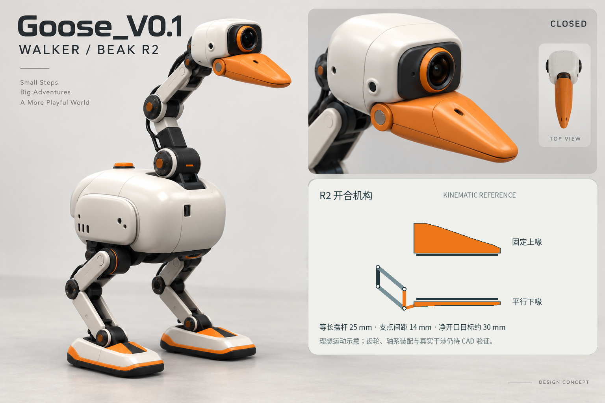

# Goose_V0.1 / Walker · Beak R2

**2026-09-27 · 方案效果与工程说明配套包**

步行鹅身体和双足沿用已选方向；嘴部采用固定上喙、平行运动下喙、单台 XL330-M288-T、嘴内柔顺垫及被动微摆。上下喙本身就是夹指，头部滚转负责改变抓取方向。

## 文件入口

| 文件 | 用途 |
|---|---|
| [R2设计效果图](../../concepts/history/beak_parallel_r2/goose_walker_r2_design.png) | 当前全身与闭合嘴部效果；开合小图使用公式化示意 |
| [嘴部运动示意](../../concepts/history/beak_parallel_r2/beak_r2_motion.png) | 由R2公式生成；平行下喙、收尖轮廓、理想开口和前向扫动 |
| [嘴部机械说明](goose_v0.1_walker_beak_r2_docs_goose_beak_r2.md) | 机构、尺寸/质量目标、执行器、接触区、控制与验证 |
| [整体结构说明](goose_v0.1_walker_beak_r2_docs_goose_walker_r2_structure.md) | 主控、相机、躯干、双腿、供电与嘴部的关联；已同步R2 |
| [采购工作簿](../../../hardware/history/beak_parallel_r2/goose_walker_r2_bom.xlsx) | 保留整机候选，新增嘴部采购、嘴部打印、R2可复算参数分表 |
| [嘴部采购CSV](../../../hardware/history/beak_parallel_r2/beak_r2_purchase.csv) | 便于工作区脚本/Agent读取，与工作簿同源 |
| [嘴部打印件CSV](../../../hardware/history/beak_parallel_r2/beak_r2_print_parts.csv) | 零件目录与加工放行条件，与工作簿同源 |

## 当前设计基线

| 项目 | R2输入 |
|---|---|
| 喙形 | 根部较高、上背略拱、俯视收尖、前缘圆钝；不采用平板鸭嘴 |
| 驱动 | 一台XL330-M288-T；约2:1减速；无额外嘴部电机 |
| 下喙 | 双侧平行四边形连杆约束姿态；不是普通大角度下巴铰链 |
| 夹持垫 | 同一副垫的窄尖/浅V槽/近根持物区；下垫约±4°被动微摆 |
| 几何目标 | 外露喙长60–65mm、根宽30–34mm、尖宽12–14mm；净开口目标约30mm |
| 质量预算 | 嘴部模块≤65g，含嘴部电机；不含相机、头壳和颈轴 |
| 全机执行器 | 仍是候选18台；本次嘴部1台已包含于整机A02，不能重复计数 |

## 工作区使用

解压后保留文件夹内部相对路径。可把整个目录放在 `Sai_Rotbots/Goose_V0.1/Design_R2/`，无需改动现有项目。

后续执行以 **嘴部R2机械说明与工作簿 → 整体结构说明 → 效果图** 的顺序理解；效果图不定义隐藏机构、孔位、惯量或性能。制造前先完成真实电机/相机包络装配、全行程干涉、视野与走线，再做单嘴台架；关节与物体均使用真实接触，不以隐藏抓附代替夹持。

**交付范围：**本包包含方案效果图、参数化运动示意、说明与候选物料；没有制造CAD、可直接打印的STL或实机验收结果。旧的55cm、6–8kg、2–4小时等图内数字不是当前规格。整机表中的价格为上一轮记录，嘴部新采购价格待询。

没有向GitHub提交文件，也没有进行采购。原始资料保持不变，此目录为配套新版本。
