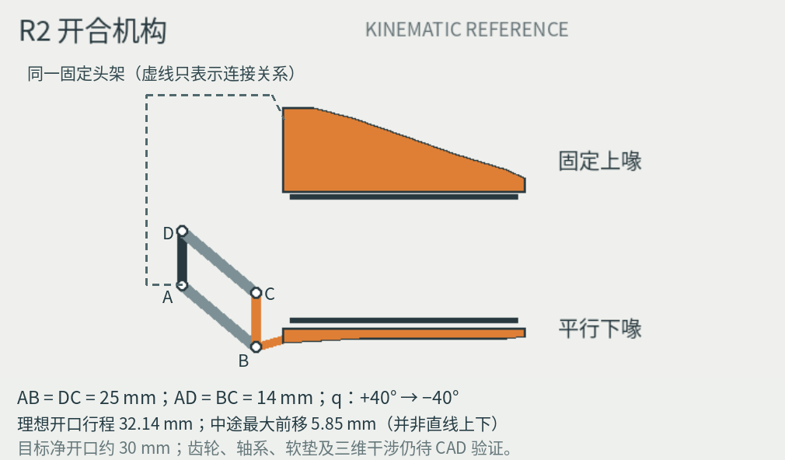

# Goose_V0.1 — R2 开合机构复核
日期：2026-09-28。范围：核对用户补充图，并整理工作区接续资料。
状态：**理想平面运动学成立；制造装配及实机尚未验证。**



## 1. 图里正确的部分及需要补齐的定义
用户图的四连杆拓扑可以成立。定义下方固定轴为A、上方固定轴为D，下方活动轴为B、上方活动轴为C。
必须同时满足 AB=DC=L、AD=BC=h；两侧均取普通非交叉的平行四边形装配支路。
上喙、A、D固定在同一个头部承力架。图中新增的虚线仅表达这种刚性连接关系，不是支架外形设计。
下喙与BC固连，因而理想运动时朝向不变；下垫的被动微摆是另一接触自由度，不代表下喙刚体大角度转动。

最重要的措辞修正：**“平行下喙”表示朝向保持，不表示沿竖直直线运动。**
其上、下方向和前后方向位置都随摆杆角改变。普通刚性四连杆不需要新增第二台嘴部电机。

## 2. 可复算的坐标与公式
坐标：X向前，Z向上；各主铰轴沿Y。A=(0,0)，D=(0,h)，角q从+X朝+Z为正。
B=(L cos q, L sin q)，C=B+(0,h)。
下喙刚体与BC固定，姿态恒定。以下开口以闭合时两片**未压缩接触垫刚接触**为g=0，
而不是拿橙色外壳边缘测距离。

```text
g(q)  = L [sin(q_closed) - sin(q)]
dx(q) = L [cos(q) - cos(q_closed)]
q(g)  = asin[sin(q_closed) - g/L]       # 使用(-90°, +90°)分支
```

输入沿用既有R2：L=25mm、h=14mm、q_closed=+40°、参考q_open=−40°、传动角位移比i=2。

| 检查量 | 本次复算 | 含义 |
|---|---:|---|
| 参考开口行程 | 32.139mm | ±40°两个端点的理论位移 |
| 中途最大前移 | 5.849mm | q=0处，相对闭合位置 |
| 参考全开/闭合水平差 | 0mm | 两端相同不等于全程不扫动 |
| 30mm目标开口的角度 | -33.863° | 提前于−40°停止的理想位置 |
| 30mm位置的前移 | 1.608mm | 与闭合位置相比 |
| 达到30mm的舵机角行程 | 147.726° | 2:1角位移比，不含真实电机零位 |
| 完整±40°参考舵机行程 | 160° | 与30mm目标应区别 |
| 到主杆共线位形的角度裕量 | 50° | 仅理想几何，不是实体碰撞间隙 |

**32.14mm不是扣除任何固定“安全余量”后自动等于30mm。**
实际净开口、闭合零点、止挡位置、软垫厚度/压缩量，需要装配和首件标定。
全行程都应保留最多约5.85mm前向扫动的检查空间；闭合接触时也可能推动物体，需低速接近。

## 3. CAD应检查的四项结构问题
1. **固定链与传力：**上喙不能“悬空固定”；头架要承受来自固定轴和夹持面的载荷。
2. **传动方向：**只驱动一根摆杆轴，用连杆约束和左右共轴同步。不要将上下两个固定轴用一对外啮合齿轮反向驱动；平行摆杆需要同向。
3. **双侧同轴与轴向释放：**左右各一组四连杆会对制造误差敏感，应明确支撑、轴向浮动/限位及装配基准，避免拧紧就卡死。
4. **实体扫掠：**检查齿轮直径、法兰、螺钉、相机、插头、护罩及软垫压缩；14mm并非已验证的齿轮中心距，25mm也只是铰轴中心距。

不改变已选步行鹅身体、相机布局、嘴内夹持原则；不新增轮子、Cargo或嘴下外挂夹爪。

## 4. 版本与采购口径
当前恢复的R2资料采用单台**XL330-M288-T＋约2:1减速**；此前本聊天的beak_refinement_01则采用**XC330直接驱动铰接下喙**。
两者均保留来源，前者为这次平行机构的工作候选，后者为历史方案，不能混合原BOM直接制造。
本次没有重新选购电机，也没有更改整机18台候选数量。材料、轴、齿轮和预算保留待验证状态。

R2工作簿新增“R2机构复核”页，输入引用既有“R2参数”；嘴部和整机表保持父子关系，不能重复计价。
XL330产品页仅用于核实原候选的规格/控制接口，不是Goose的持续力矩或可靠性证明：
https://emanual.robotis.com/docs/en/dxl/x/xl330-m288/

## 5. 本次完成与未完成
已完成：平面运动复算、原图精确标注、在原R2设计板中替换机构卡片、公式表同步、资料回收与本地相对链接整理。
未完成：三维装配/CAD干涉、强度、夹力/温升、相机视野、打印制造、实机或客户端模式切换。
没有提交GitHub，也没有把文件写到用户电脑。资料包需由用户在Work/Codex中开放对应本地目录后导入。

复算脚本：`scripts/diagnostics/goose_beak_r2_kinematics.py`（相对于交付包根目录）。
结果：[JSON](../evidence/beak_r2_kinematic_check.json)。本结果仅为数值检查记录，不是硬件验收。
