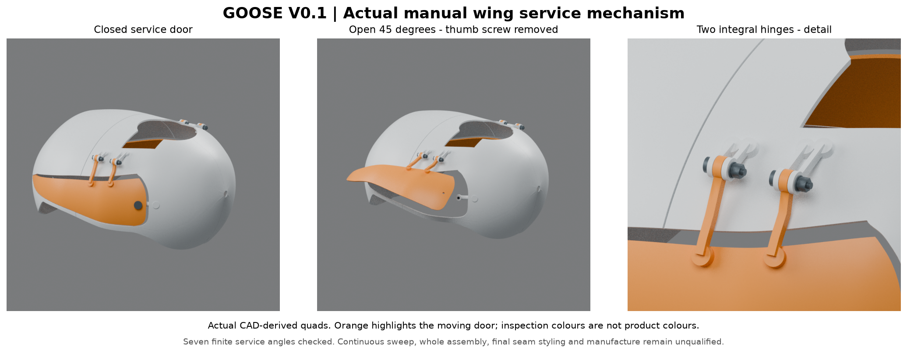
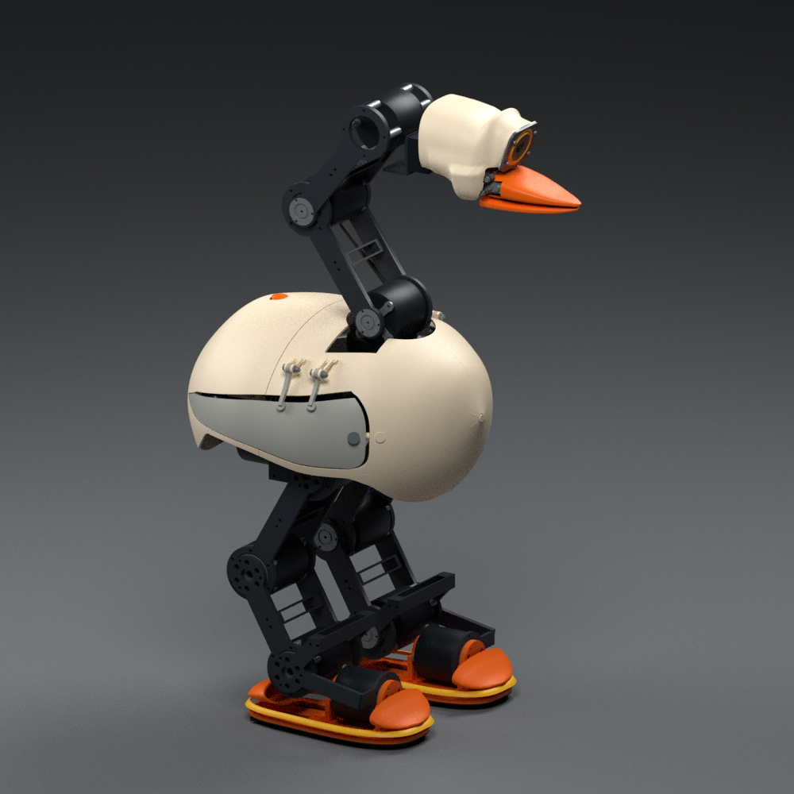
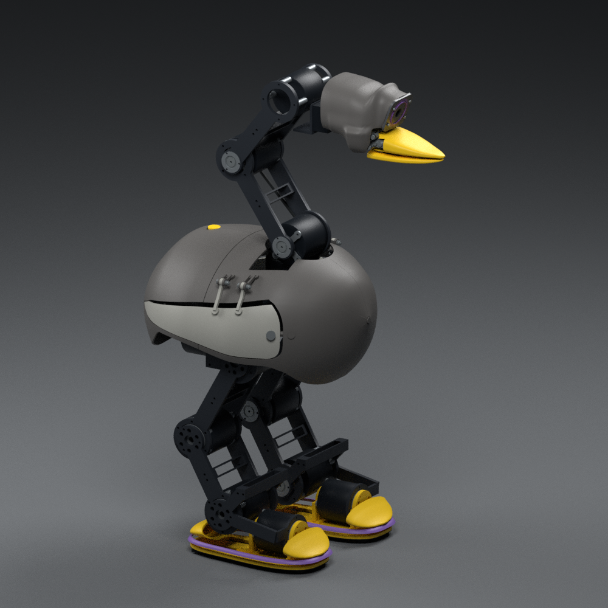
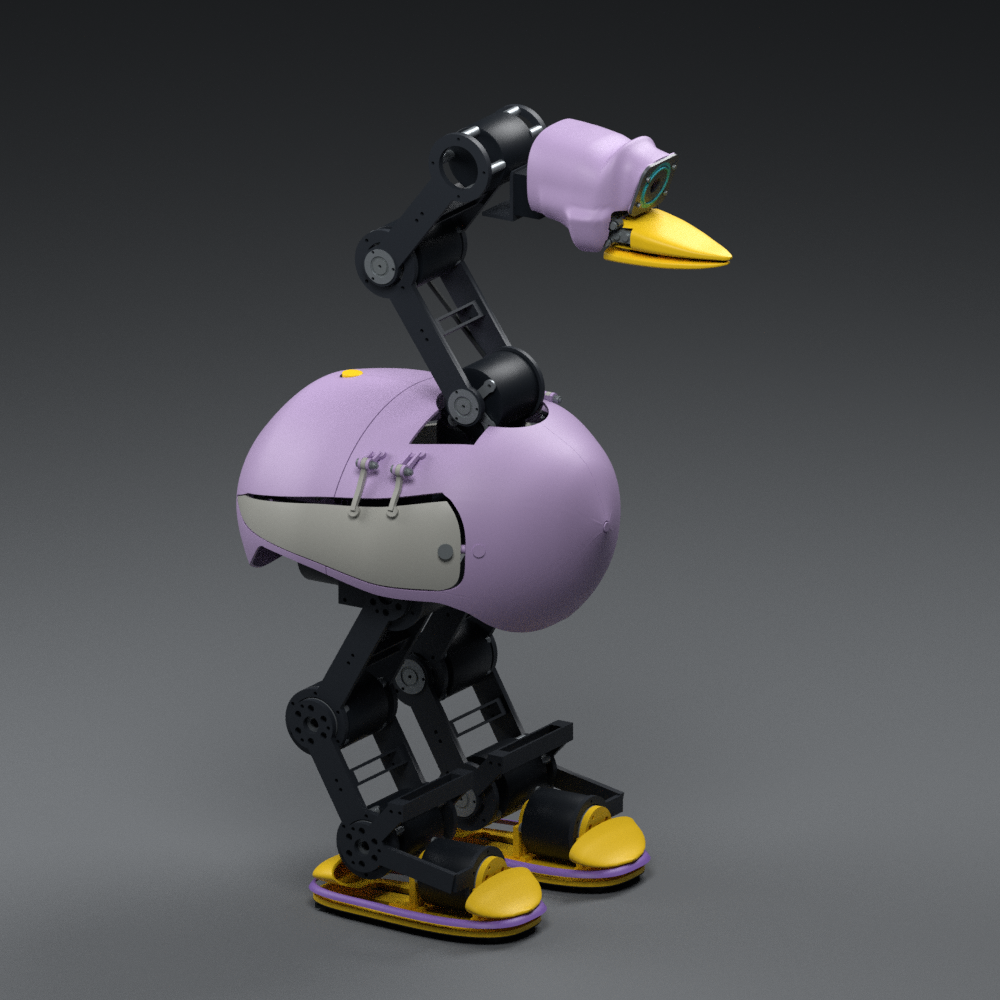
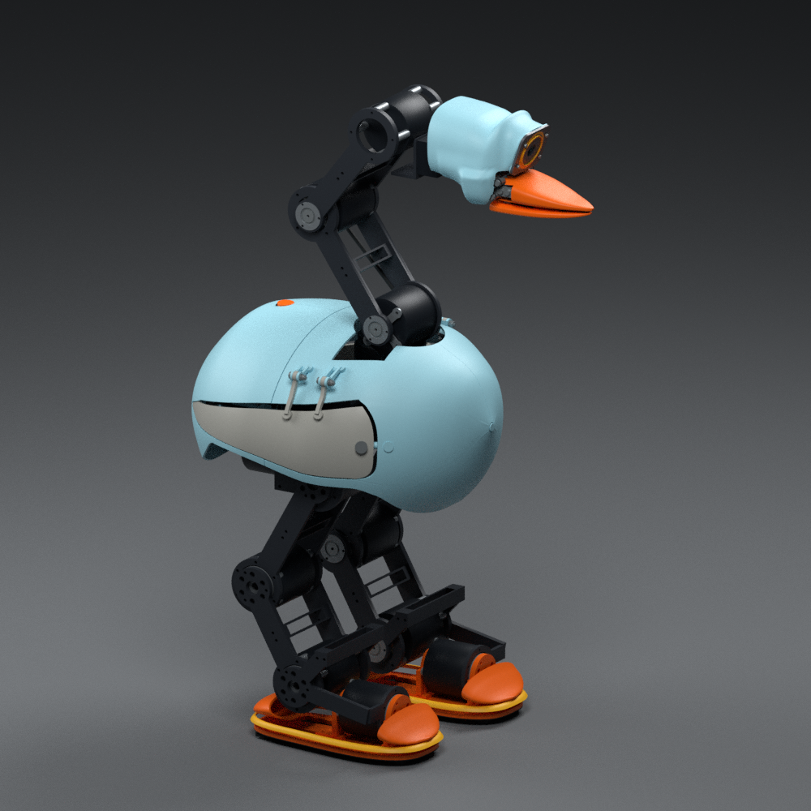

# 手动翼形检修门与同版整机检查点

本版把自交修复后的身体曲壳、四处屋顶支承、颈部圆形开口、实际手动铰链和关闭保持件合入独立整机源。它替换460对象版的六片旧壳，并增加18件名义采购五金，形成**478显示对象、18主动轴、闭嘴19体SI、10.398672986kg条件质量**；比前版减轻32.089617g。其余器件、轴序、主连杆与质量预留保持。原460源与003运行包保留，新增CAD/SI没有冒充已冻结的训练版本。

这是带实际连接的结构检查点。有限几何与静力通过，**完整制造、电气、动力学及最终外观尚未放行**。翼门上沿仍有明显接缝，外露铰链也需最终审美与实体配合验收；本版图不称为一比一最终制造外观。



图中橙色仅标识活动门片。图由24件CAD派生quad在Blender 4.0.2实际渲染，没有改几何或视口切面；开门图先移除该侧手拧螺钉和垫圈。

## 结构与装配关系

| 部位 | 当前名义构造与边界 |
|---|---|
| 固定壳 | 保留名义2.4mm曲壳，加入四处屋顶PETG凸台、M3热熔螺母底孔和半径44mm颈部开口；对接原有框架支承与名义五金 |
| 每侧双铰链 | 两轴中心X−5/+27mm，轴平行X；右Y−109/Z371mm、左侧镜像。活动桶4mm、两固定桶各2.5mm，两轴向间隙各0.25mm；总塑料叠层9.5mm |
| 铰链保持 | 四套[MISUMI MSB4.5-10轴肩螺钉](https://sg.misumi-ec.com/vona2/detail/110300249140/?HissuCode=MSB4.5-10)、M3垫圈及DIN985锁紧螺母。D4.5mm轴肩、L10mm、M3端螺纹，名义0.5mm轴向余隙；螺母在金属轴肩处锁紧，不能靠压紧塑料桶来消除余隙。见[原厂尺寸表](https://th.misumi-ec.com/pdf/fa/2010/p2_0209.pdf) |
| 打印转孔 | D4.8mm对应D4.5mm轴肩；0.3mm名义直径余隙未替代打印收缩、实际公差、旋转磨损与轴肩退刀槽检查 |
| 每门关闭保持 | 一件可取下的[DIN653-M3-8手拧螺钉](https://www.elesa-ganter.com/siteassets/PDF/EN/DIN%20653.pdf)、垫圈、Ruthex RX-M3x5.7与固定壳内部承接座；不是磁吸或仅靠摩擦。名义螺纹有效进入4.6mm，距螺母末端1.1mm；热熔安装、拔出力与拧紧力矩待资格 |
| 运行归属 | 两门运行时关闭，质量归torso，不增加执行器或策略轴。服务位仅用于检修；手拧件不是防丢的俘获螺钉 |

先将四处屋顶固定壳连接到原框架，再配装每侧双铰链轴肩螺钉、垫圈和锁紧螺母；确认门片自由转动后，装闭合插入件及手拧件。实际装配工具可达、框架/线束全路径、开门限位、局部承力和打印材料试件尚未通过，以上是名义关系而非已验证工艺。采购五金使用自建名义包络，螺纹简化；五金STL不用于打印成替代金属件。精确中国供货价格和交期仍待选定，表中没有虚填报价。

## 已完成的有限检查

| 检查 | 本版结果与限制 |
|---|---|
| 24件原生及交换 | 原生BREP及STEP回读独立小边/自交检查通过；quad全部四边面、闭合并核对体积，STL闭合/绕序/体积误差≤0.005 |
| 开合 | 左、右各0/15/30/45/60/75/90°，分别对同侧前、后固定壳；28个有限配对零交集，最小距离0.25mm。不是连续扫掠，也不覆盖全部内部零件 |
| 阳性对照 | 两侧活动门各与自身Common，恢复门体积；未把求交失败或无效输入的零值当作无干涉 |
| 屋顶支承 | 四件实际屋顶支承与四片新固定壳，共16个限定配对通过；不覆盖全机连接、全部孔边或工具路径 |
| 同源静力 | 含50g指定负载，嘴尖20N与中部50N各63工况，接触可行性与声明的关节上限通过；右膝最小余量分别0.056856/0.073253Nm，余量很窄，不能视为动态或持续热能力通过 |
| 全机原生输入盘点 | 449个已映射原生源：447通过、0拒绝、2未知（上下嘴壳检查超时）；另29个显示对象未在本次原生清单建立对应。未知不转为通过，未映射也不等于源码不存在 |
| 针对性测试 | 19项通过，覆盖几何构造尺寸、真实自交失败源、支臂碰壳失败源、闭合quad/查询控制、同版SI及现行相邻碰撞过滤；不是全机验收 |

29个未映射对象包括内联端塞、按钮、线缆、两片鞋边、17个厂商电机包络及两片柔性足底。其来源/用途需要分别归类；不能全部拿显示网格当打印源。

保留三种真实开发失败：[原始源及拒绝记录](../evidence/manual_wing_service_development_rejections.json)。自动同域面合并曾使左固定壳新增自交；较长活动支臂在45°与前壳交集4.220443mm³；较浅的关闭支承路径在关闭位交集1.392837mm³。当前构造分别保留有效原生分区、缩短外侧活动支臂和向内移动固定支承路径后重新检查。失败源用于回归，未进入当前装配。

## 同版文件入口

| 入口 | 内容 |
|---|---|
| [结构配置](../configs/manual_wing_service.json) | 转轴、固定/活动臂、底孔、名义五金及原厂资料 |
| [CAD及交换清单](../cad/exports/manual_wing_service/manifest.json) | 24件BREP/STEP/STL/quad、质量/完整惯量、名义接触与哈希 |
| [478对象整机源](../cad/source/manual_wing_service/assembly_scene.json) | 与旧源分离的实际装配；全部四色共用 |
| [19体完整SI](../evidence/manual_wing_service_parameters.json) | 588项质量台账、19体COM/完整惯量、原18轴序与枢轴 |
| [采购增量XLSX](../hardware/manual_wing_service_bom.xlsx) · [CSV](../hardware/manual_wing_service_bom.csv) · [逐体SI CSV](../hardware/manual_wing_service_body_parameters.csv) | 六件打印替换与18件名义采购件；其余整机BOM/预留保留 |
| [有限配合与静力证据](../evidence/manual_wing_service_checks.json) | 源绑定的24件、28开合、16支承、126静力结果与限制 |
| [全机原生盘点](../evidence/manual_wing_service_native_inventory.json) | 有界进程隔离查询；超时/未映射与通过分别记录 |
| [Blender检查图身份](../evidence/manual_wing_service_blender_views.json) · [组合图身份](../evidence/manual_wing_service_geometry_figure.json) | 实际quad、渲染参数、各图哈希 |
| [四色配置](../configs/microduck_color_blocking_manual_wing_service.json) · [四色渲染身份](../evidence/microduck_color_blocking_manual_wing_service_render_manifest.json) | 同几何、同镜头/灯光、不同材料角色，零几何修改器 |
| [交付一致性核查](../evidence/manual_wing_service_delivery_audit.json) | 输入/输出哈希、相对链接、尺寸与003身份保持 |

| Cream | Graphite |
|---|---|
|  |  |
| Lavender | Sky |
|  |  |

闭合零位显示网格包围尺寸43.38×26.7087×64.2034cm，含显示平移；该尺寸不是活动包络。彩图的外露支臂和上沿接缝来自本版真实候选结构，没有通过渲染遮掉。

## 返回整机后的下一退出条件

此处收束局部铰链探索，返回整机：补齐原生输入归属、全域壁厚/连接承力与线束/检修空间；闭合精确驱动电压和回馈、保护与独立急停；随后生成与本版CAD/SI相符的具名运行模型，并复查指定物夹取、拖拽和转向。连续门扫掠、最终门缝与打印试件列入该整体资格，不继续以局部图替代整机推进。

[11凸包003运行入口](task_proxy_11_v1.md)保持原质量和源身份，55对内部组合仅9对相邻连接处忽略，其余46对保留，头与躯干继续碰撞；地面、物品和其他机器人不忽略。运行代理例外不会豁免上述真实CAD检查。新硬件条件质量10.398672986kg不能直接替换003的10.430690821kg动力学身份。

## 复现顺序

需Python3.12、build123d0.11.1/OCP7.9.3.1、NumPy、SciPy、trimesh、Matplotlib、openpyxl；实际渲染另需Blender4.0.2。每条完成后再执行下一条，拒绝项不得跳过后覆盖证据。

```bash
env OPENBLAS_NUM_THREADS=1 PYTHONPATH=src .venv/bin/python scripts/cad/build_goose_manual_wing_service.py
env OPENBLAS_NUM_THREADS=1 PYTHONPATH=src .venv/bin/python scripts/diagnostics/check_goose_manual_wing_service.py
env OPENBLAS_NUM_THREADS=1 PYTHONPATH=src .venv/bin/python scripts/diagnostics/check_goose_scene_native_integrity.py --scene cad/source/manual_wing_service/assembly_scene.json --output evidence/manual_wing_service_native_inventory.json --seconds-per-part 10 --seconds-total 300
env PYTHONPATH=src .venv/bin/python scripts/diagnostics/build_goose_manual_wing_service_bom.py
blender -b --factory-startup --threads 8 --python-exit-code 2 --python scripts/models/render_goose_manual_wing_service_views.py -- --root "$PWD"
.venv/bin/python scripts/models/render_goose_manual_wing_service.py
blender -b --factory-startup --threads 16 --python-exit-code 2 --python scripts/models/render_goose_color_blocking_manual_wing_service.py -- --scene robots/Goose_V0.1/cad/source/manual_wing_service/assembly_scene.json --geometry-root robots/Goose_V0.1 --config robots/Goose_V0.1/configs/microduck_color_blocking_manual_wing_service.json --output robots/Goose_V0.1/images/microduck_color_blocking_manual_wing_service --manifest robots/Goose_V0.1/evidence/microduck_color_blocking_manual_wing_service_render_manifest.json --resolution 1000 --samples 64
env OPENBLAS_NUM_THREADS=1 PYTHONPATH=src .venv/bin/python -m pytest -q tests/test_goose_manual_wing_service.py tests/test_native_cad_skin_integrity.py tests/test_native_cad_query_sanity.py tests/test_goose_collision_filters.py
```
