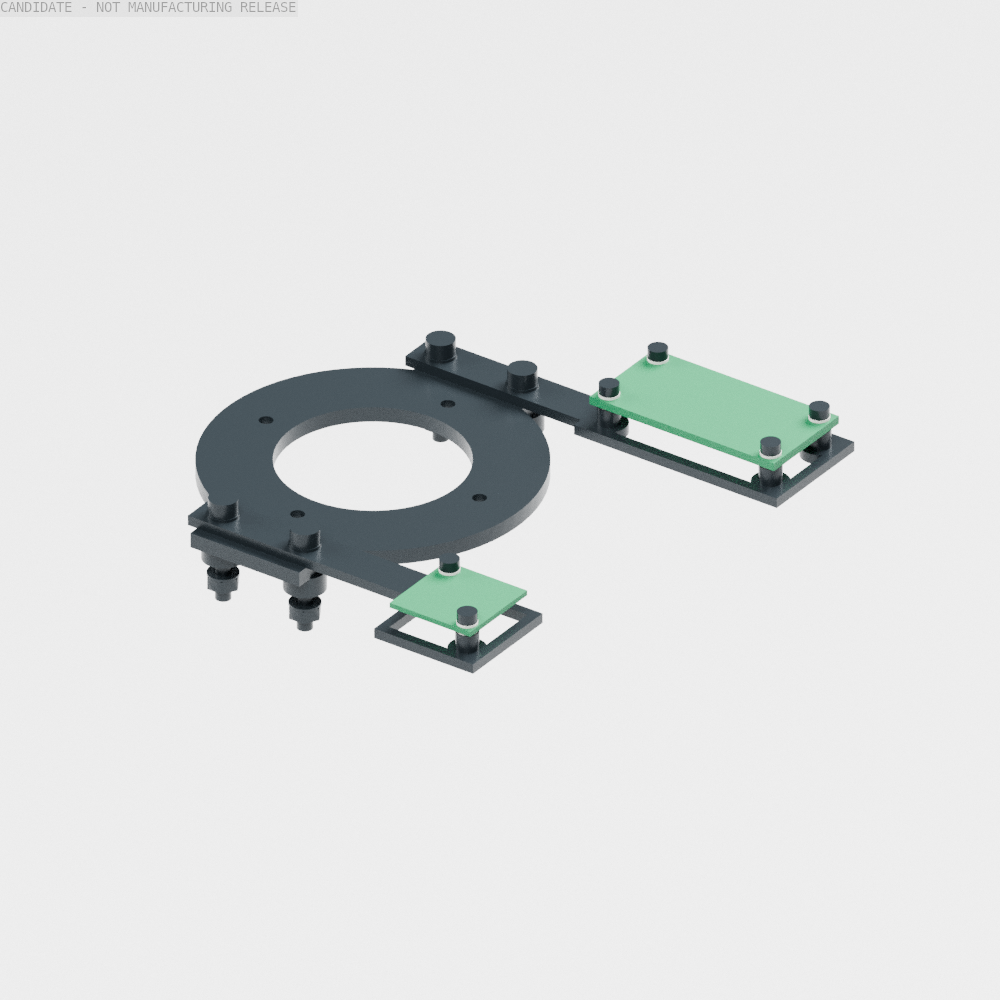

# 两块电源板的框架固定检查点

两块已选DC/DC板现在有按真实孔位设计、连接到现颈根框架的固定件。新增两件6061载板、PCB垫片及紧固件的原生CAD已保存；四组共享机架螺钉由M3×16改为M3×18的安装叠层也已明确。**34个有限姿态的新增件安装筛查通过；这项增量尚未合入默认344件装配，也不代表供电、整机装配或第三、第四阶段完成。**



图中深色部分来自实际自研CAD和现颈根框架。绿色板是按公开外形、厚度和安装孔绘制的自研安装参考片，省略了电路元件，不能作为打印件。实际元件干涉检查使用了厂商完整STEP，并非图中的参考片。两张图及可编辑[Blender装配夹具](../cad/source/power_module_fixture/mount_review.blend)均直接渲染43件有哈希的quad源，没有生成概念图。

## 安装关系

全部位置采用原生CAD毫米坐标：X朝前、Y朝左、Z朝上。此处不加物理模型单独使用的3.7mm整机抬升。几何参数、孔位和源哈希见[安装配置](../configs/power_module_mounts.json)。

| 项目 | 逻辑5V支路 | 独立TTL 5V支路 |
|---|---|---|
| 已选裸板 | Pololu D24V90F5，#2866 | Pololu D24V22F5，#2858 |
| PCB轮廓/厚度 | 40.64×20.32 / 1.5748mm | 17.78×17.78 / 1.016mm |
| 安装孔 | 四个Ø2.1844mm，35.56×15.24mm孔距 | 两个Ø2.1844mm，XY各差13.208mm的对角孔 |
| 厂商坐标到机身的平移 | (69.68,29.84,328)mm | (81.11,−48.89,328)mm |
| 原生载板 | [逻辑板载板STEP](../cad/exports/power_module_mounts/logic_buck_frame_carrier.step) | [TTL板载板STEP](../cad/exports/power_module_mounts/servo_buck_frame_carrier.step) |
| 固定到框架 | (34,34)、(52,34)mm现有M3孔 | (34,−34)、(52,−34)mm现有M3孔 |

孔位依据官方[逻辑板资料](https://www.pololu.com/product/2866/resources)和[TTL板资料](https://www.pololu.com/product/2858/resources)中的STEP与尺寸图，并逐孔核对了STEP圆柱孔轴。厂商原始文件保留在本地`artifacts/Goose_V0.1/power_module_vendor/`，不随Git分发；配置记录下载地址与SHA256。

载板底面321.9mm贴合现有`neck_yaw_rear_frame_plate`顶面，载板厚2mm。PCB底面328mm；柱顶327.5mm加0.5mm尼龙垫片，避免将PCB直接压在金属柱上。TTL板底面元件最低约在326.9mm，已保留它的实际下伸空间。

六个M2×6螺钉通过PCB及上下绝缘垫片拧入载板柱。逻辑板名义螺纹啮合3.4252mm，TTL板4.48mm。CAD保留1.6mm攻丝底孔，螺钉用光滑大径包络表示；实际加工必须攻M2螺纹，不能把底孔直接当螺纹。四组机架叠层为3mm底板＋4mm隔柱＋3mm颈根板＋2mm载板＋1mm总垫片＋2.4mm螺母，总15.4mm；M3×18名义露出2.6mm。

## 已完成的有限检查

[原生安装证据](../evidence/power_module_mount_fit.json)记录36件自研载板/名义紧固件、两个实际厂商板体，以及189件现行原生实体或明确标识的器件包络。每个姿态考虑7,885组包含新增件的组合，先用保守原生边界排除相离部分，再做有时限的实体交集检查。覆盖零位、左右髋yaw/roll组合、双侧组合、七个现行静力任务姿态和颈yaw±0.6rad，共34姿态。没有超出0.01mm³阈值的未解释交集，也没有未解决的查询错误。旧件之间的整机缺口未因本项筛查而变成通过。

逻辑板与前左机壳的一次复杂原生交集查询超过4秒。失败保留在证据中，未计作零；其保守原生AABB与该机壳的实体交集随后测得为零。实际板体包含在该AABB内，因此该结果为原交集提供零体积上界。全部名义光滑螺杆与攻丝底孔的预期重叠也单独记录，没有用任意碰撞过滤器隐藏。

36件原生实体、STEP回读和STL已检查；84,192个quad源均闭合、绕序一致，网格体积相对原生CAD最大误差约0.0933%。[输出清单](../cad/exports/power_module_mounts/manifest.json)保留每件BREP、STEP、STL和NPZ哈希。图示另含两个安装参考片，不把它们计入机器人的新增质量。

[文件完整性检查](../evidence/power_module_mount_checkpoint.json)串联源哈希、CAD输出、安装证据、CSV/XLSX和本地链接。[保存的Blender核对](../evidence/power_module_fixture_identity.json)验证图示43件、105,480个quad与源几何一致；这项验证不代替外观或制造验收。

两块实际板体均放在原有49×29×22mm安装预留内，未要求扩大机身或改变关节。保留原有65g电源/散热/线束质量预留及四组机架紧固件的质量上界，只加入两件载板、PCB固定件和四颗M3螺钉的2mm加长量，**保守新增10.12185g**。36件本身合计18.09675g，其中原机架紧固叠层是替换件，不能将这个总量再次全加到整机台账。

## 交付与剩余门槛

增量[采购工作簿](../hardware/power_module_mount_bom.xlsx)、[CSV](../hardware/power_module_mount_bom.csv)和[追溯清单](../hardware/power_module_mount_bom.json)覆盖9行、38件，包含两块裸板和全部36件固定件。中国到货价格、加工报价和具体紧固件供方未闭合，所以不是可下单整机BOM。

接线应保留焊盘、绝缘及应力释放空间；本项没有安装线束和焊接固定件。板的额定标称值不代替封闭机身中的电流和热验证。加工公差、螺纹锁止/预紧、局部强度、现颈根框架刚度以及电源保护仍待通过。两块载板当前为6061加工候选；外部机壳仍按3D打印设计。

下一项主线是计算/接口模块固定和机壳到框架的支承，随后把前端夹持、相机与这组安装增量收拢到同版整机几何、质量和惯量。PPO不占用这项工作；不以本次局部通过宣布训练硬冻结或最终实体外观。

复现：

```bash
env PYTHONPATH=src PYTHONDONTWRITEBYTECODE=1 OPENBLAS_NUM_THREADS=1 .venv/bin/python scripts/cad/build_goose_power_module_mounts.py
env PYTHONPATH=src PYTHONDONTWRITEBYTECODE=1 OPENBLAS_NUM_THREADS=1 .venv/bin/python scripts/diagnostics/check_goose_power_module_mounts.py --wall-time 240 --pair-timeout 4
env PYTHONPATH=src PYTHONDONTWRITEBYTECODE=1 OPENBLAS_NUM_THREADS=1 .venv/bin/python scripts/diagnostics/build_goose_power_mount_bom.py
env PYTHONPATH=src PYTHONDONTWRITEBYTECODE=1 OPENBLAS_NUM_THREADS=1 .venv/bin/python scripts/cad/build_goose_power_mount_fixture.py
```

检查基准为`34822285`的默认源几何、物理契约、模型和质量台账，四者保持原哈希。有限通过不许可继承到不同几何或未列出的连续运动。
