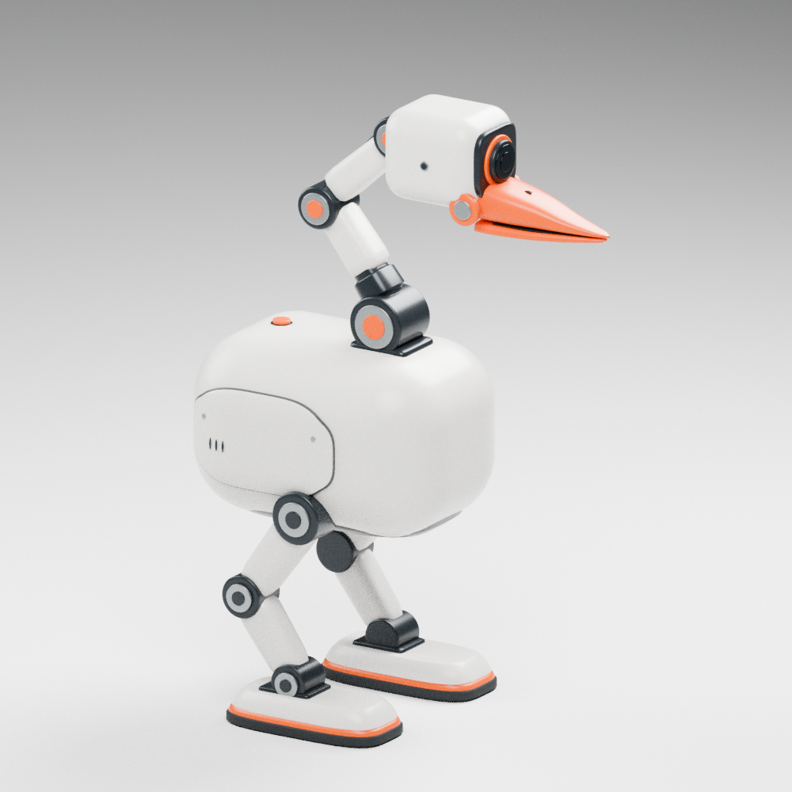
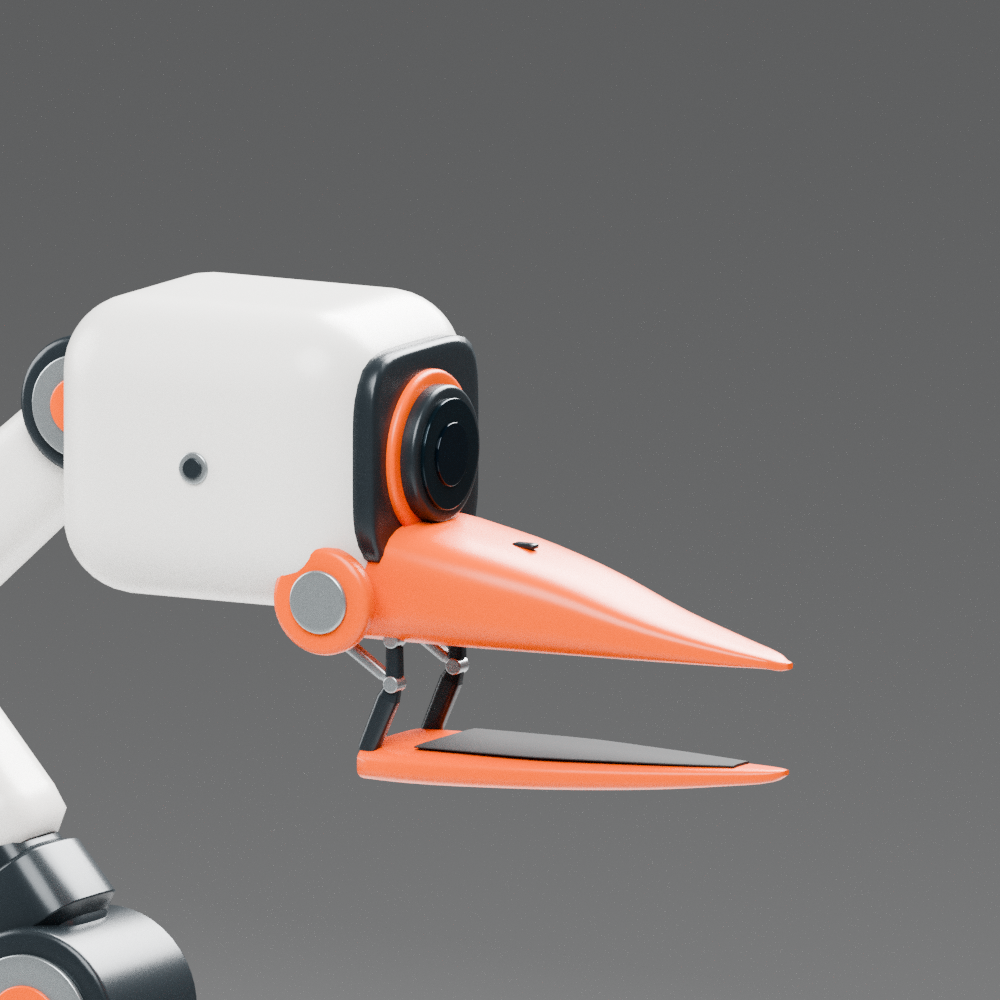

# R2 尖嘴四边面重建候选 · 2026-09-29

本轮按用户限定的半小时重建可编辑外形。以仓库既有[尖嘴参考图](concepts/r2_pointed_beak_closed_reference.jpg)为外观依据；没有用图生 3D 网格修图交差。

[侧视](../images/r2_quad_rebuild_closed_side.png) · [正视](../images/r2_quad_rebuild_closed_front.png) · [闭嘴近景](../images/r2_quad_rebuild_closed_head_detail.png) · [张嘴整机](../images/r2_quad_rebuild_open_three_quarter.png)

## 可编辑源文件与核查

- [闭嘴 Blender](../cad/source/r2_quad_rebuild_candidate/closed/goose_r2_quad_rebuild.blend)：97 个独立网格，56,624 个四边面。
- [张嘴 Blender](../cad/source/r2_quad_rebuild_candidate/open/goose_r2_quad_rebuild.blend)：109 个独立网格，61,040 个四边面。
- 每个版本旁附逐件四边面 OBJ、米制场景数据和两份检查报告。OBJ 坐标单位为毫米，Blender 为米。
- [拓扑证据](../evidence/r2_quad_rebuild_topology.json)：实际保存的 Blender 网格全四边面、边流形、无零面积面、正有向体积；OBJ 另查单连通与一致面朝向。所有分件均通过上述范围检查，报告保存 Blender 文件哈希。

## 本轮结论与边界

原先逐三角面分色造成的破碎锯齿已消除。重新建立尖嘴、独立下喙、开口连杆、圆柱关节、颈腿饰壳、机身检修面与低矮脚掌；图像全部从这些真实网格渲染。

**外观尚未验收。** 头部转接、机身与腿根层次、脚部细节及材质仍与参考存在差异；拓扑通过不等于复刻完成。白壳和饰板仍为外观体，尚无制造壁厚、真实门铰、紧固与电机内部安装结构。张嘴模型仅展示平行下喙构型，未做完整运动扫掠和传动验证。渲染仍有少量采样颗粒，但与旧图的大面积破碎色块不是同一种问题。

**制造与物理未通过。** 本版没有重新核算真实器件质量、惯量、稳定性与驱动力，没有同版 PPO 或跨引擎验证，不继承 RC2/v95 的任何通过结论。首轮交付为外观审查候选，不得直接采购或打印作为承力装配件。

## 重现

仓库生成入口为 `scripts/cad/build_goose_r2_reference_rebuild.py`，共享几何函数位于 `scripts/cad/build_goose_quad_exterior_study.py`；通过 `--output` 指定目录，闭嘴 `--opening 0`，张嘴 `--opening 30`。生成器需要 NumPy、SciPy、MuJoCo、Pillow、trimesh。

Blender 4.0.2 渲染入口为 `scripts/models/render_goose_quad_rebuild_blender.py`，传入 `--scene <scene.json> --samples 96 --resolution 1000 --views three_quarter,side,front,head_detail`。保存后的 Blender 检查入口为 `scripts/diagnostics/audit_goose_blender_quad_source.py`。
