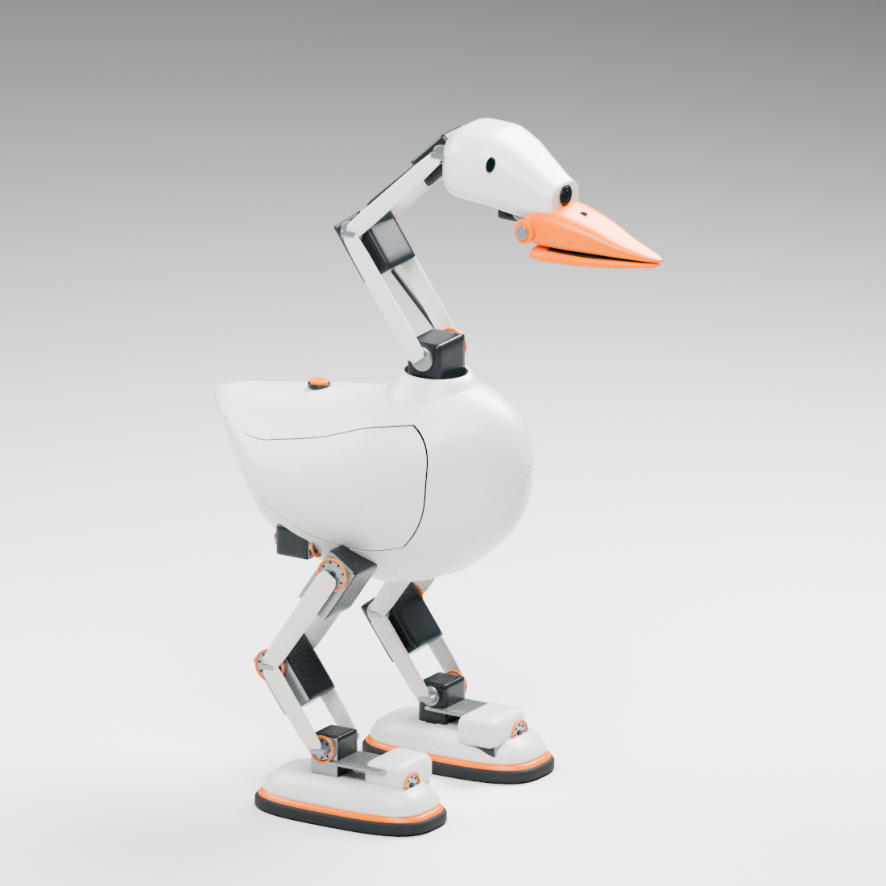

> 状态更新（2026-09-30）：本候选因头嘴不协调、身体不够简约，已被[铰接鹅嘴候选](hinged_beak_exterior_review.md)取代；以下保留历史审查，不代表外观通过。

# Goose 肩胸与收尾曲面外观候选

2026-09-30。上一版被用户明确指出头身像“两个鹅蛋”，[失败记录](streamlined_exterior_review.md)已保留。本版重做主形体，尚待用户外观审查；不以拓扑检查替代审美判断。

[侧视](../images/sculpted_closed_side.png) · [正视](../images/sculpted_closed_front.png) · [张嘴近景](../images/sculpted_open_head_detail.png) · [拆盖视图](../images/sculpted_access_door_detail.png) · [器件布置透视](../images/sculpted_closed_mechanism.png)

## 从整机轮廓到分件

机身不再是前后近似对称的卵形。抬起的短尾接入低背，肩背向颈根升起，前胸饱满、腹部内收；颈根另有中空过渡罩，减少机械臂直接插在球壳上的突兀感。侧盖随肩背展开，表面具有浅起伏，以收尖弧面表达合拢的翅膀，不刻画羽毛。

头部区分后脑、额坡、脸颊和嘴根。额头沿嘴的方向收窄，镜头改为前部小型光学窗口，取消凸出的相机面罩；侧眼改为贴合曲面的黑色杏仁形嵌件。尖嘴、平行下喙和已有夹持方向保留，缩小外露嘴轴饰盖。头罩和嘴根目前仍是外观布置，真实内腔及装配分界尚待工程处理。

主体四片薄壳、左右检修盖和颈根过渡罩分别建模。主体内表面按解析法线偏移 2.4 mm；这是源几何的偏移参数，不等于已验证的打印最薄壁厚、强度或层向方案。拆盖图是分离展示，尚未设计好铰链、限位和闭锁。

## 颈腿采用有尺寸依据的器件布置

现有方案没有一套已冻结、可整套采购的颈臂或双腿总成。本版使用候选电机的名义尺寸，保留矩形本体、前输出盘、后支承以及双侧连接板，不把外观圆柱当作真实执行器。采购件代理与自制件已在场景中分别标注。

厂家尺寸来源：[XM540-W270](https://emanual.robotis.com/docs/en/dxl/x/xm540-w270/) 为 33.5 × 58.5 × 44 mm，[XM430-W350](https://emanual.robotis.com/docs/en/dxl/x/xm430-w350/) 为 28.5 × 46.5 × 34 mm，[XC330-M288](https://emanual.robotis.com/docs/en/dxl/x/xc330-m288/) 为 20 × 34 × 26 mm。XC330 深度没有沿用旧 RC2 的 23 mm 预留。轴位置和舵盘孔距继承现有规格记录，紧固、惰轮与安装细节仍需对应厂商图纸逐项复核。

当前空间候选为 6 个 XM540、10 个 XM430、2 个 XC330；双腿各六轴，颈头五轴，嘴一轴。电机本体是依名义尺寸重建的四边面代理，**不是厂商完整 CAD，也不是装配验证通过的结构**。白色连接板、转接和外罩为自制候选。轴数和电机分工仍要经过同版负载与运动核算，不修改旧运行模型、采购表或跨引擎协议。

## 可编辑文件与证据

- [闭嘴 Blender](../cad/source/sculpted_exterior_candidate/closed/goose_sculpted_quad.blend)
- [张嘴 Blender](../cad/source/sculpted_exterior_candidate/open/goose_sculpted_quad.blend)
- [拆盖 Blender](../cad/source/sculpted_exterior_candidate/access/goose_sculpted_quad.blend)
- [检查汇总](../evidence/sculpted_exterior_checks.json)

各源文件目录包含独立四边面 OBJ、场景数据、器件尺寸来源和拓扑核查。OBJ 为毫米，Blender 为米。检查范围分别为：全四边面、单连通、闭合、面朝向、零面积面；保存后 Blender 网格；18 个名义电机本体盒相互重叠；主要壳件的打印空间预留。**不包含整机自碰撞、制造装配、真实厚度／强度或动态稳定验收。**

## 接下来的整机门槛

外观需先获用户认可。之后先统一关节布置、真实零件、质量／惯量与供电，再查全行程碰撞和线束、坐姿拾取、带物起身与拖拽；建立同版 MuJoCo 接触模型后做 PPO 训练与独立回放，再做跨引擎验证。Godot/Jolt 优先，但保持 UnitySim2Sim 与 BevySim2Sim 的中立适配接口。

暂未闭合的制造项包括支架安装、螺孔、门铰／闭锁、颈腿穿壳开口、头罩和鞋罩内腔、布线与散热。此轮不深入这些细节，也不把新外形认作可直接打印装配或物理已通过。旧 RC2/v95 的结果不能移植到本版。
