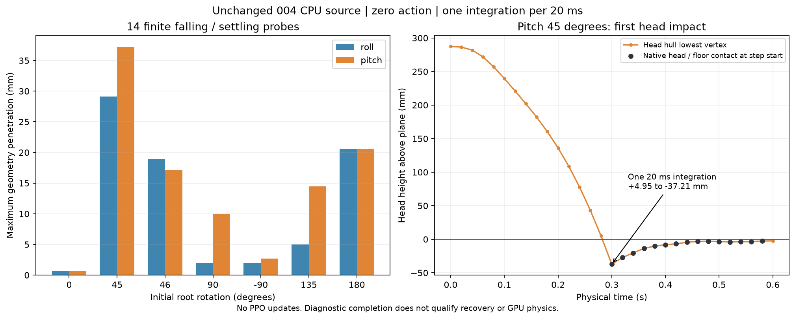

# 冻结训练版的倒地接触诊断

2026-10-04。本检查只观察004原样CPU源，不修改模型、SI、时钟、接触修正或过滤表，不进行PPO。站立／移动继续按[本周期冻结交接](virtual_training_freeze_handoff.md)推进；以下证据用于明确翻倒／起身的独立验收范围。

[精选记录](../evidence/source_contact_domain_diagnostic.json)保存14个完整初始qpos、模型／契约／运行代码及诊断入口哈希、最差积分步的原生接触和积分后实际几何位置。全逐步记录由[诊断入口](../../../scripts/evaluation/check_goose_contact_domain.py)生成到本地artifacts，未作为新训练模型或004包内容发布。

## 已实际检查的范围

原样完整机器人绕根roll或pitch旋转0、45、46、90、−90、135、180°，保持中立主动／被动关节；用原生编译后的全部11个凸体顶点，将最低点对齐地面上2mm。各执行100次零动作、每次20ms／一次积分，合计1,400次；另独立回放最差初态100次。

14组都完成，状态有限、零原生求解器警告、零自动重置。记录包装仅复制接触／几何状态并调用原函数一次；所有未由平地足底四点近似替换的原生接触，其geom、距离、位置、法线坐标系及摩擦记录在包装前后相同。最差输入的未包装运行与包装记录逐步qpos／qvel精确一致。

**这些通过仅证明诊断执行和原生接触保留，不证明倒地物理可用于起身训练。** 14组最大瞬态实际几何穿地在0.67–37.21mm范围。90°侧倒也与竖直站立足底的使用域不同；未把站立足底门槛套作所有机壳接触的资格标准。



## 可复现的最差输入

pitch=45°、中立关节、零动作。第15步从0.28s推进至0.30s：

| 实测项目 | 结果 |
|---|---|
| 头部凸体 `head_upper_bill_envelope` 积分前最低点 | +4.950559mm |
| 同一凸体积分后最低点 | −37.206638mm |
| 本步平地足底四点近似启用对象 | 无；鞋倾斜已超出其条件 |
| 积分前原生接触 | 右脚1点、左脚2点，均为脚／地面 |
| 头／地面原生接触首次出现 | 第16步开始时，实际状态已穿地 |
| 修正前后上述原生接触记录 | 完全相同 |
| 100步未包装独立回放qpos／qvel差 | 0／0 |

本输入直接显示一次离散积分跨过头部首次触地；该步没有足底替换，也没有头部接触被过滤掉。它不能独自确定所有深穿透的原因、合适的统一步长或非脚接触参数，更不能据此宣布真实硬件失效。

复现命令（仓库根，MuJoCo3.10.0及项目CPU依赖）：

```bash
PYTHONPATH=src OPENBLAS_NUM_THREADS=1 python scripts/evaluation/check_goose_contact_domain.py \
  --axis pitch --degrees 45 --ticks 100 \
  --out artifacts/Goose_V0.1/contact_domain_pitch45
```

省略`--axis`和`--degrees`会运行完整14组。报告明确保存`full_recovery_qualification=false`；诊断无数值错误不代表接触质量通过。三个针对性测试验证原样回放、首次头部入场和被篡改轨迹的拒绝。

## 交给Lab的下一动作

继续004站立／移动GPU准入及有界训练。本方不重复GPU接线或PPO，也不把倒地域局部发现转成PCB／采购等待。

起身或大角度跌倒任务需独立验首次入场、非脚部穿透、足底近似切换和原生接触保留；GPU域也独立检查。若需调整步长、碰撞入场或非脚接触，使用具名派生版本、保留完整SI并回归站立／移动及源目标一致性，不能静默改004或沿用旧资格。本诊断已直接通知现有“Goose Sim2Sim 训练任务”。
