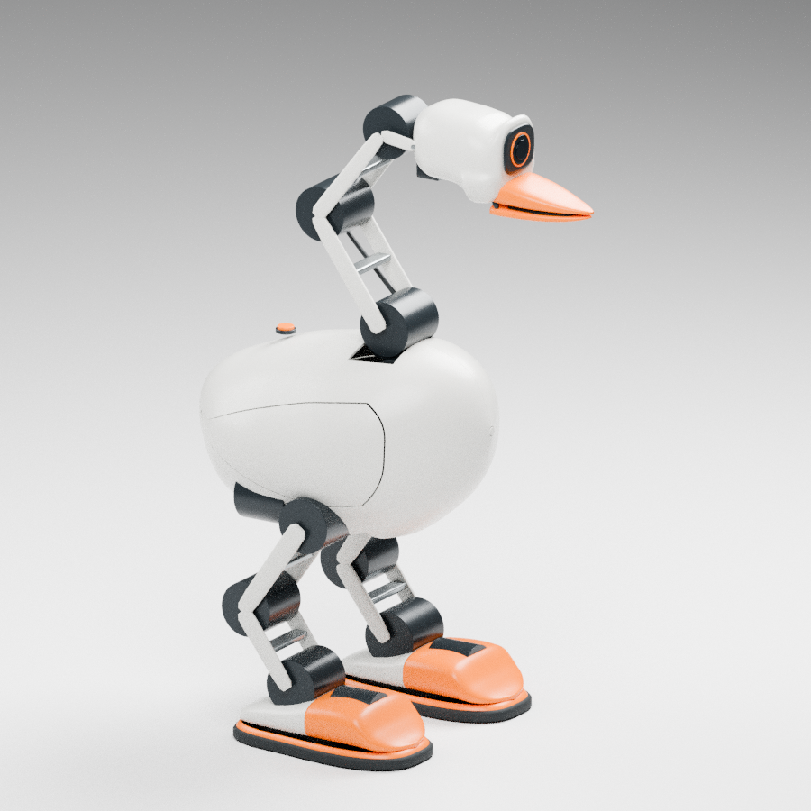
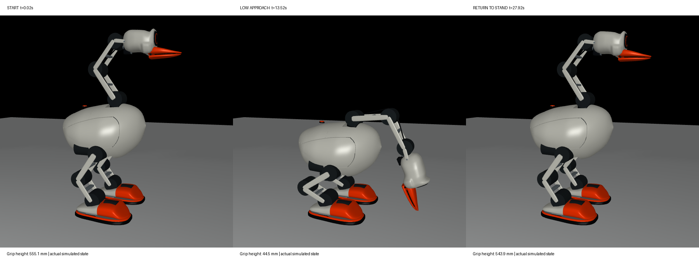

# Goose 第二阶段：嘴部传动、低位接近与供电架构

**交付版本 `goose_stage_two_si_v2`：18 轴、名义质量 8.854 kg。可以交给 Sai_Lab 开始这一版本的实验性初训；仍不是硬件硬冻结、采购放行或制造发布。** 本轮保持已确认外观、主要轴线、腿长和脚底轮廓，集中处理第一阶段的三处缺口，没有继续追逐 PPO 收敛。第一阶段文件及交接 ZIP 保留。

## 整机结论

| 项目 | 第二阶段结果 |
|---|---|
| 名义质量 | **8.8536 kg**，比第一阶段增加 **228.8 g**，不含被夹的 50 g 物体 |
| 质量估算包络 | **7.724–9.984 kg**，相关上/下界假设；不是制造公差或统计置信区间 |
| 外形与运动链 | 外包络约 **434 × 285 × 639 mm**；原躯壳、头壳、鹅掌、主轴位置和 18 轴顺序保留 |
| 主要执行器 | **11 × AK45-36 V3.0、3 × AK45-10 V3.0、3 × AK40-10 V3.0、1 × XC330-M288-T** |
| 嘴部变化 | XM540 候选与额外齿轮减速替换为 AK45-36 + **1:1 等曲柄平行连杆**；仍为铰接下喙，连杆不把下喙改成平移钳 |
| 中颈变化 | AK45-10 升级 AK45-36：新头部质量使原中颈连续设计限值和扰动姿态余量不足 |
| 控制约定 | 物理 1 ms、力矩 5 ms、策略 20 ms；65 维观察、18 维动作；SI 与轴序不变 |
| 静力与姿态 | **63/63** 接触静力工况满足当前约束；所有轴落在本版连续设计限值内；7 个姿态的电机本体相交筛查通过 |
| 低位接近 | 名义 + 4 个扰动样本，均完成 **28 s 下蹲—接近—悬停—退回—站立**；没有非足部触地或超过 0.5 mm 的已建模自碰撞 |
| 预算 | 执行器公开参考合计 **USD 3010.20**；整机仍按 **人民币 3.5–5 万**规划，含打印材料、不含打印机；未取得正式中国采购报价 |
| 版本使用 | 质量、惯量与驱动已超出第一阶段部分逐体预算，**必须作为新训练版本**；旧策略不得仅凭相同轴数直接复用 |

大结构没有再次改比例，但电源保护的最终体积/质量和封闭头壳热能力仍可能触发调整。因此现在可以交接**有明确边界的参数候选**，还不能承诺后续质量和结构绝不变化。



## 可交付文件

- [完整 SI 契约](../configs/stage_two_contract.json)、[结构参数](../configs/stage_two_structure.json)、[关节 CSV](../configs/stage_two_joints.csv)、[逐体质量/重心/惯量 CSV](../configs/stage_two_bodies.csv)。
- [MuJoCo MJCF](../models/stage_two/robot.xml)、[URDF](../models/stage_two/robot.urdf)：同版自由根、关节与惯量；控制、armature、碰撞排除仍以契约为准。
- [四边面场景源](../cad/source/stage_two_architecture/scene.json)、[Blender](../cad/source/stage_two_architecture/goose_stage_two_quad.blend)、[去壳结构图](../images/stage_two_architecture_mechanism.png)。这些是架构设计源和包络，**不是可直接生产的完整零件图**；仿真交换网格允许三角化。
- [执行器 BOM](../hardware/stage_two_actuator_bom.csv)、[传动与电源候选 BOM](../hardware/stage_two_mechanism_power_bom.csv)、[供电架构及待确认问题](../hardware/stage_two_power_architecture.json)。
- [静力/姿态](../evidence/stage_two_system_gate.json)、[嘴部机构与电机净空](../evidence/stage_two_mechanism_gate.json)、[低位接近](../evidence/stage_two_supported_reach.json)、[电气预算](../evidence/stage_two_power_gate.json)、[逐体版本差异](../evidence/stage_two_parameter_delta.json)。
- [四边面检查](../evidence/stage_two_geometry_gate.json)、[训练器初始化](../evidence/stage_two_trainer_entry.json)、[测试记录](../evidence/stage_two_test_gate.json)、[交接清单与文件哈希](../evidence/stage_two_delivery_manifest.json)。

## 嘴部：从不够力的占位推进到有条件的传动方案

电机采用厂家列明 **349 g、直径 55 × 长 56.5 mm、额定 8 N·m / 40 rpm** 的 [AK45-36 V3.0](https://www.cubemars.com/product/ak45-36-v3-0-kv80-robotic-actuator.html)。额定运动点不能冒充封闭头壳内的静止持续输出。电机位于原头壳内；固定上喙、铰接下喙和视觉摄像头关系保留。

两根曲柄等长 12 mm，轴心距 39.825 mm，未交叉装配，理想角传动比 1:1；开嘴范围 0–0.55 rad。按额定值 0.8 降额、连杆效率 0.85 的**设计假设**，可用输出为 5.44 N·m。本版控制收至 **4.4 N·m 连续设计、4.5 N·m 峰值、1 rad/s**。80 mm 作用臂的理想夹力为 55 N，静态 50 N 工况含小幅重力负载后约需 4.017 N·m。**50 N 是本项目目标，不是已查证的真鹅生理咬合力，也不是已测得的实物持续夹力。**

61 个开合采样验证几何闭合、传动角与净空；峰值连杆力含 10% 额外系数为约 521 N。两只 [JTEKT 698](https://koyo.jtekt.co.jp/en/products/detail/?pno=698) 轴承为 8 × 19 × 6 mm、各 7.2 g，目录静额定载荷 910 N；前轴承筛查负载约 605 N，静安全系数仅 **1.505**，余量不宽。8 mm 钢轴在声明缺口系数后约 144 MPa，对应本版 160 MPa 设计限值；曲柄约 68.9 MPa，对应声明的 80 MPa 限值。材料、轴夹紧界面、开孔净截面、疲劳仍需后续验证。

连杆端部候选为 [igus GFM-0506-05](https://www.igus.com/ContentData/Products/Downloads/iglide_G300_FM_USen.pdf) 衬套；本轮只按 20°C 的压力/PV 目录能力筛查，没有宣称高温、磨损或蠕变已通过。采用局部 2 mm 头壳壁厚时，采样到的最小净距约 **0.91 mm**，插头与弯线半径未放行。原壳质量估算仍保守保留，不以薄壁减重美化数字。

小曲柄/连杆的部分质量在训练模型中合并到闭嘴位置；估算导致头部重心最大误差约 0.161 mm，遗漏附加惯量约 9.97e-7 kg·m²。输出曲柄与下喙轴随下喙转动。模型不是完整柔性连杆或齿隙模拟；开合视觉中的输入曲柄仍是闭嘴代理，不能把它当机构动画验收。

## 低位接近：修复提前触地，尚未完成拾取

第一阶段直接插值关节角时，躯干俯仰造成喙尖提前触地。本版控制根据**编码器、IMU 和固定名义参数**重建双足支撑下的姿态，再求头颈目标；不读取仿真真值的根平移、随机化质量或接触力用于控制。接近/退回轨迹在中段向前绕开机身 60 mm，避免下喙横穿躯壳。它假设平地、不滑移、双足支撑，不是通用落足状态估计器。

最终名义与 4 个扰动样本都完成 28 s 往返，悬停点约 **X=279–282 mm、Z=43.7–45.0 mm**。名义根位置重建误差小于 1 mm；完整样本的具体误差、双足接触比例和力矩保存在报告中。旧候选的[直线路径失败记录](../evidence/stage_two_supported_reach_straight.json)保留原模型哈希，只用于追溯失败原因，不能与最终模型证据混用。



**仍未做到：张嘴接触目标、夹住、举起和拖动真实物体。** 45 mm 的夹取点高度不足以证明能捡薄布、平放的小件；这属于下一阶段任务闭环。静力最坏膝关节约 **6.151 / 6.4 N·m**，动态与热余量不能只靠静力通过来判断。

## 电源：支路候选明确，主母线仍是硬阻塞

保留 Radxa ZERO3W + USB hub；17 个 CAN 轴分成 9/8 两路，剩余 XC330 走 5V TTL，去掉原嘴部 12V 支路。

- 逻辑 5V：候选 [Pololu D24V90F5](https://www.pololu.com/product/2866)，裸板 40.6 × 20.3 × 7.6 mm / 4.8 g；保留含散热和接线的 25 g 预留，规划 3.5 A 负载。产品名的 9A 不作为封闭安装后的持续能力保证。
- 头滚转 5V：候选 [Pololu D24V22F5](https://www.pololu.com/product/2858/specs)，裸板约 17.78 × 17.78 × 7.87 mm / 2.3 g；保留 40 g 分配。按规格表 24V 输入时典型 2.2 A 选型，XC330 5V 堵转 1.8 A 仅用于支路峰值预算。
- 两路 CAN 以 1Mbps、200Hz、每轴收发各一帧及保守帧长度估算，占用 **59.2% / 52.8%**；驱动固件时延、重发和实线质量仍未测。
- **350W 正机械功率限制不等于电池输入功率限制。** 假设运动转换效率 0.6–0.8，再加电子支路 35W，得到 472.5–618.3W / 20V 时 23.6–30.9A 的示例。该公式不约束静止铜耗或瞬态，40A 只是待实测的主线束设计要求，必须配置实际母线电流测量。
- 6S 2.2Ah 为 48.84Wh；假设 80% 可用能量，平均 60/100/150/250W 时约 39.1/23.4/15.6/9.4 分钟。**这些是场景计算，不是实测续航。**

AK48-2405-2D-A2 的准确工作电压、欠压/过压阈值及回馈路径尚未取得可靠官方定义。公开 [V3.2.0 手册](https://www.cubemars.com/data/cms/202602/ak-series-prodcut-manual-v3-2-0-for-ak-3-0-robotic-actuator.pdf) 的 18–52V 表是 AK54/AK60/AK80，不能套给 AK48；核查时下载页的 AK48 安装手册链接为空。因此 **6S 满电 25.2V 直连仍未放行**。

单次整机重心下降 80 mm 的势能示例约 6.95J；2200µF 电容从 24V 升至 25.2V 仅能存约 0.065J，相差约 107 倍。满电或电池断开时必须有额定明确的钳位/泄能路径。当前 12J 吸收要求、60V 器件等级、40A 主路径及 133g 保护/转换预留都只是设计要求，**还没有选定并证明整套硬件放得下**。

## Sai_Lab 接入与后续变更

解压包根，使用 Python 3.12 的 MuJoCo/PyTorch/RSL 环境：

```bash
PYTHONPATH=src python scripts/diagnostics/validate_goose_stage_one_entry.py --stage stage_two --device cuda --output artifacts/stage_two_entry.json
PYTHONPATH=src python scripts/training/train_goose_stage_one.py --stage stage_two --output artifacts/stage_two_first_run --iterations 2 --envs 4 --horizon 16 --device cuda
```

没有 CUDA 时用 `--device cpu`；训练输出目录必须不存在。脚本名保留旧入口兼容性，**`--stage stage_two` 不可省略**。本轮实际只完成 NVIDIA GB10 上的 CUDA/RSL 初始化、动作/观察边界与一步物理检查，**优化器更新为 0**；训练命令是给 Sai_Lab 的入口，不是本轮新策略成果。

当前 PyTorch 2.9.1+cu129 构建会提示 GB10 计算能力 12.1 超过其列出的最高 12.0；本轮实际执行的 CUDA 前向/接口操作通过。这条环境提示予以保留，未把初始化检查扩大成完整训练环境或长期训练验收。

低位往返检查：

```bash
PYTHONPATH=src python scripts/evaluation/evaluate_goose_supported_reach.py --stage stage_two --output artifacts/reach.json
```

MuJoCo、Godot/Jolt、Unity、Bevy 继续以同一 SI 契约与结构 JSON 的坐标转换为准。没有为 Jolt 改模型语义；**尚未完成新版三后端动力学对照**。本轮并未把旧 RC2 接收器冒充新版接收器。

后续焊点、孔位和外饰细化可以延期，但要逐体检查质量、重心、惯量和器件净空。新比较工具同时检查轴序/轴线、执行器、控制时序、动作定义、碰撞资产和逐体预算；即使总质量相同也会检出不兼容变更。范围内也不自动批准策略移植。本版对第一阶段的比较已经要求新训练版本。

## 下一轮只处理三个整机门槛

1. **主电源可接通且回馈可处理**：先取得准确驱动窗口，选定并验证钳位/泄能和断电路径，再回填体积、质量与热预算；不能用购买电池代替这项闭合。
2. **嘴部可装配且能持续输出目标力**：确认电机输出接口、夹紧轴/支架、轴承座与接头；台架校准夹力，分阶段做持续保持和温升试验。真实采样或硬件确认不在本轮伪造通过。
3. **形成物体任务闭环**：先完成指定样件的低位接触、闭嘴、提起/放下和起动拖拽验证；再交由 Sai_Lab 扩展步行/拖行策略。不把 PPO 收敛当作前两项问题的替代品。

本轮到此交付独立参数候选。制造孔位、局部美化和长时间策略优化继续后置；上述电源、承力连接和热能力属于必须解决的结构问题，不能作为“细节”直接略过。
