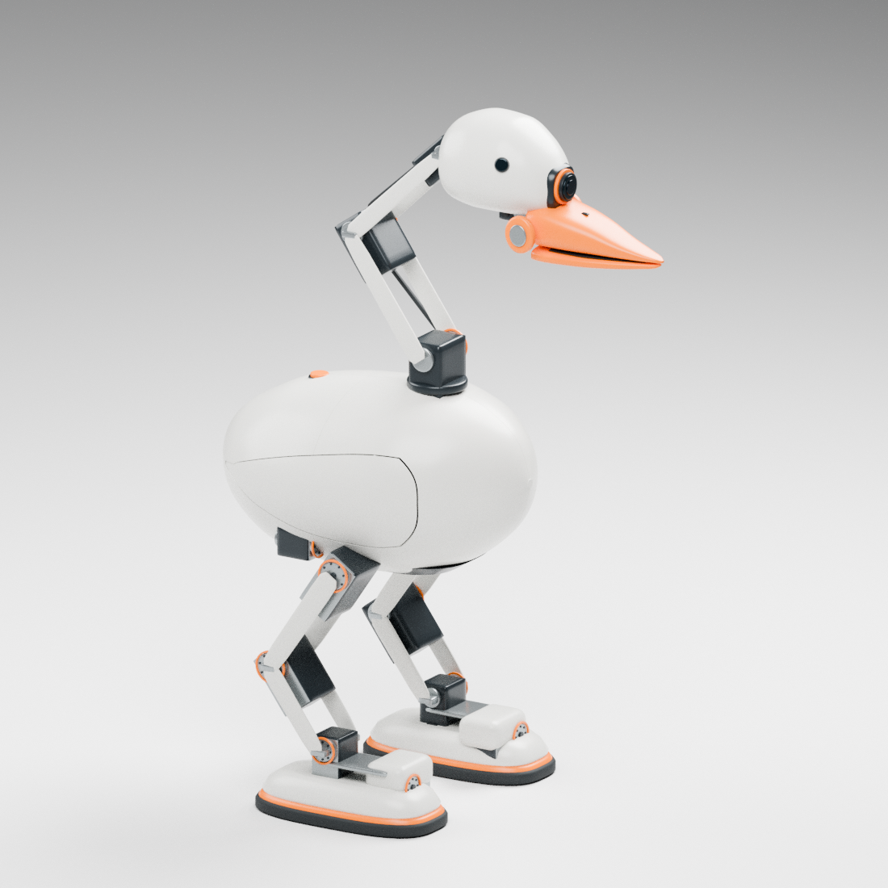

# 流线型候选失败记录

**用户已否决，不进入物理阶段。** 2026-09-29 的头身卵形方案被指出像“两个鹅蛋”，缺乏形体设计。本轮不能以网格检查通过或名义电机尺寸正确替代外观质量。

[失败侧视](../images/streamlined_rejected_side.png) · [来源与否决记录](../evidence/streamlined_exterior_rejection.json)

生成器 `scripts/cad/build_goose_streamlined_exterior.py` 保留用于复现，原始模型与图像保存在本地 `artifacts/Goose_V0.1/streamlined_exterior/`。

下一版须重做肩背、前胸、腹部和尾部之间的比例与过渡；头部须重建后脑到额头、嘴根的形体关系，保留简约曲面及器件尺寸约束。
