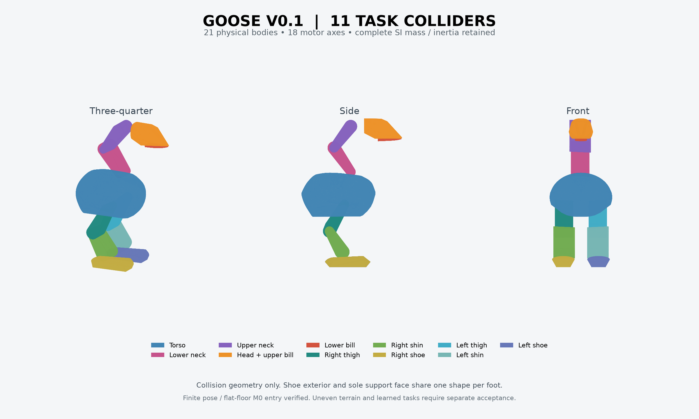

# 11 个碰撞体的 Sim2Sim 工程入口

## 直接取用

[碰撞体三视图 PNG](../images/task_proxy_11_v1_colliders.png) · [全部碰撞文件](../models/task_proxy_11_v1/) · [装配模型 robot.xml](../models/task_proxy_11_v1/robot.xml)

文件目录共11个OBJ、1个MJCF及1个原硬件参数JSON。OBJ是米制局部凸包；装配变换在XML中，不能把所有OBJ直接叠放在同一世界原点。保持文件原名与同目录关系。

| 碰撞角色 | OBJ文件 |
|---|---|
| 躯干 | [torso_envelope.obj](../models/task_proxy_11_v1/torso_envelope.obj) |
| 下颈 | [lower_neck_envelope.obj](../models/task_proxy_11_v1/lower_neck_envelope.obj) |
| 上颈 | [upper_neck_envelope.obj](../models/task_proxy_11_v1/upper_neck_envelope.obj) |
| 头部＋上喙 | [head_upper_bill_envelope.obj](../models/task_proxy_11_v1/head_upper_bill_envelope.obj) |
| 下喙 | [lower_bill_envelope.obj](../models/task_proxy_11_v1/lower_bill_envelope.obj) |
| 右大腿 | [right_thigh_envelope.obj](../models/task_proxy_11_v1/right_thigh_envelope.obj) |
| 右小腿 | [right_shin_envelope.obj](../models/task_proxy_11_v1/right_shin_envelope.obj) |
| 右脚／足底代理 | [right_flexible_sole.obj](../models/task_proxy_11_v1/right_flexible_sole.obj) |
| 左大腿 | [left_thigh_envelope.obj](../models/task_proxy_11_v1/left_thigh_envelope.obj) |
| 左小腿 | [left_shin_envelope.obj](../models/task_proxy_11_v1/left_shin_envelope.obj) |
| 左脚／足底代理 | [left_flexible_sole.obj](../models/task_proxy_11_v1/left_flexible_sole.obj) |

游戏引擎接收时一起读取[同版SI／关节与控制契约](../configs/task_proxy_11_v1_contract.json)和[逐对碰撞过滤表](../configs/task_proxy_11_v1_collision_filter.json)。[运行入口清单](../configs/task_proxy_11_v1_entry.json)绑定源运行时及原生接收器；只加载XML不能继承足底接触修正或动态验收。此目录不是Unity场景文件，硬件CAD与打印文件也不在其中。

## 验证与移植细节

`goose_task_proxy_11_v1`通过本轮 M0 入口验收。它是独立的任务碰撞版本，硬件 CAD、打印源、BOM 与外观源保持原样；31 组编译后的质量、重心、惯量、关节、驱动与闭环字段逐项相等。唯一入口是[task_proxy_11_v1_entry.json](../configs/task_proxy_11_v1_entry.json)。

| 实际运行层 | Goose 本版 | MicroDuck game015 参考 |
|---|---:|---:|
| 碰撞叶形状，包含 compound 内的每个子形状 | 11 | 11 |
| 源端编译支持顶点 | 4,792 | 23,041 |
| 目标端实际支持顶点 | 4,788 | 参考源端计数，未作同版目标测量 |
| 动力学刚体 | 21 | 15 |
| 主动轴 | 18 | 14 |

MD 的任务模型、启用掩码和嘴部固定关系见[实际参考核对](../evidence/microduck_game_collision_baseline_v1.json)。用户澄清的“29”没有用作工程门槛。本版没有复制 MD 的接触掩码，也没有关闭整机自碰。

碰撞按躯干、两段颈、头与上喙、下喙、左右大腿、小腿、鞋共 11 个角色组织，全部为凸包。中间轴载体和安装内件保留物理质量与完整惯量，不各自生成碰撞块。直接连接处的代理允许交错；五组跨中间轴的相邻安装角色显式排除，另有四组直接父子刚体配对被引擎关节规则忽略。11 个角色的 55 组内部配对，合计只忽略 9 组，其他 46 组保持碰撞，包括头与身体、身体与小腿、左右脚。上颈与头在本版也仍保留碰撞；角色图相邻不等于必须全部排除。

完整逐对规则见[碰撞过滤契约](../configs/task_proxy_11_v1_collision_filter.json)。允许忽略的配对为：身体↔下颈、下颈↔上颈、头与上喙↔下喙，以及左右各自的身体↔大腿、大腿↔小腿、小腿↔鞋。跨轴的连接链中没有第三个外部碰撞角色。原契约中无独立碰撞体的嘴部耦合杆排除另行保留，不计入 9 组。名单只作用于一台机器人的实例句柄，所有角色与地面、物品、其他机器人的接触继续启用。制造级 CAD 装配干涉仍按真实零件检查，不能用这些代理例外通过制造验收。

[过滤实测](../evidence/task_proxy_11_v1_collision_filter_acceptance.json)在每端使用 97 个刻意重叠的诊断夹具：55 组内部配对、11 组地面、11 组物品、20 组跨机器人配对。后者同时包含同名角色和在同机内被忽略的 9 组角色。源端读取实际接触约束，目标端使用原生装配、关节过滤、生产 hook 与实际烹制凸包读取接触点及求解接触；每组先验证未过滤的真实穿入，源端另作移除过滤后的阳性对照。结果两端一致。诊断改变的是夹具的碰撞体位置，不是交付模型；它不代表物理姿态、制造净空或任务通过。

移植时应按这张配对表设置局部例外，包含引擎隐式父子过滤，不能仅复制 MJCF 的显式名单。Unity 可逐对调用 [Physics.IgnoreCollision](https://docs.unity3d.com/ScriptReference/Physics.IgnoreCollision.html)，其状态不会随场景保存，实例化后需重新应用；Godot 可对指定刚体调用 [body_add_collision_exception](https://docs.godotengine.org/en/stable/classes/class_physicsserver3d.html#class-physicsserver3d-method-body-add-collision-exception)，并核对两向例外与目标端实测。全局层屏蔽会误删非相邻自碰或跨实例接触。Unity/Godot 的整机运行尚未验收；Unity [Convex MeshCollider 的 255 三角面限制](https://docs.unity3d.com/Manual/class-MeshCollider.html)还要求独立烹制与接触面误差检查，不能把本版高分辨率凸包直接标成 Unity 已通过。

Godot 4.7.2 / Jolt 的[独立原生过滤验收](../evidence/task_proxy_11_v1_godot_filter_acceptance.json)已通过152个夹具和7项拒绝／生命周期检查。使用真实源凸包、正确基变换与米制，先在另一位置的静态副本上用[原生形状查询](https://docs.godotengine.org/en/stable/classes/class_physicsdirectspacestate3d.html#class-physicsdirectspacestate3d-method-collide-shape)证明未过滤穿入，再读取动态刚体的实际接触回调。97项有效表检查外加55个全部内部配对的未过滤阳性对照；头与身体、左右鞋及跨实例连接角色均保留接触。新[过滤工具](../../../integrations/godot/goose_collision_filters/collision_policy.gd)先校验完整55组表和机械连接链，按实例句柄双向应用9组例外，并移除旧的错误例外；创建关节后须显式复位[关节的自动碰撞排除](https://docs.godotengine.org/en/stable/classes/class_physicsserver3d.html#class-physicsserver3d-method-joint-disable-collisions-between-bodies)，再应用和读回名单。

该夹具使用1kg诊断刚体、零重力、20ms步长，不是完整21体装配、关节动力学、足底柔度或任务验证，也不替换旧硬件／003模型。Godot自带`GodotPhysics3D`在相同深重叠夹具中15项出现查询或接触失败，11项接触结果不符；[失败证据](../evidence/godot_physics_collision_filter_rejection.json)继续保留，根因未判定。该后端不能继承Jolt通过状态。

合并头部与上喙前曾出现夹持面被凸包侵入的问题。本版按打印源实际上喙接触平面裁切，补入真实夹持垫轮廓，裁去头部包络底端最多 1.2 mm；硬件头壳未改。有限功能面查询误差约 2.6 nm，目标烹制的支持平面差异小于 0.2 μm。该几何一致性不等于真实夹物成功。

每只鞋只有一个凸形碰撞体，包括鞋面外壳及原六块脚垫的支撑包围面。脚垫间空隙和旋转支撑刚度采用整体足底近似。每脚总法向刚度约 140,142 N/m、阻尼 12 N·s/m，来自原设计假设，未实测标定。MuJoCo 对平面上的正向足底使用四个材料积分点；Rapier 在同一支撑面上使用原生接触流形。这些点是求解器接触点，碰撞叶仍是 11 个。凹凸地面、足底侧面及翻倒后的接触不能继承本轮平地通过状态。

接触更新采用一次 20 ms 的后向欧拉法向弹簧求解。10 mm 是预测带，实际间隙仍用于弹簧，平衡位置没有被抬高。MuJoCo 修正法向柔度后同步重算椭圆摩擦锥的主系数；否则脚会错误地过度防滑。计算依据对应[MuJoCo 3.10 约束实现](https://github.com/google-deepmind/mujoco/blob/3.10.0/src/engine/engine_core_constraint.c#L2048)。测试同时覆盖受载平衡、低于摩擦限保持、高于摩擦限滑动。

控制器保留原比例增益，速度反馈增益显式取父版的 0.25；这是新版 50 Hz 控制配置，未修改电机被动阻尼或硬件能力。动作仍是 18 维，基础观测 65 维，指定物拾取扩展 82 维。原生接收器使用独立的 Rapier 接触分支并在自由根积分处保持单位四元数；原生产接收器的拒绝保护未改。

[本轮验收](../evidence/task_proxy_11_v1_acceptance.json)包含两端各 2,500 次实际积分：原出生位置冷启动后站立 30 秒、小幅关节动作 10 秒、嘴部行程 10 秒；342 个耦合 FK 姿态及 4 个危险组合拒绝检查；实际 21 体惯量读取、11 个原生叶形状与烹制结果、控制时钟、重力前馈及 82 维扩展对照。没有运行 PPO。平地名义工况下最大足底穿入约 0.70 mm，三组目标整机步耗时 P95 均低于 0.30 ms。源与目标的瞬态关节差异最高约 0.061 rad、根位置差约 8 mm，不能据此宣称策略已经跨引擎通过。

本版可用于 Sai_Lab 的工程入口和新策略绑定。训练后的行走、转向、起身、真实物体拾取／拖拽，以及 Godot/Jolt、Unity 和实际材料分别验收。硬件采购／制造放行及最终实物外观仍沿用各自未完成状态。旧 30,105 叶版本和 89 叶冷启动失败记录保留，均不恢复为默认。

重现与打包命令见[接收器说明](../../../integrations/bevy/goose_task_proxy/README.md)。源、模型、契约、接收器和报告的哈希绑定随包保存；更换任何一层都需重新核验。
