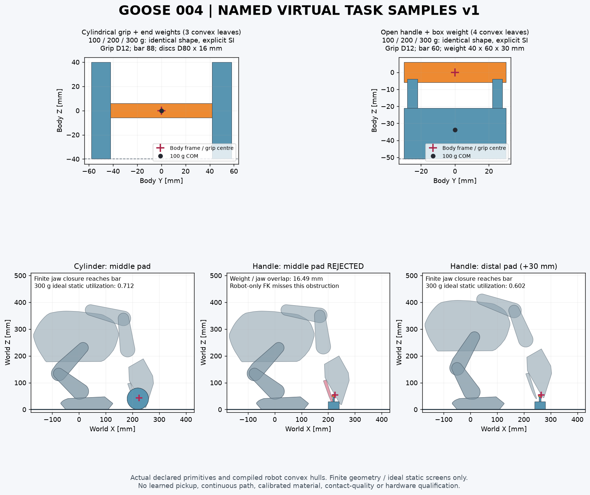

# 指定物虚拟输入 v1｜004 冻结机器人

2026-10-04。本批补齐 Lab 已冻结的 **100／200／300g、圆柱抓杆与把手样件**，供指定物训练接收。站立、移动及恢复训练继续使用原 004；PCB、采购与制造不作为等待条件。本批没有改变机器人 CAD、SI、18轴、11凸叶、过滤或65／82维观测。

入口：[物品目录及全部SI](../models/task_samples_v1/object_catalog.json)、[同源精选证据](../evidence/task_samples_v1_handoff.json)。6个正式模型另有2个50g开发模型，50g不替代Lab的三档正式载荷。完整拾取、接触质量、GPU及实物资格均未通过本批检查授予。



## 样件与坐标

| 家族 | 明确几何 | 动态体／凸叶 | 地面抓杆中心高度 |
|---|---|---:|---:|
| `cylinder_weight` | 横向圆柱抓杆直径12、长88mm；两端配重盘直径80、厚16mm，中心Y=±50mm | 1／3 | 40mm |
| `handle_weight` | 横向抓杆直径12、长60mm；两根直径6、长24mm竖杆；40×60×30mm配重箱，中心Z=−36mm | 1／4 | 51mm |

模型命名为 `<family>_<100/200/300>g_v1.xml`，三档使用相同几何，分别序列化完整质量、COM及COM处惯量张量。杆／盘／箱在同一刚体内可交错；惯量来自显式声明的分件质量和并轴合成，碰撞几何密度置零，不能让接收器按外包络重新估算质量。这是虚拟样件定义，尚无真实购买或打印材料标定。

物体body原点是**抓杆中心**，不是COM。沿用既有TaskGoal的物体body `xpos/xquat`；惯量与COM独立读取。箱式样件COM在原点下方约34～35mm。落地出生及目标放置高度须计入目录的原点到最低面距离，不把body原点放在Z=0。任意旋转下的最低点须重新计算。

摩擦μ=0.65是声明的虚拟假设。物品`priority=2`使它的μ控制物品／机器人及物品／地面的原生接触；`condim=3`、`margin=0`、`solref=.005 1`、`solimp=.95 .99 .001`。contype=1／conaffinity=3保留外部接触。没有物品焊接、吸附或额外抓持约束。样件的3／4叶另计入场景，不改变机器人11叶预算。

可在MJCF根下分别include既有robot.xml及一个样件XML。对6个正式样件逐一原生编译，核对新增1个自由体／7个qpos及源机器人逐体质量、COM、完整惯量不变。不要把本批物品覆盖成新的机器人入口，也不要继承物品材质或任务资格。

## 真实嘴部与地面边界

原生烹制后的凸包，在零位世界X=220mm、Y=0截面：jaw=0.1／0.2／0.3／0.4／0.55rad对应垂直开口约6.136／12.630／19.635／27.339／40.765mm。开口不是恒定的“平行30mm”；转到嘴尖附近时，下喙截面可能已离开该X位置，须查实际最近距离。完整截面区间在证据内。

有限搜索固定双脚平地，躯干下沉0／40／70／90mm，物体抓点X=220／260／300／340mm，头俯仰0／0.35／0.7／1.05／1.4rad；比较原`grip`及其head局部X向+30mm的实际嘴垫位置。后者仍在源夹面轮廓内，**没有新增site或改观测合同**。

共320个组合，50个机器人自身／地面几何可行；再查询每一物品叶与全部11个机器人凸包，只有35个实际样件端点可行：圆柱22、把手13。把手在原`grip`的15个机器人可行姿态全部失败，下喙碰配重箱13.85～16.49mm；只看抓杆可达会漏掉此问题。把手的13个可行端点均使用+30mm嘴垫位置。

对35个端点逐个采样闭嘴，按真实四杆关系更新主动／被动坐标，首次下喙接触抓杆前未发现其他超过0.2mm的物品、自身或地面穿透。0.02rad采样会越过首次接触约毫米级，遇接触即停止；它不能证明连续进场、带载闭合或防滑。

| 参考端点 | 躯干下沉 | 物体抓杆世界坐标m | 头俯仰 | 300g理想连续力矩利用率 |
|---|---:|---|---:|---:|
| 圆柱、原嘴垫 | 40mm | (0.22,0,0.04) | 1.05rad | 0.712 |
| 把手、嘴垫+30mm | 0mm | (0.26,0,0.051) | 1.05rad | 0.602 |

35个端点×3档质量均通过理想静力必要条件，最高利用率0.915。使用完整源质量、实际Jacobian、自由基座六维力／矩平衡、8个足底支持点和μ=0.65摩擦菱形；负载按名义COM重力传到头部。所有18轴力矩、支持力和qpos均保留，广义重力另外用独立势能有限差分核对。这不含夹紧内力、防滑压力、软垫相容性或PD保持，不能称完整载物平衡通过。

## 接触台架与拒绝边界

另用原样两片嘴凸包及四杆，把头固定、样件自由，预置在嘴口，执行有界局部jaw PD。每个正式样件375次实际20ms积分；后250步=5s双嘴均有正法向力，6个样件全部达到这一局部指标。两家族100g的零摩擦／零驱动力4个反例均无法达到双面保持。

但正式样件仍有最大 **3.47～6.82mm接触穿透**、jaw最大 **1.247～1.552rad/s**（超过1rad/s设计值）、闭环坐标残差最大约0.83mm及持物漂移。目标速率限制／速度转矩降额不等于实际速度硬限。故接触质量和完整拾取均为false；不得把这6个台架结果当成GPU、18轴运行控制或学会拾物。中部台架也未验证前端嘴垫的动态抓握。

Lab接收本批几何／SI／端点与反例，负责源端接触准入、出生及完整任务。站立／移动PPO继续；拾取的接触质量和完整抬起、保持、移动、转向、放置按Lab计划独立验收。材料、真实样件及制造随后单独标定。

## 复现

从仓库根运行，使用Python3.12、MuJoCo3.10、NumPy、SciPy；制图另外需要Matplotlib。原始场景与轨迹落在被忽略的artifacts目录，精选结果和输入哈希入库。

```bash
PYTHONPATH=src python scripts/models/build_goose_task_samples.py
PYTHONPATH=src python scripts/evaluation/check_goose_sample_contact.py --out artifacts/Goose_V0.1/task_samples_v1_domain/contact_closed_envelope
PYTHONPATH=src python scripts/evaluation/check_goose_sample_ground_static.py
PYTHONPATH=src python scripts/evaluation/check_goose_sample_pose_contacts.py --poses artifacts/Goose_V0.1/task_samples_v1_domain/ground_static.json --out artifacts/Goose_V0.1/task_samples_v1_domain/native_contacts
PYTHONPATH=src python scripts/evaluation/package_goose_task_samples_handoff.py --run artifacts/Goose_V0.1/task_samples_v1_domain
PYTHONPATH=src python -m pytest tests/test_goose_task_samples.py tests/test_goose_task_proxy.py tests/test_goose_collision_filters.py tests/test_goose_contact_domain_diagnostic.py -q
```

本批29项针对性测试通过，覆盖独立SI编译、6个原生组合include、物体坐标合同、摩擦负对照、势能重力核对、真实配重箱碰撞反例及已有代理／过滤／倒地诊断回归。
