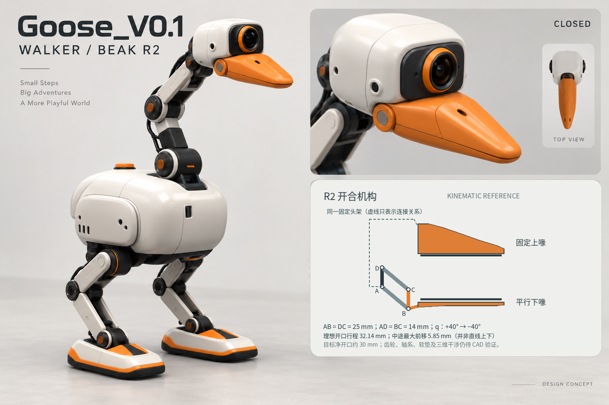

# Goose_V0.1 — 步行鹅结构与候选BOM（嘴部R2配套）

**日期：2026-09-27 · 方向：B / Walker Goose · 状态：外观已选定，硬件选型待验证**

本稿把选定造型拆成内部结构、关节、现成组件、打印加工件和采购入口。它不是制造图、完整装配包或已验证的整机BOM。“整机暂配数量”供结构占位与询价；“首批建议数量”供台架打样，不是采购指令。

## 1. 外观图与参数边界



[嘴部R2机械方案](beak_r2.md) · [配套采购工作簿](../hardware/walker_r2_bom.xlsx)

本次更新嘴部，其余沿用选定的白色圆润机身、长颈、两条机械腿及宽脚掌。方案效果图不含旧版未核算的尺寸、载荷或续航表。详细机构与数量以嘴部R2文档及对应采购分表为准。

**全机背景以本文为准；嘴部以 [嘴部R2说明](beak_r2.md) 与 [本次机构复核](kinematic_review.md) 为准。效果图不定义隐藏机构、尺寸或载荷。**

| 项目 | 本稿采用的口径 |
| --- | --- |
| 每腿关节数 | 按MicroDuck参考的5轴研究，不使用图片的3轴标注。[S01] |
| 鹅颈 | 沿用首轮7R候选，嘴夹独立1轴。并未完成轴线、全工作空间、负载或布线验证。 |
| 高度、质量 | 图内55cm、6–8kg不是核算结果；最终尺寸由实物包络与质量/力矩闭环确定。 |
| 载荷、续航 | 图内0.2–0.5kg、2–4小时没有工程证据，不作为承诺。 |
| 计算单元 | 优先小型Radxa路线；Jetson不是默认必买件。 |
| 头部相机 | 先选RGB相机。单镜头外观不能据此称为双目/RGB-D；ToF另列可选件。 |
| 图上的“力控/自适应夹爪” | 当前落实为单轴开合、柔性接触垫、限流和机械限位的候选；没有力传感/夹持验证。 |

MicroDuck官方产品页标称25cm、780g、15个电机；其RL仓库将每腿5轴、颈头4轴写得明确，嘴夹独立控制。这是参照，不是把上游尺寸、负载或策略复制给Goose。[S01][S11]

## 2. 主要模块与内部结构

以下为本轮布置建议，不是从原图推导出的实际CAD内部装配。

| 模块 | 内部结构建议 | 功能与设计重点 |
| --- | --- | --- |
| 头部 | 轻型相机、镜头面板、头壳、嘴夹驱动及铰接支架 | 大镜头形成眼睛；相机略高于上嘴，实际测试地面工作区是否被嘴遮挡。 |
| 嘴夹 | 固定上喙、平行连杆下喙、单XL330、金属轴/衬套、嘴内软垫及被动微摆托 | 叼轻物、夹拉环、松开放置。嘴尖钝化；不是高力工业夹具。 |
| 鹅颈 | 7个候选旋转轴、连接支架、对侧支撑和护线结构 | 转头、点头、歪头、前探与收颈。要能转，也要有线缆余量和不自碰撞的空间。 |
| 躯干 | 承力内框、主控、USB/总线接口、电源分配、刚性固定IMU | 颈根和髋部的载荷传到内框，外壳主要保护与造型。 |
| 电池舱 | 低位电池托、锁止、连接器及绝缘 | 尽量靠近髋部，抽换不必拆头颈。位置最终由整机重心决定。 |
| 双腿 | 每腿髋偏航、髋侧摆、髋俯仰、膝俯仰、踝俯仰 | 髋侧摆负责横向移重；髋偏航辅助转向。不能只保留图片可见的前后屈伸轴。[S01] |
| 脚掌 | 刚性脚底板、可拆脚壳、软质底垫 | 既要支撑，也要检查摆腿时脚间碰撞、踝部干涉和脚尖离地。 |
| 线束与检修 | 分支线束、护线夹、可拆检修盖 | 颈部外观不能靠把线全部塞进没有空间的关节来实现。 |

**建议的内部层次：**

```text
头部：RGB相机 + 嘴夹（选配ToF）
              │ 活动线束与关节支撑
颈部：7R候选机构
              │
躯干上/中层：承力内框、Radxa主控、通信接口
躯干刚性区域：IMU（不是把活动头的姿态当成机身姿态）
躯干低位：电池与分支电源
              │
左腿5轴                右腿5轴
   │                       │
宽脚掌+软垫             宽脚掌+软垫
```

搬运姿态建议为收颈、低位持物、接近身体；停车后再伸颈。不假设加宽脚就能消除持物行走时的失稳。

## 3. 关节布局：暂按18个执行器研究

**双腿10 + 颈头7 + 嘴夹1 = 18。**

这是沿用首轮7R鹅颈的结构研究表，而不是已选中的成品机械臂。“12个XC330、6个XL330”只是便于零件包络、质量估算和询价的候选分配。对腿部、颈根甚至头部俯仰，都可能需要根据实测更换执行器。

| 关节名 | 部位 | 轴 | 作用 | 暂配候选 | 状态 |
| --- | --- | --- | --- | --- | --- |
| left_hip_yaw | 左腿 | 髋偏航 | 转向与摆脚方向 | XC330-M288-T | 待力矩/温升/冲击测试；仅轻量路线候选 |
| left_hip_roll | 左腿 | 髋侧摆 | 横向移重 | XC330-M288-T | 待力矩/温升/冲击测试；仅轻量路线候选 |
| left_hip_pitch | 左腿 | 髋俯仰 | 前后摆腿 | XC330-M288-T | 待力矩/温升/冲击测试；仅轻量路线候选 |
| left_knee_pitch | 左腿 | 膝俯仰 | 屈伸与下蹲 | XC330-M288-T | 待力矩/温升/冲击测试；仅轻量路线候选 |
| left_ankle_pitch | 左腿 | 踝俯仰 | 脚掌前后贴地角度 | XC330-M288-T | 待力矩/温升/冲击测试；仅轻量路线候选 |
| right_hip_yaw | 右腿 | 髋偏航 | 转向与摆脚方向 | XC330-M288-T | 待力矩/温升/冲击测试；仅轻量路线候选 |
| right_hip_roll | 右腿 | 髋侧摆 | 横向移重 | XC330-M288-T | 待力矩/温升/冲击测试；仅轻量路线候选 |
| right_hip_pitch | 右腿 | 髋俯仰 | 前后摆腿 | XC330-M288-T | 待力矩/温升/冲击测试；仅轻量路线候选 |
| right_knee_pitch | 右腿 | 膝俯仰 | 屈伸与下蹲 | XC330-M288-T | 待力矩/温升/冲击测试；仅轻量路线候选 |
| right_ankle_pitch | 右腿 | 踝俯仰 | 脚掌前后贴地角度 | XC330-M288-T | 待力矩/温升/冲击测试；仅轻量路线候选 |
| neck_base_yaw | 颈/头 | 颈根偏航 | 左右转向 | XL330-M288-T | 沿用首轮7R研究方案；轴线、负载与布线未冻结 |
| neck_base_pitch | 颈/头 | 颈根俯仰 | 整颈前探与抬起 | XC330-M288-T | 沿用首轮7R研究方案；轴线、负载与布线未冻结 |
| neck_twist | 颈/头 | 中段轴向扭转 | 改变弯折平面 | XL330-M288-T | 沿用首轮7R研究方案；轴线、负载与布线未冻结 |
| neck_mid_pitch | 颈/头 | 中段弯折 | 调节S形颈姿态 | XC330-M288-T | 沿用首轮7R研究方案；轴线、负载与布线未冻结 |
| head_yaw | 颈/头 | 头偏航 | 嘴朝向调整 | XL330-M288-T | 沿用首轮7R研究方案；轴线、负载与布线未冻结 |
| head_pitch | 颈/头 | 头俯仰 | 点头与夹取角度 | XL330-M288-T | 沿用首轮7R研究方案；轴线、负载与布线未冻结 |
| head_roll | 颈/头 | 头滚转 | 歪头与夹爪方向 | XL330-M288-T | 沿用首轮7R研究方案；轴线、负载与布线未冻结 |
| beak_open | 嘴夹 | 独立开合 | 固定上喙/平行下喙，约2:1传动 | XL330-M288-T | 需夹持力、开度、夹点与柔顺垫测试 |

## 4. 执行器候选：先比较两种，不一次混入多套生态

| 型号 | 厂商规格摘要 | 本轮用途 |
| --- | --- | --- |
| ROBOTIS XL330-M288-T | 18g，20×34×26mm，推荐5V；5V堵转扭矩0.52N·m；位置/速度/电流等反馈。[S03] | 轻载颈头轴及嘴夹的样件。 |
| ROBOTIS XC330-M288-T | 23g，同为20×34×26mm；推荐5V；5V堵转扭矩0.93N·m；金属齿轮。[S04] | 腿部与颈俯仰轴的轻量路线测试候选。 |

二者的**堵转扭矩不是可长期使用的持续扭矩**。同一外形/总线也不代表动力学、零点、控制参数可互换。尤其不能把这组小型执行器理解为已经可以支撑55cm、6–8kg的Goose。

例如仅有0.10kg物体、相对于某关节轴的水平力臂0.20m时，静态重力矩就约为 `0.10 × 9.81 × 0.20 = 0.196N·m`；这还不包括相机、嘴夹、连杆、电机自重和加速负载。该算式是示例，不是本机负载模型。

首批建议各拿2个进行台架测试：实测位置跟踪、摩擦/齿隙、保持温升及负载变化，再决定整机执行器。若不满足，要调整尺寸、重量、结构或电机，不靠超压驱动弥补。

## 5. 现成组件与采购入口

下表价格为上一轮整机记录，本配套版未逐项重新核价；不含税、物流、进口成本，库存与交期未确认。嘴部细目以配套工作簿“嘴部R2采购”为准，不能与整机父项叠加采购。空白单价保留为待询价。

| 编号 | 组件 | 候选型号/形式 | 整机暂配 | 首批建议 | 参考单价USD | 状态 | 放行条件 | 官方资料/采购入口 |
| --- | --- | --- | --- | --- | --- | --- | --- | --- |
| A01 | 腿部及重载颈轴执行器 | ROBOTIS XC330-M288-T | 12 个 | 2 个 | $103.39 | 先样件 | 先核算/实测持续力矩、步态速度、温升；不适用于已承诺的55cm/6–8kg整机 | [S04](https://emanual.robotis.com/docs/en/dxl/x/xc330-m288/) [S13](https://www.robotis.us/dynamixel-xc330-m288-t/) |
| A02 | 轻载颈头与嘴夹执行器 | ROBOTIS XL330-M288-T | 6 个 | 2 个 | 待询价 | 先样件 | 额外头颈质量需反算上游负载；完整7R尚未验证 | [S03](https://emanual.robotis.com/docs/en/dxl/x/xl330-m288/) |
| E01 | 机载主控 | Radxa ZERO 3W，建议2GB及板载eMMC版本 | 1 块 | 1 块 | 待询价 | 先样件 | 核对具体SKU、USB、电源、板卡尺寸与ONNX时延 | [S05](https://docs.radxa.com/en/zero/zero3) |
| E02 | 舵机通信转换器 | ROBOTIS U2D2 | 1 个 | 1 个 | $36.92 | 先样件 | 配置驱动/端口并实测读写时序；不能直接套原版串口程序 | [S06](https://emanual.robotis.com/docs/en/parts/interface/u2d2/) [S12](https://robotis.us/products/u2d2) |
| E03 | USB扩展 | 两口以上USB Hub，具体型号待选 | 1 个 | 1 个 | 待询价 | 待选型 | 同时验证UVC视频与串口；核对供电和反向灌电 | [S05](https://docs.radxa.com/en/zero/zero3) [S06](https://emanual.robotis.com/docs/en/parts/interface/u2d2/) [S07](https://www.arducam.com/arducam-usb-autofocus-imx219-b0292.html) |
| S01 | 头部主相机 | Arducam B0292 | 1 个 | 1 个 | $34.99 | 先样件 | 测试最近工作距离、夹爪遮挡、视频延迟与头部实重 | [S07](https://www.arducam.com/arducam-usb-autofocus-imx219-b0292.html) |
| S02 | 躯干IMU | SparkFun SEN-21336 / LSM6DSV16X | 1 块 | 1 块 | $25.50 | 先样件 | 需时间戳/姿态估计/驱动适配；非MicroDuck imu_to_dxl替换件 | [S08](https://www.sparkfun.com/sparkfun-micro-6dof-imu-breakout-lsm6dsv16x-qwiic.html) [S14](https://github.com/pollen-robotics/microduck/blob/main/docs/design/robotd-design.md) |
| S03 | 近距ToF（可选） | Pololu #3417 / VL53L5CX | 0 块 | 0 块 | $19.95 | 可选 | 先验证RGB方案；不等同精密抓取深度相机；3.3V主机需匹配I2C电平 | [S09](https://www.pololu.com/product/3417) |
| S04 | 状态灯与导光件 | 低功耗LED、驱动限流及打印导光结构 | 1 套 | 0 套 | 待询价 | 待选型 | 灯不与镜头混淆；具体电路和安装面待定 | 本轮结构建议 |
| S05 | 音频模块（可选） | 小扬声器+功放；麦克风仅按任务需要 | 0 套 | 0 套 | 待询价 | 可选 | 不属于抓取闭环的首批采购；型号和接口未选定 | 本轮结构建议 |
| P01 | 可拆电池包 | 带保护的成品电池包，串数/容量/接口待选 | 1 组 | 0 组 | 待询价 | 暂缓 | 按整机峰值/均方根电流与质量选型；NP-F外形不代表放电能力够用 | [S11](https://store.pollen-robotics.com/products/microduck) |
| P02 | 匹配充电器 | 与最终电芯化学体系及串数匹配的成品充电器 | 1 个 | 0 个 | 待询价 | 暂缓 | 电池SKU冻结后一起购买 | 本轮结构建议 |
| P03 | 整机电源分配 | 分支降压、保险、防反接、断电器件及连接器 | 1 套 | 0 套 | 待询价 | 待选型 | 各支路电流、线损、回灌和散热测试后才能下单 | [S03](https://emanual.robotis.com/docs/en/dxl/x/xl330-m288/) [S04](https://emanual.robotis.com/docs/en/dxl/x/xc330-m288/) |
| P04 | 降压模块台架候选 | Pololu D24V90F5 | 待定 块 | 1 块 | $36.82 | 先样件 | 不能以9A标题认定一块能带18舵机；不并联未知均流模块 | [S10](https://www.pololu.com/product/2866) |
| P05 | 运动电源切断组件 | 锁止按钮+适配直流负载的切断电路 | 1 套 | 1 套 | 待询价 | 待选型 | 按钮外形不是安全认证；断电会失去支撑，先在防坠台架测试 | 本轮结构建议 |
| C01 | DYNAMIXEL信号/电源线束 | X330对应X3P线、分支连接与应力释放 | 1 套 | 1 套 | 待询价 | 待选型 | 长度/线径/针序/压降待走线定稿；电机不带电插拔 | [S03](https://emanual.robotis.com/docs/en/dxl/x/xl330-m288/) [S04](https://emanual.robotis.com/docs/en/dxl/x/xc330-m288/) |
| C02 | 电池与电源线束 | 防反插连接器、软线、绝缘及固定件 | 1 套 | 1 套 | 待询价 | 待选型 | 连接器持续/峰值电流和弯折半径核对 | 本轮结构建议 |
| C03 | IMU与相机线束 | Qwiic 3.3V线、USB数据线与活动段软线 | 1 套 | 1 套 | 待询价 | 待选型 | I2C电平、USB弯折寿命、抗拉与插头尺寸验证 | [S05](https://docs.radxa.com/en/zero/zero3) [S07](https://www.arducam.com/arducam-usb-autofocus-imx219-b0292.html) [S08](https://www.sparkfun.com/sparkfun-micro-6dof-imu-breakout-lsm6dsv16x-qwiic.html) |
| M01 | 舵盘/从动支撑/连接件 | 与所选X330型号匹配的官方或验证过的支撑件 | 1 套 | 1 套 | 待询价 | 待选型 | 不能按概念图圆形关节直接选择圆形电机；核对附件清单 | [S03](https://emanual.robotis.com/docs/en/dxl/x/xl330-m288/) [S04](https://emanual.robotis.com/docs/en/dxl/x/xc330-m288/) |
| M02 | 金属轴/轴承/衬套 | 按CAD轴径与受力位置选型 | 1 套 | 1 套 | 待询价 | 待CAD | 未做轴系CAD前，不指定608等具体轴承尺寸 | 本轮结构建议 |
| M03 | 紧固件 | M2/M3螺钉、螺母、垫片与适配热熔嵌件 | 1 套 | 1 套 | 待询价 | 待CAD | 螺纹、长度、锁紧方式与数量待装配图，不强改厂商螺孔 | 本轮结构建议 |
| M04 | 可更换脚底垫 | 橡胶/硅胶片或经测试的TPU垫 | 2 片 | 2 片 | 待询价 | 先样件 | 测试摩擦、压缩、磨耗；非宽脚必然稳定 | 本轮结构建议 |
| M05 | 可更换嘴夹垫 | R2约2mm硅胶垫，Shore A20–30试样；三段接触区 | 2 片 | 4 片 | 待询价 | 先样件 | 摩擦/滑移/小物体夹持试验；不是经过验证的力控夹爪 | 本轮结构建议 |
| T01 | 限流稳压电源（测试工具） | 电压设为所选舵机工作点；带限流与保护 | 0 台 | 1 台 | 待询价 | 先样件 | 按测试电流选档；确认供电极性及超压保护 | [S03](https://emanual.robotis.com/docs/en/dxl/x/xl330-m288/) [S04](https://emanual.robotis.com/docs/en/dxl/x/xc330-m288/) [S06](https://emanual.robotis.com/docs/en/parts/interface/u2d2/) |
| T02 | 防坠与关节测试夹具（工具） | 台架/固定夹/承力支架 | 0 套 | 1 套 | 待询价 | 待CAD | 不得在整机演示中用隐藏支撑代替平衡能力 | [S02](https://github.com/sgyli7/Sai_Rotbots/blob/main/docs/OPEN_SOURCE_STATUS.md) |

### 采购清单里容易漏掉的实际连接件

USB相机与U2D2同时使用时，需要确认主控可用USB Host口，必要时加Hub；不是买齐三块板就自然能连接。[S05][S06][S07]

U2D2只负责通信，不给舵机供电。[S06] SparkFun IMU虽然采用与上游相关的LSM6DSV16X芯片，但它是通用I2C模块，不是MicroDuck原生`imu_to_dxl`板，需要自己的驱动、采样时间戳和姿态融合接口。[S08][S14]

舵盘、从动支撑、线材和螺钉是否随舵机附送，要逐SKU核对；最终需要哪些长度和数量，应由装配CAD导出，不靠效果图估计。

## 6. 可打印/可加工件目录

下表的软垫与采购表描述的是同一物料，不重复计价。材料是工艺候选，承力打印件必须测试层间方向、紧固和受力工况；不是指定材料后即可认定强度合格。

| 编号 | 零件组 | 暂配数量 | 单位 | 制造路线建议 | 结构重点 | 当前边界 |
| --- | --- | --- | --- | --- | --- | --- |
| F01 | 头壳与镜头面板 | 1 | 套 | PETG/ASA分体打印 | 相机可拆；镜头/USB插头包络；散热与碰撞保护 | 仅候选外观；尚无制造STL |
| F02 | 上嘴与下嘴刚性骨架 | 1 | 套 | 打印主体+金属铰接轴 | 固定上喙、平行下喙、双侧等长摆杆；嘴尖钝化；嘴内微顺应垫 | 夹持开度/连杆与负载待测试 |
| F03 | 嘴夹软垫 | 2 | 片 | 裁切橡胶/硅胶或TPU打印 | 机械卡位或螺固；避免脱落 | 与组件M05为同一物，不重复计价 |
| F04 | 颈段连接件与关节护罩 | 1 | 套 | 验证后的打印件；必要部位金属加强 | 7轴布置、双侧支撑、限位、线缆弯曲空间 | 护罩不代表已选中的电机外形 |
| F05 | 躯干外壳与检修盖 | 1 | 套 | 分体打印 | 主控/电池可独立拆；孔位在布置后生成 | 不含Cargo；不以渲染切面代替装配图 |
| F06 | 躯干承力内框 | 1 | 套 | 金属板件与验证后的打印支座 | 颈根/髋部力传到内框，外壳不作唯一承力件 | 壁厚、应力、紧固与跌落工况待定 |
| F07 | 腿部支架与对侧支撑 | 2 | 套 | 金属受力件/验证后的打印支架 | 每腿5轴；髋偏航和侧摆不能省略 | 轴线、无碰撞运动范围待CAD |
| F08 | 宽脚掌上壳与底板 | 2 | 只 | 刚性脚板+打印上壳 | 踝轴位置、脚间隙、脚底垫安装 | 不直接承诺不平地面/楼梯能力 |
| F09 | 脚底垫 | 2 | 片 | 裁切橡胶/硅胶或TPU打印 | 接地摩擦与微小缓冲 | 与组件M04为同一物，不重复计价 |
| F10 | 电池托与锁止件 | 1 | 套 | 打印+必要的金属锁止 | 低位装配，绝缘、防反插、能检修 | 电池型号冻结后制作 |
| F11 | 相机/IMU/主控安装架 | 1 | 套 | 小型打印支架+紧固件 | IMU刚性固定；相机光心可标定 | 没有额外第二IMU/力传感器默认需求 |
| F12 | 线夹/护线件/插头挡块 | 1 | 套 | 打印或采购标准件 | 连接器卸载与活动段抗拉 | 长度和位置由机构全行程检查确定 |

## 7. 供电与感知的接口约束

### 供电

拟采用“电池/台架电源 → 保护与分配 → 逻辑电源、执行器电源分支”的结构，具体容量、电流和降压模块数量待测试。这里不是可直接照接的电路图。

XL330-M288-T与XC330-M288-T的厂商允许输入范围均为3.7–6.0V、推荐5V。[S03][S04] 即便上游仿真配置出现不同电压，也不能据此把2S/3S电池原电压直接加到这些标准型号上。

Pololu D24V90F5是可测试的5V支路候选，而不是已经选定的整机电源。厂商说明实际持续电流受热条件影响，不能将标题中的“9A”直接用于18舵机整机保证。[S10] 未验证均流的输出不能简单并联；回灌、负载跃变、线损及限流都应验证。

停止运动与切断执行器供电需要区分。双足断电会失去主动支撑；先在防坠台架验证故障处理，不能把图上的橙色按钮称为已经实现的安全急停系统。

### 相机与嘴夹

B0292是RGB相机候选，不是RGB-D。[S07] 需要实际测试嘴尖工作距离、镜头近焦范围、抓物时遮挡和延迟。选配VL53L5CX只增加8×8测距，不等同高分辨率三维抓取相机。[S09]

嘴部R2保持一个主动输入，经约2:1传动带动平行下喙；增加嘴内分区软垫、被动微摆托、限流及机械止挡。电流反馈只能辅助判断受力，不能当成经过标定的夹持力传感器；瓶子、杯子、柔软织物、细拉环应分开测试。

## 8. 和既有工程的衔接

MicroDuck的每腿5轴、50Hz策略循环、执行器建模与ONNX导出规则值得参考；50Hz是策略/控制频率，不能直接当作所有物理仿真的步进频率。[S01]

Goose的拟议18执行器结构与原MicroDuck的15执行器不同。原14维策略动作和61维观测不会因为外形相近就自动适配。需要独立的关节顺序、坐标/限位、惯量与执行器参数，再确定观测和动作契约。[S01]

Sai_Rotbots中的模型/控制/来源记录方法可以沿用，但其既有轮腿机器人质量、阶梯成绩、仿真扭矩上限和100g任务证据，不是Goose的硬件证明。[S02]

## 9. 当前可执行的采购边界

现在适合采购的是：两类执行器样件、通信接口、主控/相机/IMU，以及测试供电、线材、软垫和台架。首先解决“头嘴实重 → 颈部负载 → 单腿关节负载”这条链。

整机18个执行器、最终电池、电源分配、承力内框、完整壳体和全部螺钉暂不批量下单。它们需要在实物尺寸、力矩/热测试及CAD装配之后释放。

本配套版同步了整体结构、嘴部方案与采购工作簿。没有完成制造CAD、整机仿真训练、实机步行、采购、订单提交或仓库修改。

## 一手来源

**[S01] MicroDuck RL / 关节布局与训练约定**  
https://github.com/pollen-robotics/microduck_rl/blob/develop/README.md  
每腿5关节；颈头4关节；14维动作，嘴夹独立；50 Hz策略。读取文件blob：7575f9baf33db3dd2bee7131e3b1e212d54ccac1。

**[S02] Sai_Rotbots / 硬件成熟度**  
https://github.com/sgyli7/Sai_Rotbots/blob/main/docs/OPEN_SOURCE_STATUS.md  
仿真alpha；未完成制造、实机持续力矩与热验证。读取文件blob：7a5951295e3b6736f09498e677ce3a5f656ca0f0。

**[S03] ROBOTIS XL330-M288-T e-Manual**  
https://emanual.robotis.com/docs/en/dxl/x/xl330-m288/  
18 g；20×34×26 mm；3.7–6.0 V，推荐5 V；0.52 N·m@5 V为堵转扭矩。

**[S04] ROBOTIS XC330-M288-T e-Manual**  
https://emanual.robotis.com/docs/en/dxl/x/xc330-m288/  
23 g；20×34×26 mm；3.7–6.0 V，推荐5 V；0.93 N·m@5 V为堵转扭矩；金属齿轮。

**[S05] Radxa ZERO 3 官方文档**  
https://docs.radxa.com/en/zero/zero3  
RK3566，65×30 mm；USB接口、电源、存储选项以具体板卡版本为准。

**[S06] ROBOTIS U2D2 e-Manual**  
https://emanual.robotis.com/docs/en/parts/interface/u2d2/  
USB到DYNAMIXEL通信接口；不向舵机供电。

**[S07] Arducam B0292 官方产品页**  
https://www.arducam.com/arducam-usb-autofocus-imx219-b0292.html  
8MP A219/IMX219系列自动对焦USB UVC相机；官方页面参考价USD 34.99。不是深度相机。

**[S08] SparkFun SEN-21336 / LSM6DSV16X**  
https://www.sparkfun.com/sparkfun-micro-6dof-imu-breakout-lsm6dsv16x-qwiic.html  
Micro Qwiic IMU；19.05×7.62 mm；3.3 V接口路线；官方页面参考价USD 25.50。不是MicroDuck原生DYNAMIXEL IMU板。

**[S09] Pololu #3417 / VL53L5CX**  
https://www.pololu.com/product/3417  
8×8 ToF测距；13×18×3 mm；裸板0.5 g；官方页面参考价USD 19.95。非完整RGB-D。

**[S10] Pololu #2866 / D24V90F5**  
https://www.pololu.com/product/2866  
5 V降压模块，标题9 A；持续电流取决于热条件，页面给出典型4–8 A范围；官方参考价USD 36.82。

**[S11] MicroDuck 官方产品页**  
https://store.pollen-robotics.com/products/microduck  
官方标称25 cm、780 g、15电机、RK3566、相机/ToF；仅用于参照，不是Goose规格。

**[S12] ROBOTIS U2D2 官方商店**  
https://robotis.us/products/u2d2  
官方页面参考价USD 36.92；库存/交期需确认。

**[S13] ROBOTIS XC330-M288-T 官方商店**  
https://www.robotis.us/dynamixel-xc330-m288-t/  
检索显示参考价USD 103.39；价格为公开页面快照，非含税到手报价，采购前复核。

**[S14] MicroDuck robotd / 原生硬件接口**  
https://github.com/pollen-robotics/microduck/blob/main/docs/design/robotd-design.md  
原生15舵机与imu_to_dxl v2共用串口总线；通用I2C IMU及U2D2需适配，不是原版软件即插即用。
