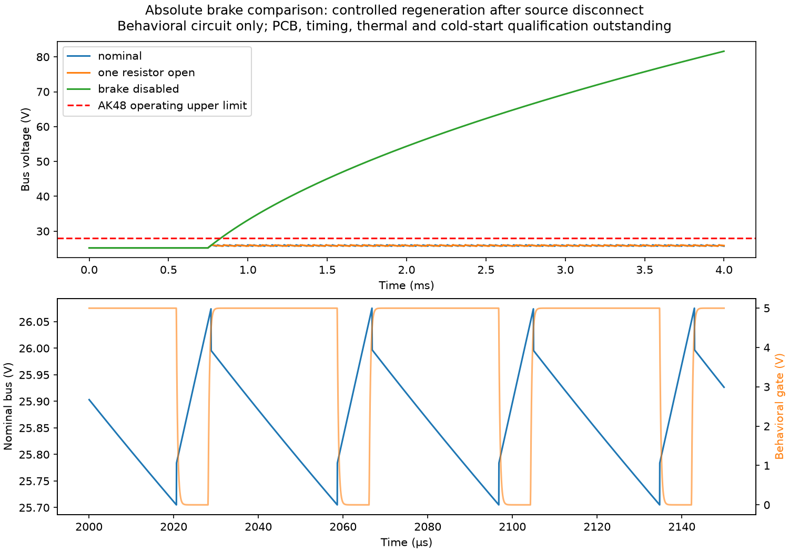

# 绝对阈值制动支路：可编辑电路与行为仿真检查点

2026-10-04。本轮把“绝对约26V阈值”推进为有具体器件、针脚、可编辑KiCad源及NGSPICE波形的独立比较候选。**不是PCB制造文件、可采购放行BOM或整机供电放行**。478件硬件源、质量惯量及003训练包未改变。

## 电路与来源

[候选配置](../configs/absolute_brake_chopper_candidate.json)保存46个引用、准确SKU、针脚/网络、7份原厂PDF哈希及未确认项；[KiCad 7源](absolute_brake_chopper/absolute_brake_chopper.kicad_sch)内嵌符号，打开不依赖额外符号库。[逐件候选清单](absolute_brake_chopper/candidate_bom.csv)保留未定SKU，不填造可采购状态。符号针脚类型暂为passive；原生解析和连通性核对不等于ERC通过，全部封装尚未放行。

| 功能 | 候选与原厂依据 | 本轮边界 |
|---|---|---|
| 母线自供5V | [TPS7A1650DGNR](https://www.ti.com/lit/ds/symlink/tps7a16.pdf)，固定5V版 | IN/EN连接急停断开后的电机BUS；固定版针2 DNC保持未连接；EP用编辑器pad9表示，不是宣称原厂给它编号9 |
| 2.5V基准 | [REF5025IDR](https://www.ti.com/lit/ds/symlink/ref50.pdf)，高等级 | 0.05%初始、3ppm/K；不混用标准等级AIDR；焊接漂移仍需核验 |
| 滞回检测 | [TLV3201DBVR](https://www.ti.com/lit/ds/symlink/tlv3201.pdf)，100k/10.7k/1.65M反馈 | 55ns规格要求5V、20mV输入过驱和15pF负载；器件内部滞回仅有典型值，不能补成最大值保证 |
| 栅极驱动 | [UCC27511DBVR](https://www.ti.com/lit/ds/symlink/ucc27511.pdf) | 按本型号1=VDD、2=OUTH、3=OUTL、4=GND、5=IN−、6=IN+；不套相近型号针脚 |
| 制动开关 | 4×[BSC027N06LS5](https://www.infineon.com/assets/row/public/documents/24/49/infineon-bsc027n06ls5-datasheet-en.pdf) | 栅极各自2.2Ω和100k下拉；4.5V下3.9mΩ，热倍率1.8为假设；电流共享、实际铜面积及开关损耗未资格 |
| 电阻支路 | 8×[LTO100F4R700FTE3](https://www.vishay.com/docs/50051/lto100.pdf)，4.7Ω±1%并联 | 100W要求25°C壳温，不能当自由空气额定；单次冷态脉冲曲线不能代替重复热资格；库存未确认 |
| 母线电容 | 10×[35SVPF120M](https://industrial.panasonic.com/cdbs/www-data/pdf/AAB8000/AAB8000COL88.pdf)，120µF/35V | 第33页4.4Arms条件100kHz/105°C，10–100kHz补正0.7；ESR18mΩ条件100–300kHz/20°C，不能自动用于所有频率和寿命阶段 |

支路位于独立断开器的**负载侧**：`BUS → 电阻组 → MOS开关 → GND`；检测器和驱动也从BUS取电。J3只提供BIAS_PG观察，尚未构成硬件启用链。此结构避免简单把制动供电一并切走；本轮行为模型仍采用预先建立的理想5V/2.5V，未证明真实冷启动、掉电恢复或故障状态。

## 已验证的范围

[角点比较](../evidence/absolute_brake_chopper_comparison.json)与[真实NGSPICE输出摘要](../evidence/absolute_brake_chopper_spice.json)分别保存，不把理想波形当成器件最大保证。

- 原生KiCad 7.0.11导出的13网络、128连接针脚与配置一致；DNC保持未连。17项测试覆盖错误基准等级、上游取电、反相/错误驱动针脚、MOS/电容极性、阈值反馈、重复引用、虚假放行以及独立节点方程求解。
- 名义开启26.016V、关闭25.713V。每个转换64个保守角点，包含声明的回流焊与内部滞回预留；开启25.698–26.323V、关闭25.404–26.035V。这两项预留及精密电阻SKU仍未由原厂或实板保证，因此不是资格区间。
- 按17轴未改的受控轴功率包络890.429W、初始最小960µF、独立ESR预留及假设5µs整链响应，加入20mV比较器过驱后比较峰值26.767V。保持28V下的要求预算约41.3µs，**实际最大响应仍未知**。50/100µs反例被拒绝。
- NGSPICE 42实际积分4ms：上游源在0.5ms断开、890.429W理想回馈从0.75ms开始；名义峰值26.0754V，单电阻断开26.0753V；关闭制动的反例约0.829ms越过28V。之后的高电压只是无器件损坏模型的拒绝轨迹，不能解释为硬件能承受81.6V。
- 波形能量平衡包含电容储能、制动电阻、Ron开关、ESR和检测分压耗能，相对误差小于1e−8。名义/单电阻断开中位开关频率约26.27/12.52kHz；理想均流单电容RMS约1.792/1.162A，小于相应0.7补正后的3.08A。实际ESR频谱、寿命、均流和温升未闭合。



## 合回整机后的限制

当前478件账本有`main_protection`93g及`brake_hardware_extra_allocation`120g，共213g未闭合预留。120×80×6mm裸铝均热板按2700kg/m³为155.52g；8个电阻的原厂质量上界合计28g，比较组合183.52g，尚余29.48g供PCB、电容、其余元件、安装与线束。**这是库存预留对照，不是完整装机质量**；不得只抵扣其中一项，或把未资格散热板当最终散热器。没有据此更改整机质量与惯量。

468.769W连续负功率的理想均分约58.60W/电阻，按1.5K/W内部热阻需要壳温≤87.1°C；普通小铝板没有因此取得持续散热资格。0.1s峰值冷脉冲比较为11.13J/电阻，仍需按原厂脉冲曲线、初始温度和重复周期验收。本轮没有安装包络/固定/导热/气流源，因此不声明装得进机身。

下一整机退出条件：完成真实板件、线束/断开与冷启动路径、热/频率保证和安装固定后，替换账本预留并在同版装配复跑静力、干涉及接触回归。物理急停/看门狗保证、整机任务与跨应用引擎资格仍保留，不能由本电路局部通过覆盖。

后续独立增量见[制动安装检查点](brake_packaging_checkpoint.md)：已有48件原生CAD、独立同版SI及有限转向／低姿态和静力证据；这没有改写本电路的原始波形或替代PCB、热／线束／工具资格，也没有修改003训练包。

## 复现

使用Python项目依赖、KiCad 7及NGSPICE 42；生成物和连续波形留在忽略的`artifacts/`，原厂PDF不入库。以下命令从仓库根执行，均离线，不向电机发命令：

```bash
PYTHONPATH=src python scripts/models/build_goose_brake_chopper.py --spice-output artifacts/Goose_V0.1/brake_chopper_review/spice
kicad-cli sch export netlist --format kicadxml --output artifacts/Goose_V0.1/brake_chopper_review/circuit.xml robots/Goose_V0.1/hardware/absolute_brake_chopper/absolute_brake_chopper.kicad_sch
PYTHONPATH=src python scripts/models/build_goose_brake_chopper.py --native-netlist artifacts/Goose_V0.1/brake_chopper_review/circuit.xml --spice-output artifacts/Goose_V0.1/brake_chopper_review/spice
ngspice -b artifacts/Goose_V0.1/brake_chopper_review/spice/nominal.cir > artifacts/Goose_V0.1/brake_chopper_review/spice/nominal.log 2>&1
ngspice -b artifacts/Goose_V0.1/brake_chopper_review/spice/one_resistor_open.cir > artifacts/Goose_V0.1/brake_chopper_review/spice/one_resistor_open.log 2>&1
ngspice -b artifacts/Goose_V0.1/brake_chopper_review/spice/brake_disabled.cir > artifacts/Goose_V0.1/brake_chopper_review/spice/brake_disabled.log 2>&1
python scripts/diagnostics/check_goose_brake_chopper.py --directory artifacts/Goose_V0.1/brake_chopper_review/spice
PYTHONPATH=src python -m pytest -q tests/test_goose_brake_chopper.py
```
