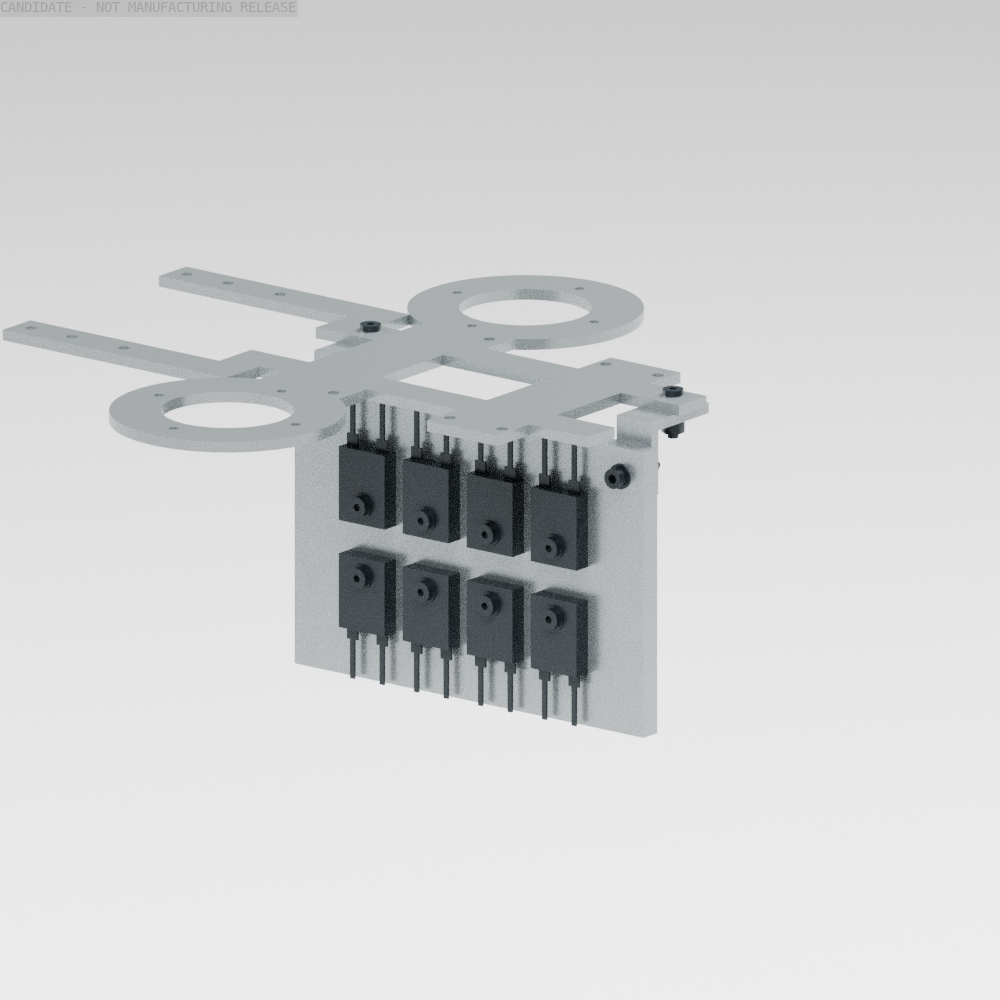
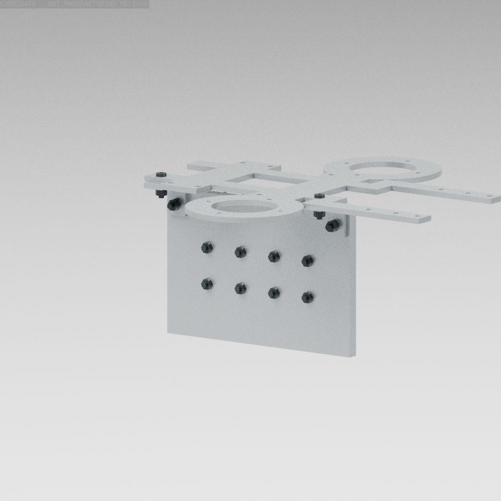

# 制动安装组：独立 CAD、质量与有限姿态检查点

2026-10-04。把绝对阈值制动电路中的8个电阻、安装板、紧固件和固定路径推进为48件可回读的原生CAD增量。**这仍是安装比较候选，不是完整PCB、散热或制造放行；没有替换478件基线或003训练包。**

| 表示 | 本轮身份与范围 |
|---|---|
| 保留的硬件基线 | 478显示对象，18主动轴，19体闭嘴SI，10.398672986kg条件质量 |
| 独立安装候选 | 525显示对象，18主动轴，19体闭嘴SI，10.486951740kg条件质量，增加88.279g |
| 实际CAD增量 | 48件：包含替换计算平台板、均热板、8个整件电阻、2个L支架和紧固件；原生BREP、STEP/STL和quad采样源 |
| 游戏／训练模型 | 仍是003的11个凸碰撞体、21动力学体、18主动轴；没有引入这些五金细节或改写旧SI |

## 安装与质量

[配置](../configs/brake_packaging_candidate.json)、[逐件源及交换记录](../cad/exports/brake_packaging/manifest.json)、[独立装配源](../cad/source/brake_packaging/assembly_scene.json)和[质量惯量账本](../evidence/brake_packaging_parameters.json)绑定同一父源。原生几何使用零位世界毫米；装配与SI统一加3.7mm全局升高，不能在旋转配合时重复加上。

120×80×6mm铝板竖放在机身内部，8个LTO100整件按两排、引脚朝外布置；两只L支架把它连接到保留的计算平台板。平台板仅另开两处3.2mm孔，旧源保留。电阻的3.5g原厂质量上界已经包含引脚，未重复计重。

首版3mm高的螺钉头只留1mm颈底净空，[失败实体与证据](../evidence/brake_packaging_socket_head_rejection.json)保留。平台改用[ISO7380 M3×12低头件的最大尺寸](https://www.accu.co.uk/socket-button-screws/494801-SSB-M3-12-10-9)，该处名义净空2.35mm。电阻使用[ISO7380-1 M3×16 A2低头件](https://www.accu.co.uk/socket-button-screws/8106-SSB-M3-16-A2)、M3垫圈和[DIN934 M3金属螺母](https://www.accu.co.uk/hexagon-nuts/7888-HPN-M3-A2)，取供应商最大头／螺母包络；国内供货、安装预紧和防松工艺仍未放行。防松胶是待资格工艺，不能拿产品温度范围当本连接的振动或热保证。

原先的左前部PCB预留会进入左髋转向空间，螺钉头也在髋偏航／侧摆角点触碰电机；[有限运动失败记录](../evidence/brake_motion_rejection.json)保留。新版安装组横向偏移1.5mm，板件预留改为机身前部的19.2×80×50mm竖向包络。没有缩小关节范围或套用仿真碰撞忽略。**这个框还不是PCB布局、安装设计或实际质量分布。**

48件合计302.611g，其中包含替换的平台板。仅抵扣旧平台板94.332g和制动安装预留120g；`main_protection`的93g电路／线束预留完整保留在原声明位置。因此新增质量88.279g，不能把空PCB框当已做出的器件，或把两个预留都无依据清空。

## 已通过的局部范围

[原生安装与静力证据](../evidence/brake_packaging_checks.json)检查48个新件、保留原生硬件、PCB及其余电子预留。旧平台板回读与公共体积证明只移除两孔材料，未扩大或隐藏原有零件。每个新增件通过原生自交／单实体、STEP和STL回读；quad采样闭合及体积误差门槛仍为0.5%。名义面接触和垫圈堆叠可要求零间隙，**仍拒绝正实体干涉**。自交集正对照与故意错放PCB的反例均用于检查查询能识别材料。

[运动净空证据](../evidence/brake_motion_clearance.json)覆盖21个不同有限姿态：零位、40／60／80度下蹲、低取、左右单脚支撑、左右及双髋±15度转向、各髋声明偏航／侧摆范围的四个角点。被动嘴部按保留契约的mimic运动，先核对主动轴位兼容与零位坐标恒等。所有样本通过2mm门槛，实际近对最小间隙约2.163mm。无原生CAD的保留显示／采购包络只在本检查内部构造保守凸包，**没有写回硬件源或运行碰撞模型**。这不是连续轨迹或完整任务资格。

同版质量／COM／完整惯量合回后，嘴尖20N和中段50N的两组各63例静力筛查通过，继续使用原有驱动限值及理想接触条件。质量增加而某些余量改善来自安装位置及账本估计范围变化，不意味着动态或热能力增加。实际连续额定、打印材料和完整接触任务仍另行资格。

下面两张来自本轮48件quad源，只显示安装组及替换平台板；没有把空PCB框画成实体电路：





## 后续退出条件与复现

实际PCB与元件、固定／连接器／弯线和检修工具路径、连续联合扫掠、散热与导热接触、防松／预紧工艺仍须闭合。原厂LTO100的壳温额定不代表这块小铝板能持续耗散468.769W；电路冷启动、断开器、最大整链响应、频谱／均流和实板热资格见[电路检查点](absolute_brake_chopper_checkpoint.md)。保留原模型的两处嘴壳完整性超时和未建组件缺口，不用本安装组局部通过覆盖整机问题。

以下命令从仓库根运行，使用build123d/OCP、NumPy、SciPy、trimesh、MuJoCo及Blender4.0；不向硬件发送命令：

```bash
PYTHONPATH=src python scripts/cad/build_goose_brake_packaging.py
PYTHONPATH=src python scripts/diagnostics/check_goose_brake_packaging.py
PYTHONPATH=src python scripts/diagnostics/check_goose_brake_motion_clearance.py
blender -b --factory-startup --python-exit-code 2 --python scripts/models/render_goose_brake_packaging.py -- --output artifacts/Goose_V0.1/brake_packaging_review/render
PYTHONPATH=src python -m pytest -q tests/test_goose_brake_packaging.py
```

渲染的PNG校验与源身份见[渲染记录](../evidence/brake_packaging_render.json)。安装候选的独立参数可供下一轮整机比较，未取得训练／制造／电气放行。
