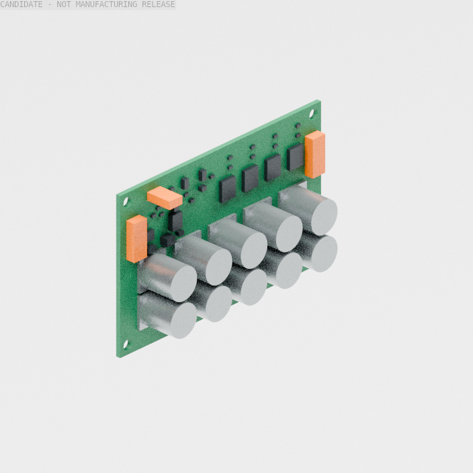
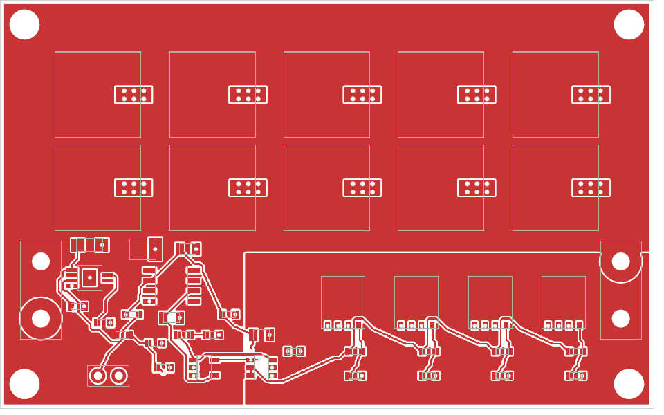

# 制动板：原生 ECAD 与安装包络检查点

2026-10-04。[独立配置](../configs/brake_pcb_candidate.json)把上一轮制动电路推进为可编辑的 [KiCad 原理图](brake_pcb_candidate/brake_pcb_candidate.kicad_sch)、[PCB](brake_pcb_candidate/brake_pcb_candidate.kicad_pcb)及随项目保存的自定义焊盘库。**连通和几何 DRC 已通过；整机供电、制造及采购仍未放行。** 本版没有替换478件硬件基线、525件制动安装候选或11凸体运行包，也没有继续PPO。

| 实有交付 | 验证范围 |
|---|---|
| 80×50×1.6mm 双层板，44个板上元件、8个外置电阻 | 15个电气网络、141个原生原理图连通针脚，44个PCB与原理图实例关联 |
| 35条信号连接及BUS／制动回路／地铜区 | 原生KiCad7.0.11 DRC为0违规、0未连接、0封装错误；独立复制项目后重复通过 |
| 45件包络BREP、闭合quad采样及STEP | 全部位于前轮PCB预留内，STEP回读保留45个实体；不是原厂精细器件CAD |
| [候选清单](brake_pcb_candidate/candidate_bom.csv) | 精确器件、目录订货码候选和未定无源件分别注明；不能直接作为采购放行单 |

[构建记录](../evidence/brake_pcb_native_check.json)、[原生DRC](../evidence/brake_pcb_native_drc.txt)、[复制及反向检查](../evidence/brake_pcb_native_reload.json)与[原生几何记录](../evidence/brake_pcb_envelope_check.json)绑定本版源哈希。故意把U1焊盘叠到同一点，检测到93项违规和4个未连接；移除反馈中点走线，检测到1个未连接。反例使用同一封装库，另行核实改动实际序列化，避免用缺库警告冒充发现电气故障。电路、封装／报告拒绝及原有制动安装的42项测试通过；这些不是整机全部测试。

## 电路与封装依据

固定输出LDO采用DGN8图纸，不误用DRB；比较器采用DBV5，不误用DCK。SVPF电容检查安装底座宽度与最大高度，使用10.5mm底座包络、12.7mm高度，不能只看标称10mm罐体直径。MOSFET大漏极焊盘依据原厂图纸重建，独立复核仍待完成。

按[Yageo RT目录](https://yageogroup.com/content/datasheet/asset/file/PYU-RT_1-TO-0-01_ROHS_L)的25ppm/°C、0.1%范围，0603反馈改为两只825kΩ串联，保持总值1.65MΩ；中点仅连接两只电阻，未改变比较器反馈的理想阈值。订货码是目录候选，库存未核实。补入基准输入及驱动输入的局部电容、比较器旁路和LDO PG延迟电容。PG目前仅引到监测端，尚未形成独立硬件使能链。

提出的叠层为两面70µm铜、1.44mm芯板及两面10µm阻焊；原生PCB文件保存此叠层，板厂能力尚未确认。焊盘内接地过孔需要填孔／盖铜工艺；不能把普通开孔过孔当作等价已合格焊接方案。DRC检查铜间距和连通，不计算载流、铜温、寄生电感、均流或响应上界。原理图符号的引脚均为被动类型，原生网表正确**不等于ERC资格**。

## 合回整体的边界

板背面原点为原生机器人毫米坐标`[101.4,-40,265]`；完成板中心为`[102.2,0,290]`，器件朝+X。轴映射见配置及几何记录，独立预览未叠加整机3.7mm全局升高。外形仍在前轮`[97.4,-40,265]…[116.6,40,315]`预留内；对同一放置的静态空间可继承其包含关系，不能因此继承固定、线束、工具或连续运动资格。

封装之间当前输入模型的最小距离约0.8mm；部分使用名义尺寸，电容使用最大安装尺寸，这不是全部零件最坏公差下的制造间隙。45件有有效实体和闭合quad采样；quad采样不是细分曲面控制笼。采购件包络不导出为可打印替代器件。

PCB／无源件／连接器实际质量尚未闭合。`main_protection`的93g预留完整保留，未由包络体积估算质量，也未搬动旧SI中预留的位置。安装板525件候选的条件质量仍为10.486951740kg；本板不是新的整机质量冻结。

当前关键退出条件是：准确无源件及端子选型、封装复核与板厂工艺、实际功率路径和散热、冷启动及故障／急停使能链、真实固定和线束，然后合并完整质量／惯量并重跑受影响的整机检查。前轮预偏置理想制动仿真不能证明这些条件。装饰焊点和丝印细化可后置。





[顶层SVG](../images/brake_pcb_candidate/top_copper.svg)、[底层SVG](../images/brake_pcb_candidate/bottom_copper.svg)和[包络STEP](../cad/exports/brake_pcb_candidate/package_layout.step)均来自本版原生数据。

## 复现

从仓库根执行；需要兼容的pcbnew/KiCad CLI，以及CAD阶段的build123d/OCP、NumPy、SciPy、trimesh。本次原生工具为KiCad7.0.11，CAD运行时Python3.12；依赖运行时和厂商PDF保存在本地临时目录，未加入仓库。

```bash
PYTHONPATH=src python scripts/models/build_goose_brake_pcb.py --drc
PYTHONPATH=src python scripts/cad/build_goose_brake_pcb_envelope.py
PYTHONPATH=src python scripts/diagnostics/check_goose_brake_pcb.py --kicad-cli /path/to/kicad-cli
PYTHONPATH=src python -m pytest -q tests/test_goose_brake_pcb.py tests/test_goose_brake_chopper.py tests/test_goose_brake_packaging.py
```

本检查不向机器人发送命令。有限通过范围与仍未放行的整机项目见[Goose唯一入口](../README.md)。
