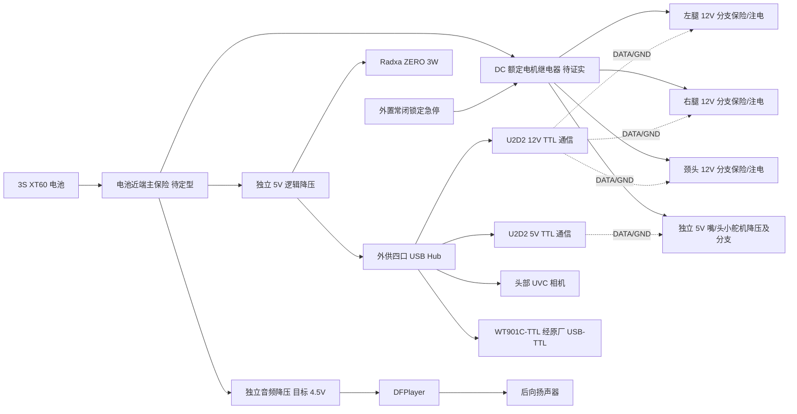

# Goose RC2 接线与装配工作稿

适用 [16 轴规格](../configs/robot_spec.json) 和 [现行候选 BOM](goose_rc2_bom.xlsx)。本稿用于评审与台架准备，**未完成线束定长、保险选型、螺钉堆叠和实物通电验收**，不可直接作为无复核的装配放行书。原交接资料仍独立保留。

## 供电和通信拓扑

12 V 域为 10 个腿轴与 4 个颈轴：左腿 ID 1–5，右腿 ID 6–10，颈部 ID 11–14；其中颈俯仰两台 XM540。5 V 域为头滚转 XC330 ID 2 与嘴 XC330 ID 3。两个 U2D2 **只通信**，不供应执行器电流。厂家 TTL JST-EH 三针定义 pin 1 GND、pin 2 VDD、pin 3 DATA；同型插头跨域可误插，因此两个域的插头、线色与标签必须物理区分。不能把 U2D2 和其中一台舵机之间的 VDD 连接解释为供电能力。线束从分支电源注入，回地按可测的单点参考规划；5 V、12 V 的 VDD 绝不互接。

急停常闭触点只控制继电器线圈/控制级，不能直接承担电机总线开断；逻辑和相机可保持供电以记录故障。继电器候选的实际 DC 负载与反电动势能力、失电开断、保险座及线束温升未验，必须以实物和厂家资料闭合。移动状态按失电可能摔倒处理，调试时用防坠台架。电池平衡充电、欠压停机、放电端电压 ≥电机允许值及换电防误插另作实测。保险额定不能由堵转电流相加直接选定；15 A 主、左右/颈各 3 A、5 V 舵机 2 A 是评估起点，需按实际电流曲线、导线截面、连接器和 DC 分断能力定型。

四口 Hub 恰供两块 U2D2、UVC 相机和 IMU 转接器。Radxa 的 USB Host 板级供电限制为 500 mA，选定的相机官方工作电流也为 500 mA，故 Hub 必须独立供电；上游 VBUS 是否防反灌要在实际 Hub/线缆组合上做断电连续性检查，不能只凭“外供”二字推断。DFPlayer 使用 Radxa 串口控制，串口逻辑电平、限流、电源启动和播放电流待样机量测；音频 4.5 V 直接从 3S 另降压，不经 5 V 逻辑轨串级。音频资料见 [厂家事实](../design/audio_facts.md)。

## 结构装配顺序

1. 按 [CAD 清单](../cad/exports/cad_manifest.json) 的哈希核对源和打印网格；先切片一只承力叉、一只腿部静态座、嘴枢轴和壳体接缝试件，量孔径、层向、轴承座和热区变形。12×12×1.5 mm 铝管切为当前清单长度，按 CAD 孔位夹具钻孔并去毛刺。
2. 在外部工装上分别装两条腿。核每个 XM430 的前 horn、后 HN12 idler、压环、板厚、螺钉侵入深度，再紧固静态座；腿的轴旋转全行程时检查框架、线束和脚底。底部 TPU tread 固定不作为承力螺栓替代。
3. 组装身体底板、两侧电机和前后外壳；安装可拆的 TPU 双铰带及磁吸侧门。每侧用一对 6×2 mm 磁铁（整机四颗），先标极性并在实际 PETG 试件上验证双组分胶的保持力，再封固；验证开门后能在不拆腿和不拉扯线束的情况下接触电池、保险、USB 和急停接头。侧门轮廓保持抽象，不画羽毛。
4. 组装颈根/中段 540、铝管和头部 430，分别核 HN13/HN12 后支承；再安装头滚转、固定上嘴、R2 四杆、浮动下嘴和软垫。用实体关节从站立扫到地面侧叼姿态，确认既不碰外壳也不挤相机线。
5. 安装相机与各电路板，先用到货板样/修订图核孔距、插头弯折、散热和可维护空间；固定后做镜头无遮拦/FOV、视觉标定与扬声器开孔核查。当前机内 [包络与质量预留](component_envelopes.json) 不是安装孔放行。
6. 电源断开时测 12 V/5 V 域不短接、针脚方向、急停常闭释放、Hub VBUS 防反灌和各支路保险；先给逻辑轨供电，再以限流台架逐段上电。软件上电前读回所有电机型号、ID、模式、限流和位置零点，任一项不符禁止使能全机。

零件结构干涉、螺钉堆叠/螺纹深度、线束实际裁切清单、板卡安装、足底摩擦与打印层向强度仍是工程放行条件；实物温升、跌落/拖拽力和载物步行是另设实测门槛。
