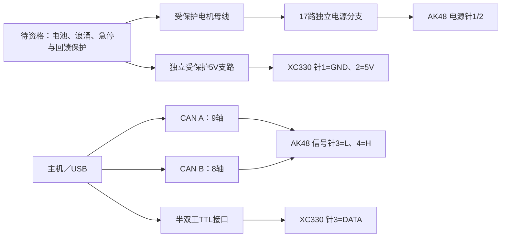

# 当前电气检查点：精确驱动资料与18轴接线端点

2026-10-04 已取得精确 AK48 硬件与新版软件手册，补齐电压、接插件及所选型号的协议字段。当前18轴接线端点和条件回馈核算已可复现；新增[绝对阈值制动支路](absolute_brake_chopper_checkpoint.md)具有实际可编辑KiCad源、64角点/转换、原生连接核对和三组NGSPICE行为波形/故障对照。**PCB/热/完整断开与安装资格、制造线束及硬件启用仍未放行**。478件硬件候选、SI及003训练包均未因此改变。下文0.75Ω与相对阈值模块保留其比较身份，并非新增支路的选型。

## 已闭合的资料缺口

[原厂中文下载页](https://www.cubemars.com/cn/technical-support-and-software-download.html)包含有效的 AK48 安装说明和新版 V3 软件手册链接；同日英文页对应的 AK48 链接仍为空。不能把一个语言入口缺链接当成厂商没有资料。

[精确硬件手册](https://www.cubemars.com/data/cms/202609/ak48-2405-2d-a2-drive-installation-instructions-cn.pdf)第5、8、9页明确：AK48-2405-2D-A2 **V1.11**工作输入15–28V，名义24V；额定输出5Arms、最大10AP。这是驱动输出电流标签，不能当作直流母线电流或自行换算成Iq。第8页合并电源/CAN插头的板端配合视图如下，线端观察方向可能镜像，制作后仍须逐针导通核对。

| 插头 | 针1 | 针2 | 针3 | 针4 |
|---|---|---|---|---|
| 板端XT30PW(2+2)-M／线端XT30(2+2)-F | 电源正／红 | 电源负／黑 | CAN_L／蓝 | CAN_H／白 |
| XC330头部TTL，线端JST EHR-03 | GND | 独立5V | DATA | 无 |

AK48附带100±10mm线材：电源16AWG、CAN信号30AWG。这不是整机线束的长度或热验收。AMASS的[XT30(2+2)-F原厂规格](https://www.china-amass.net/uploads/71.XT30-2%2B2-F-SPEC-2025V0.pdf)为20A／16AWG／温升≤85K的测试条件，不能通过一个电机插头串接整机40A配电，也不能据此接受壳内85K温升。CAN信号沿线连接，电机电源独立星形分支。

[新版软件手册](https://www.cubemars.com/data/cms/202609/ak-series-motor-module-v3-driver-software-user-manual.pdf)第28页列出本机三个准确KV型号的MIT范围：

| 型号 | 速度字段rad/s | 转矩字段Nm | 名义输出Kt，Nm/Iq A |
|---|---:|---:|---:|
| AK40-10 V3.0 KV170 | ±45 | ±5 | 0.4894 |
| AK45-10 V3.0 KV75 | ±20 | ±8 | 1.1286 |
| AK45-36 V3.0 KV80 | ±6 | ±34 | 3.9790 |

三款位置字段均±12.56rad，Kp 0–500，Kd 0–5。17轴当前设计限值均在这些通信字段范围内；这不证明连续持力、实机标定或热能力。转矩字段±34Nm也不能覆盖电机本身峰值额定。现有MIT编码保持端点不回绕的保护，没有拿手册示例里其他型号的常数替换本机。物理`CommissionedAkProfile`仍要求实机身份、固件、位置/速度语义、零位、转矩标定及硬件超时证据；没有凭目录数据把未验证项设成true。

XC330-M288-T的[原厂范围](https://emanual.robotis.com/docs/en/dxl/x/xc330-m288/)是3.7–6.0V，建议5V，半双工TTL。它不能接主电机电压或CAN。[U2D2](https://emanual.robotis.com/docs/en/parts/interface/u2d2/)只提供通信，不向舵机供电；实际TTL接口与独立5V支路安装仍需完成。

全部来源、下载哈希、页码和适用性见[原厂事实表](ak48_v1_11_electrical_facts.json)。未将原厂PDF复制进仓库。此前[通用手册适用性记录](ak_manual_applicability_audit.json)保留历史身份；它对AK54/60/80的18–52V不能沿用到本机。

## 当前接线端点与复现

[18轴JSON](current_actuator_endpoints.json)／[CSV](current_actuator_endpoints.csv)绑定478件装配源和参数哈希。轴序、轴位、17个CAN轴的9/8分组及节点号均沿用原计划，另有独立5V头部轴。每条CAN物理线仅两端各120Ω；接线表不填造保险定值或全机线长，也没有向任何电机发送命令。

离线复现：`PYTHONPATH=src python scripts/diagnostics/check_goose_electrical_endpoints.py`。精选[检查结果](../evidence/electrical_endpoint_and_brake_review.json)记录端点、型号协议范围和回馈假设。测试覆盖H/L互换、正负极接反、TTL误接24V、错轴/错节点、缺失/重复轴、错误端接及高电流串接等拒绝。

## 回馈稳态与瞬态分别验收

17轴受控轴功率包络仍为468.769W连续设计／890.429W峰值，按力矩限值×速度限值求和。为比较暂按100%进入母线，不假定电源能够吸收；它不覆盖失控机械动能、磁场储能、导线电感或实际电机损耗，350W正向机械限值也不限制负功率。

旧[回馈包络报告](../evidence/current_regeneration_envelope.json)要求电阻在20V低点便吸收全部功率，是充分条件而不是保持电压低于上限的必要条件。开启后的理想方程为`C·V·dV/dt=P−V²/R`，稳态为`V=sqrt(P·R)`。本轮用独立数值积分和能量守恒复查该修正，没有把旧拒绝报告覆盖掉。

以**未选型的比较值**0.75Ω±1%计算，890.429W下最坏理想稳态约25.971V；27.7V处最坏制动电流约37.306A，需按散热板条件比较，不能套用[ODrive Clamp](https://docs.odriverobotics.com/v/latest/hardware/regen-clamp-datasheet.html)自由空气20A条件。平均热功率、脉冲能量、安装温度和精确电阻SKU尚未闭合，因此没有列成可采购放行件。

6S满电25.2V加该模块最大2.50V触发偏移为27.7V，距AK48上限仅0.3V。声明外加2200µF、容差−20%、忽略ESR时，890.429W下从触发到28V仅约**16.5µs**；假设50µs延迟的理想电容电压已超过28V。再另留10mΩ ESR的保守瞬态裕量，当前条件无可用裕量。此ESR处理是独立保守预留，不是对厂商实际触发节点和波形的测量。

23V电源或绝对26V制动阈值能提供较大比较裕量，但仍只是要求场景；普通降压模块不自动吸收回馈，也没有由此更改电池、驱动或动作限值。厂商数据表没有给出最大响应延迟保证。**稳态算得下不等于瞬态通过；本轮没有放行6S+该相对阈值模块。**

下一退出条件是确定可证明的钳位/响应、断电吸能、浪涌/急停路径与实际器件，再把保护板、电阻、线束的真实质量和包络合回整机。闭合驱动额定与选型仍由设计Agent负责；[剩余问题稿](actuator_supplier_questions.md)已移除资料已明确的问题，未发送给任何人。实物温升与带载运动保留独立台架门槛。
