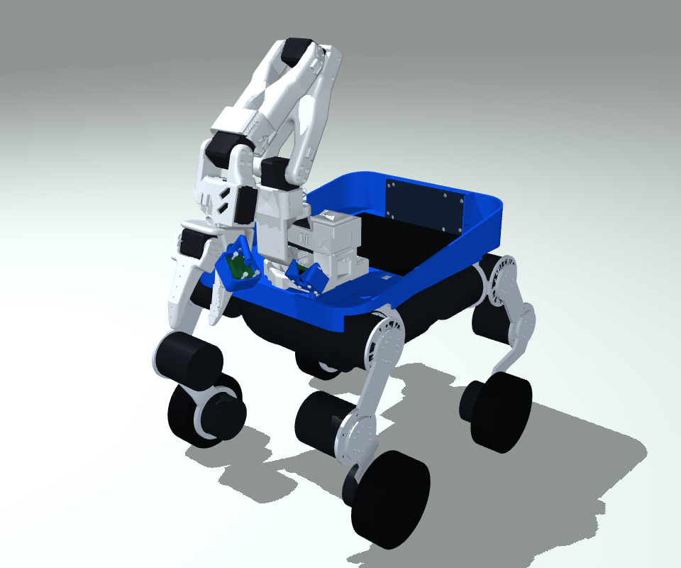
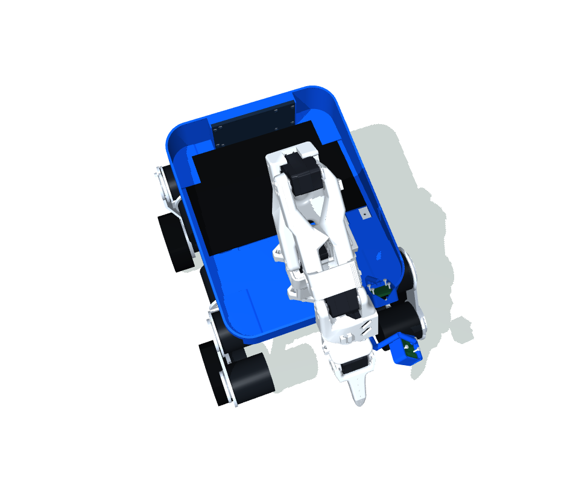
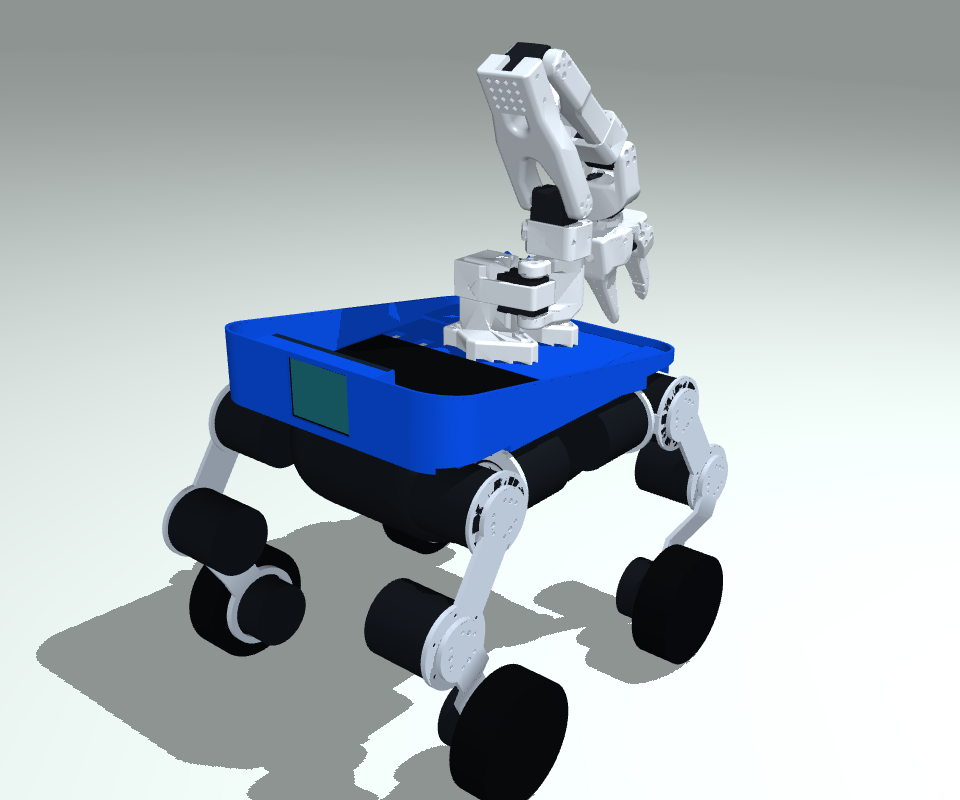
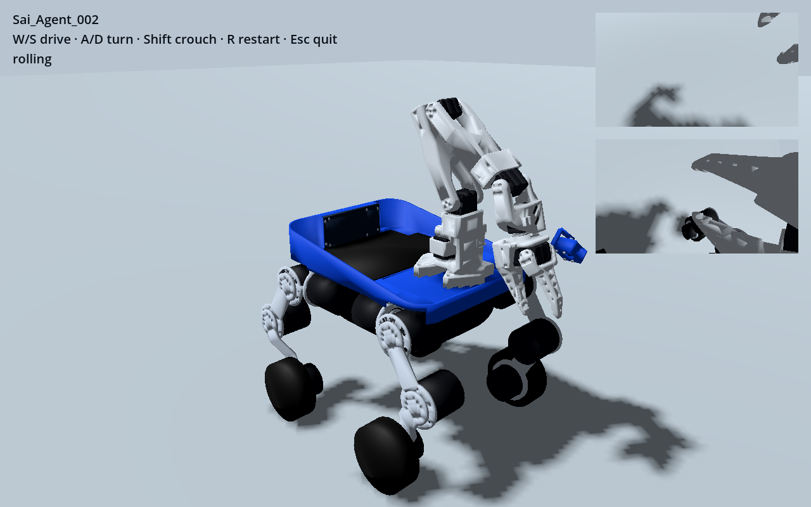

# Sai_Agent_002

The simple open-bay variant: same SO101, four wheel-legs, outer blue shell,
camera placements and rear touchscreen as 001; no powered cargo clamp.







These are rendered directly from the distributed geometry, not generated
concept images. The original arm pose is retained. A small rear screen service
cover and existing rim/hip structures remain at the edges; no cross-bay drive
cover, rail, moving pads or separate inner storage box remains.

## Changes

- Remove the opposed pad sliders, belt rotor, bearings, rail, servo and guard.
- Remove their force-board/load-cell system, dedicated cargo 6 V branch and
  cargo-only Maestro PWM board/mounts. Shared arm, leg, camera and display
  electronics are retained.
- Restore holes/slots in the original 4 mm cargo floor by a CAD boolean union.
  The continuous 2 mm non-slip mat is nominally 152 × 220 mm; its top stays at
  the original Z=259 mm in the design frame. This is an insert dimension, not a
  guaranteed usable-box envelope through the curved walls.
- The full model now has 22 actuators: 16 wheel-leg and 6 SO101 axes. There are
  no cargo joints and no belt/object constraints. The reduced training model
  retains all mass but fixes the arm at home, as in 001.
- Nominal estimated robot mass changes from 9.276 kg to 8.956 kg. Component
  mass, COM and inertia changes are propagated to both MJCF and Godot JSON.
  Unassigned hardware remains covered by the original 600 g allowance; the
  removed unassigned electronics are not given fabricated precise masses.

Detailed [removed-parts/change record](changes.json),
[physical manifest](models/robot_manifest.json) and
[part-level provenance](models/asset_provenance.json).

## Run and inspect

From the repository root:

```sh
uv sync
uv run sai-agent godot --robot Sai_Agent_002
uv run sai-agent godot --robot Sai_Agent_002 --task cargo
uv run sai-agent godot --robot Sai_Agent_002 --stairs .04
uv run sai-agent godot --robot Sai_Agent_002 --stairs .04 --descending
```

W/S forward/reverse, A/D yaw, held Shift crouch, R reset. Cargo uses the same
contact-only SO101 pickup and trained crawl policy, with a short settling phase
in place of active clamping. It has no artificial cargo attachment. Validation
records are collected under [evidence](evidence).

| Check on the actual 002 model | MuJoCo | Godot/Jolt |
|---|---|---|
| Eight movement/crouch commands | 8/8 | 8/8 |
| Four-riser 20/40 mm ascent/descent | 4/4 | 4/4 |
| Opt-in nominal 60 mm ascent/descent, 45 s budget | 2/2 | 2/2 |
| 100 g pickup and transport over 18/25 mm obstacles | 2/2 | 2/2 |

The inherited 60 mm profiles remain opt-in experiments:

```sh
uv run sai-agent godot --robot Sai_Agent_002 --stairs .06 --stair-skill ascent60
uv run sai-agent godot --robot Sai_Agent_002 --stairs .06 --descending --stair-skill descent60
```

See the variant's [validation record](evidence/validation.json). No inherited 001 result is relabelled as
a 002 result. Hardware/VLA/touch firmware and Unity editor validation remain
outside this simulation variant's verified scope.

GPU training also completed a 32-world, two-update (2,048-step) smoke run on
NVIDIA GB10 with the actual 002 reduced model. This verifies training execution,
not the quality of a new policy; deployment still uses the tested shared actors.

## Reproduce geometry

```sh
uv run --extra assets python scripts/build_agent002.py
uv run --extra assets python scripts/render_model.py --robot Sai_Agent_002 --out artifacts/002-review
```

The builder uses the preserved 001 model and checked-in, licensed per-part
chassis meshes. It removes mechanisms from the geometry **and** physical model,
recalculates chassis inertia and regenerates the training model and game GLB.
All non-chassis retained bodies are required to match 001 exactly.

The changed shell and mat have actual STEP geometry in [`cad/`](cad).
With build123d 0.11.1 and trimesh installed, the nominal floor edit is reproduced by:

```sh
python robots/Sai_Agent_002/cad/restore_floor.py robots/Sai_Agent_002/cad/source-001-shell.brep robots/Sai_Agent_002/cad
```

Those STEP files cover the changed project shell/mat, not a falsely certified
complete manufacturing assembly. The source BREP is project-owned. Existing
supplier hardware keeps the same 001 definitions and provenance. The shell
remains one valid solid; no motor, arm link or screen is rescaled to fit.

## Physical limits

Cargo retention is passive. The original walls and non-slip floor can retain
the tested small item, but loads may slide, bounce or fall on other terrain.
This is the deliberate functional difference from 001. No active restraint or
force sensing is claimed. Mass, friction, motor response and the filled
shell's COM/inertia remain estimates requiring hardware measurement.
